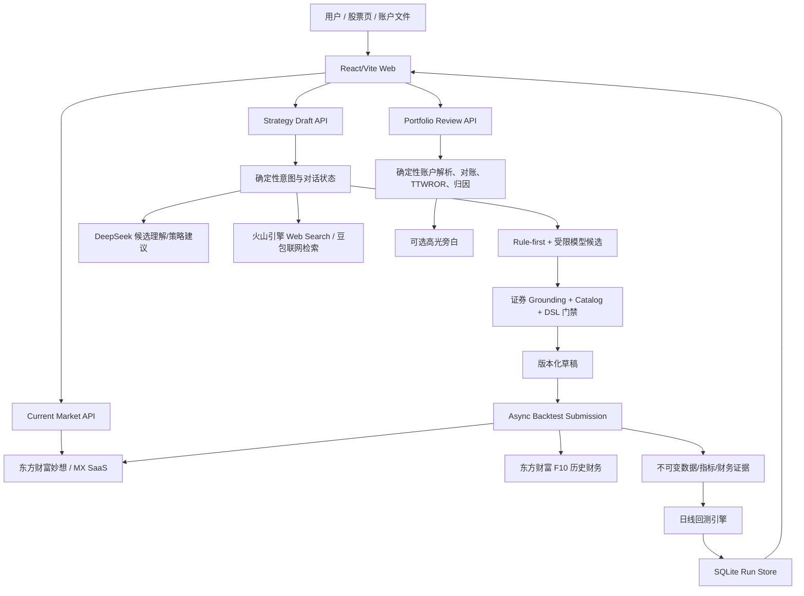

# AI 持仓复盘、自然语言策略回测：完整交接与继续执行基线

> 快照时间：2026-09-05 01:56 EDT（America/New_York，UTC-04:00）  
> 来源任务：Codex 任务 `01a04bb7-cc38-7a03-bd96-09c67533fce8`（`commander AI持仓复盘、回测能力`）  
> 主项目：`/Users/mima0000/Documents/回测`  
> 本文用途：整份复制到一个新的 Codex 对话，即可继续工作。  
> 安全说明：本文不包含任何 API Key、Cookie、令牌或个人账户数据。

---

## 0. 给新对话中 Codex 的接管指令

你正在接手一个已有大量实现、但仍处于 **dirty-worktree 本地联调阶段** 的 A 股产品。你要同时维护两条产品纵切：

1. AI 持仓复盘：目标是把用户真实账户流水、持仓和净值整理为可核对的复盘；当前普通 UI 真实文件闭环尚未完成；
2. 自然语言策略回测：把用户口语策略安全地识别、澄清、编译、取数、回测并展示结果。

请遵守以下执行原则：

1. 先只读核对当前分支、HEAD、工作区、运行进程、数据库与现有测试；不要把本文中的时间敏感数字当成永远不变。
2. 当前工作区包含用户和此前任务积累的大量改动；禁止 `git reset --hard`、`git checkout --`、整包覆盖、整包提交或删除未知文件。
3. 不要部署。必须先完成本地真实输入端到端联调，再让用户审核；得到用户明确授权后才可部署。
4. 严格区分五种证据：`Catalog/配置存在`、`编译 ready`、`fixture 测试`、`Local-Real-Dirty`、`Clean-SHA Live`。当前最高证据只到 `Local-Real-Dirty`。
5. 不得把当前值当历史序列，不得把模型建议当可执行策略，不得把本地计算指标冒充东方财富服务商指标。
6. 用户输入不完整时要理解上下文并给出少量、可编辑、可编译的候选；但不得凭空补充关键买卖条件、股票、事实或因果关系。
7. 联网检索、模型理解、策略编译、历史数据和回测是不同权限边界；任何模型输出都必须经过服务端 Grounding、Catalog、DSL 和数据能力校验。
8. 不要暴露 `.env.local`、`~/.mx-skills/em_api_key`、进程环境、数据库中的用户数据或任何密钥。
9. 测试只跑本次改动及直接依赖的最小集合；先修已确认的 P0，不做无关重构。
10. 每次声称“完成”时必须附上：精确版本身份、数据身份、运行身份、测试命令、测试结果、仍未覆盖的边界。

接手后的第一批动作应按本文第 19 节执行，不要先做 UI 美化，也不要先部署。

---

## 1. 一页结论

### 1.1 当前真实状态

- 自然语言策略回测主干已经具备：口语输入、确定性/受限模型候选、DSL/Catalog 校验、草稿与澄清、异步 run、日线回测、摘要/曲线/成交/因果活动展示。
- 东方财富相关能力已分多路接入：选股、单标的查数、按需历史日线、历史财务 PE、服务商技术指标序列适配与缓存。
- 一个 **混合证据的 Local-Real-Dirty run** 已跑出用户要求的演示数字：东方财富 `300059.SZ`、近一年、`PE < 35 且 MACD 金叉买入 / MACD 死叉卖出`，收益 `-3.31%`、基准 `-22.86%`、超额约 `+19.56%`、最大回撤 `-11.79%`、胜率 `50%`、6 个完整往返、12 笔成交。这里“混合证据”特指真实 MX 基础行情 + 真实东方财富 F10 PE + 本地兼容计算 MACD。
- 但该 run 的代码身份为 `6c4058...+dirty`，且 **没有** `provider_indicator_series`。由于代码对“含财务条件”的策略跳过服务商指标取数，这个演示中的 MACD 不是“东方财富服务商指标序列端到端”的证明。
- AI 持仓复盘并非纯 Mock：确定性解析、对账门禁、TTWROR、最大回撤、已实现盈亏归因、高光和旁白边界已有代码与测试；但整个纵切大多仍是未跟踪 dirty 文件，普通网页上传也还不能形成完整每日净值曲线。
- 本地服务当前可访问：后端 `127.0.0.1:8011`，前端 `127.0.0.1:5184`；health/ready/version 与首页均返回 200。
- 当前运行进程是在本轮 `wash` 修复前启动的，密钥只在进程内存中。源码测试已验证修复，但浏览器仍显示旧行为；必须由用户重新输入两把 Key 重启本地联调服务，才能做最终浏览器验收。
- 生产部署模板当前存在硬冲突：CloudBase 强制 `MARKET_DATA_PROFILE=on_demand_snapshot`，production strict replay 却只接受 `composite_snapshot`。因此当前没有可成立的生产启动路径，也没有部署授权。
- 服务商历史指标还有两个可信度缺口：历史点的 `observed_at/first_available_at` 目前由代码回填成交易日 15:00，并非供应商首发/修订时间；缺失交易日会被静默当作“无信号”，而非完整性失败。因此即使跑出 provider run，也不能在补齐 PIT 与覆盖门禁前称为无前视偏差的可信回测。

### 1.2 当前建议

先完成四个 P0 闭环，再谈体验或部署：

1. 冻结并拆分 dirty 工作区，建立可复现版本身份；
2. 先补 provider 指标的 PIT、交易日覆盖和原始响应证据，再让纯技术策略与“财务 + 技术”混合策略真实使用并冻结东方财富指标序列；
3. 重启本地服务并验证 `wash` 不再进入投资策略生成，同时修复“不卖出”语义；
4. 统一本地与生产数据 profile、模型/豆包配置，跑 clean-SHA 本地真实 E2E。

---

## 2. 项目坐标、版本和证据等级

### 2.1 主项目

- 仓库：`/Users/mima0000/Documents/回测`
- 当前分支：`codex/public-live-integration`
- 当前 HEAD：`6c4058ac6f1cfa3feafd333d771211b3ac3141d6`
- 最近提交说明：`fix(web): pin live backtest cutoff to snapshot window`
- Git remote/upstream：当前未配置
- 2026-09-05 01:56 EDT 工作区快照：
  - 69 个已跟踪修改；
  - 63 个未跟踪状态条目；
  - 合计 132 个 dirty 状态条目；
  - staged 为 0；
  - 仅已跟踪 diff 为 `+7842/-821`，不含未跟踪文件内容。

本文随后又新增为一个 untracked 文件，因此 `132` 不是阅读本文时的实时总数；执行任何写操作前必须重新统计。

这些数字会随继续工作变化。接手后重新运行：

```bash
cd /Users/mima0000/Documents/回测
git branch --show-current
git rev-parse HEAD
git status --short
git diff --stat
git diff --cached --stat
git remote -v
```

### 2.2 其他相关目录

- 历史任务所在旧目录：`/Users/mima0000/Documents/Codex/2026-08-27/la`
  - 只作为历史上下文；当前实现与数据库以 `/Users/mima0000/Documents/回测` 为准。
- WorkBuddy 独立前端试作交接：
  - `/Users/mima0000/Documents/Codex/WorkBuddy/ashare-backtest-ui-handoff-20260904/`
  - `HANDOFF_MANIFEST.md`
  - `PROMPT_1_BUILD.md`
  - `PROMPT_2_VERIFY_EXPORT.md`
  - `workbuddy-app/README.md`
- 下载包：
  - `/Users/mima0000/Downloads/WorkBuddy-A股回测前端交接-20260904-v1.zip`
  - 2026-09-05 实测 SHA-256：`4d4f58f96b1585a9866963fbca24083788079ae4b34534dfce9a49bcce3a3b53`

WorkBuddy 文档是 2026-09-04 的独立前端快照，其中“提交回测会同步等待数分钟”的描述已可能落后于主仓库的异步 preparation 改动，不能反向覆盖主项目现状。

### 2.3 现有交接文件状态

- `HANDOVER.md`
- `HANDOVER_QUICKSTART.md`

两份旧文件仍记录旧 HEAD、旧 dirty 数量和旧测试结果，已经过期。本文是新的时间戳基线；不要直接覆盖旧文件，以保留历史差异。

### 2.4 证据词典

| 标签 | 含义 | 当前是否具备 |
|---|---|---|
| Catalog | 能力目录中声明支持 | 是 |
| Compile-ready | 自然语言能编译成合法 StrategySpec | 是，多类规则已验证 |
| Fixture | 使用 fake/mock/local fixture 的测试通过 | 是，覆盖较广 |
| Local-Real-Dirty | 本地真实服务/数据跑通，但代码有未提交修改 | 是，当前最高等级 |
| Clean-SHA Local | 干净 Git SHA 下本地真实端到端 | 否 |
| Clean-SHA Live | 干净 SHA、正式环境、真实数据、浏览器闭环 | 否 |

任何“已支持”都必须同时说明属于哪一层。

### 2.5 三套身份必须分开

| 对象 | 身份 | 当前可采信范围 |
|---|---|---|
| 本文审计的源码快照 | HEAD `6c4058...` + 2026-09-05 01:56 EDT 的 dirty 工作区；本文和后续补丁又继续改变了工作区 | 可用于定位代码与待办，不能从 HEAD 单独恢复 |
| 当前运行进程 | backend PID 44466 / 8011；frontend PID 44467 / 5184；无内容哈希，启动于 `wash` 修复前 | 可证明旧进程 health 与旧页面行为，不能证明最新源码 |
| 演示历史 run | `run:a3b2...`；manifest 记录 `6c4058...+dirty`；market/financial/result identity 见第 10 节 | 可证明一次混合证据回测，不能证明当前源码、provider MACD 或 clean release |

新接手者必须分别刷新这三套身份，不能用“服务还活着”推断“已加载最新源码”，也不能用旧 run 推断当前代码仍可复现。

### 2.6 授权矩阵

本文记录的是历史任务授权与安全边界，**不会自动扩大新对话的权限**：

| 动作 | 当前状态 |
|---|---|
| Git、进程、端口、DB schema/计数/第 10 节指定 run identity 的只读元数据核对 | 可做；不得读取 portfolio/user payload、未知日志正文、凭据或其他账户内容 |
| 源码、测试或文档修改 | 历史授权不继承；新对话必须先让用户明确当前目标与可修改范围，并确认不会覆盖未知 dirty 改动 |
| 创建本地验证工件或运行测试 | 先取得当前用户确认；使用隔离临时 DB、禁外网、禁缓存，并确保工件不含凭据/个人数据 |
| 重启 8011/5184 | 需要用户在 GUI 重新输入两把 Key；不得从旧进程提取 Key |
| 调用真实外部 MX/DeepSeek/Volcengine | 不从本文自动推断；先确认当前用户意图、配额与 Key 可用性，并保存脱敏证据 |
| stage / commit / 建分支 / push | 当前未授权；先提交拆分方案给用户确认 |
| 删除、清理、reset、覆盖未知文件 | 未授权 |
| 公网部署 | 明确未授权，并被技术门禁阻断 |

### 2.7 Dirty 工作区清单边界

当前 69 个 tracked 修改横跨 language、market data、API、backtest、bootstrap、CloudBase、docs、tests 和 web；63 个原始 untracked 状态项包含：

- 核心新代码：portfolio review、dialogue state/turn/intent、MX、provider catalog/runtime/cache、research/advisor、async submission；
- 大量对应测试；
- 启动/探针/快照脚本；
- `web/src/portfolio-review/`、`web/dist-local/`；
- `HANDOVER*`、ZIP、`.claude/`、`.design/`、`.tmp_xgcircle/`、`recovered/`、`research/` 等来源未完全确认目录。

没有证据能可靠判断每一项属于用户、此前代理还是生成工件，因此本文不伪造“负责人/可删除”字段。接手者先把以下命令输出保存为时间戳只读清单，再与用户确认所有权；在此之前不得整包 stage、移动或清理：

```bash
git status --short
git ls-files --others --exclude-standard
git diff --name-status
```

---

## 3. 项目背景与产品目标

### 3.1 为什么做这个产品

目标不是造一个会随意给投资建议或自动交易的聊天机器人，而是建立一个可审计的“账户事实 → 策略假设 → 历史验证”工作台：

- 用户能导入真实账户材料，先得到中性、可核对的持仓和交易复盘；
- 用户能用口语表达交易规则，系统帮助补齐表达，但不能偷换条件；
- 当前事实、历史序列、模型理解和执行结果各自有来源与时间边界；
- 回测结果能追溯到策略版本、Catalog、代码、数据快照、交易假设和结果哈希；
- 产品先服务“看懂自己做了什么、验证一个假设”，不承诺收益，不替用户下单。

### 3.2 产品近期目标

#### A. AI 持仓复盘

近期窄 MVP：

1. 支持 A 股/港股现金账户材料的确定性导入；
2. 对持仓、成交、资金流、费用、币种和净值进行确认与对账；
3. 输出 1 日/7 日或指定区间的中性持仓复盘；
4. 输出持仓权重、成本/浮盈亏、TTWROR、最大回撤、已实现盈亏和关键交易高光；
5. 联网模型只解释经过核验的历史背景，不重写账户事实；
6. 后续再增加简单反事实，最后才考虑把账户行为转成规则回测。

#### B. 自然语言策略回测

近期目标：

1. 用户一句话提出股票、买入、卖出和区间；
2. 不完整或不标准表达得到上下文相关、少量、可编辑候选；
3. 当前查数先直接回答，再给一行谨慎解读和 2–3 个可回测方向；
4. 模型可灵活建议参数，但必须标记“推断/可编辑”，并重新经过 Compiler/Catalog；
5. 东方财富负责真实选股、查数、日线、财务和技术指标；系统只识别条件、冻结证据、匹配信号与执行回测；
6. 回测提交采用异步准备与可查询 run，不让前端请求长时间无响应；
7. 全部 A 股与稳定指标是目标，但必须按真实覆盖逐步验收，不能用少量标的探针冒充全市场完成。

### 3.3 明确非目标

- 不进行真实资金交易或自动下单；
- 不给收益承诺或个性化投资建议；
- 不让模型生成并直接执行 Python/SQL/Pine Script；
- 不允许模型绕过证券身份、Catalog、DSL、数据或执行规则；
- 不把截图 OCR 结果直接当成已对账账户事实；
- 不把当前行情值复制成历史序列；
- 不在用户本地审核前部署公网版本。

---

## 4. 系统架构

### 4.1 总体结构



### 4.2 后端入口与模块

- ASGI 入口：`ashare_lab/main.py`
- 配置装配：`ashare_lab/bootstrap.py`
- FastAPI 路由装配：`ashare_lab/api/app.py`
- 主要 API：
  - system：health、ready、version、capabilities；
  - strategy v1：草稿、revision、澄清；
  - backtest v1：创建、状态、取消、summary、series、trades；
  - strategy v2：draft/validate/execute/get run，默认关闭；
  - current market：screen/query/screen-query，dirty-only；
  - portfolio review：parse/analyze/narrate/import-contract，dirty-only。

应用层目前没有完整的入站用户认证/授权中间件。v2 的签名 receipt 是运行证明，不是用户身份系统。

### 4.3 前端入口

- `web/src/main.tsx`
  - `/portfolio-review` → 持仓复盘；
  - 其他路径 → 自然语言策略回测。
- `web/src/App.tsx`：策略对话、草稿、回测与报告主编排。
- `web/src/portfolio-review/`：持仓复盘页面，当前为 dirty-only。
- `web/src/shared/api/client.ts`：Mock/Live 切换。

普通 `pnpm dev` / `pnpm build` 默认仍可能走 Mock；Live 必须显式 `VITE_USE_MOCK=false`。任何 Mock 截图或 Mock 测试都不是正式回测证据。

### 4.4 状态与持久化

- 回测 run：SQLAlchemy + SQLite，当前主要数据库 `var/ashare.db`；
- 默认任务队列：线程队列；也有 RQ 方向；
- 策略草稿、revision、对话历史：`InMemoryDraftStore`，重启丢失；
- 慢快照 preparation 协调：进程内状态，重启恢复未闭环；
- 持仓复盘 API：当前 stateless，没有复盘对象持久化、用户隔离和审计版本。

---

## 5. 当前 API 面与成熟度

| 模块 | 端点/入口 | 当前状态 |
|---|---|---|
| System | `/api/v1/health`、`ready`、`version`、`capabilities` | committed，当前 8011 实测 200 |
| Strategy v1 | 创建草稿、澄清回答、revision | 主干 committed；多轮/查数旁路有 dirty 扩展 |
| Backtest v1 | 创建、状态、取消、summary、series、trades | 主干 committed；按需准备/服务商指标有 dirty 扩展 |
| Strategy v2 | draft、validate、execute、run | committed，但默认关闭 |
| Current market | `/api/v1/market/screen`、`query`、`screen-query` | dirty-only，依赖 MX |
| Portfolio review | `imports/parse`、`analyze`、`narrate-highlight`、`import-contract` | dirty-only |
| Web strategy | `/` | 当前 5184 Live 本地可访问 |
| Web portfolio | `/portfolio-review` | 页面存在；真实上传闭环不完整 |

---

## 6. 已完成内容与当前实现状态

### 6.1 自然语言策略识别

已实现：

- 确定性意图：选候选、新策略、模糊策略、补充、观点、查数、闲聊、取消、换标的、未知；
- rule-first 解析：常见明确规则优先本地解析；
- 受限模型候选：只在规则解析失败或需要对话表达时使用；
- 股票名称必须经服务端解析器唯一映射；代码必须满足 A 股交易所规则；
- 模型候选必须带原文 grounding，并通过 Catalog 与 DSL；
- 不完整规则形成 revision-bound 澄清；旧 revision 的回答会被拒绝；
- 当前查数是对话旁路，不应篡改未完成策略状态；
- 观点或宽泛表达可生成 2–3 个非执行候选；选中后仍要重新编译；
- 前端真实输入初始为空，发送后清空。

部分完成：

- 这不是统一自主 Agent，而是确定性路由 + Compiler + 有边界模型；长对话规划仍弱；
- “新建条件”动作仍可能主动预填文字，存在输入框回归风险；
- 模糊规则的候选质量依赖上下文与模型，目前仍有过度联想和重复追问；
- 对“永不卖出/持有到回测结束”的策略语义没有正式 DSL 决策。

### 6.2 回测执行

已实现：

- StrategySpec v1；
- 日线、多种技术/价格量条件、财务条件和部分事件条件；
- 信号确认、下一交易日开盘价代理成交；
- A 股手续费、最低佣金、成交量容量、涨跌停等待、公司行动、分红/配股研究假设；
- 异步 run 生命周期、取消、进度、结果读取；
- summary、净值/基准曲线、成交和完整 activity 因果链；
- 结果与策略、Catalog、代码、快照、配置、随机种子、结果哈希绑定；
- 预声明稳健性场景：滑点 1.5x/2x、参与率 2.5%/10%，不做事后参数优化。

部分完成：

- 服务商技术指标已具备 Catalog 映射、取数、缓存、冻结、worker 还原与信号匹配代码；
- 纯技术 fixture 路径已测试；
- 尚无当前真实 MX 的“提交 → 持久化服务商序列 → worker → 结果”的自动化或人工完整证据；
- 混合财务 + 技术策略会跳过服务商指标路径，是当前最大执行缺口；
- preparation 状态不是耐久队列，进程重启恢复不完整。

### 6.3 AI 持仓复盘

已实现（dirty code）：

- 契约 `CN_A_HK_CASH_V1`；账户流水是账户收益事实源，市场数据只补背景；
- CSV/XLSX 解码后的行做表头、代码/市场、日期、币种、费用、成交、期末余额推断；
- 持仓、成交、资金流、每日净值、市场观察的结构化 Schema；
- 融资、融券、债务偿还及未建模公司行动会阻断；
- 不会用交易净额冒充当前持仓；要求同一时点期末持仓、期初缺口和历史汇率对账；
- 分析必须建立在用户确认后的结构化草稿；
- 持仓权重、成本、浮盈亏、成交/资金时间线；
- TTWROR、最大回撤、日级序列；
- 券商报告值或 FIFO 推导的已实现盈亏；
- 最多 5 个正收益卖出高光；
- 高光旁白按打开时调用，模型不得修改账户事实，历史来源发布时间必须不晚于事件时点；
- `/portfolio-review` 上传、确认、分析、回放界面。

未闭环：

- API 明确 `file_upload_supported=false`；服务端只接收浏览器已解码 JSON；
- OCR 未连接，截图只预览，不进入真实分析；
- XLSX 依赖 cdnjs 外链脚本，离线/CSP/供应链/隐私未收口；
- 浏览器上传当前只推断持仓、成交、资金流，`daily_equity` 与 `market_ticks` 固定为空；
- UI 无每日净值补充入口，普通文件无法形成真实 TWR/账户曲线；
- 未实现 MWR/XIRR、波动率、Sharpe、Sortino、交易胜率、连胜连跌；
- 当前归因是卖出交易已实现盈亏，不是完整 P&L bridge；
- 未覆盖分红、利息、费用、税、汇率和外部流量的完整归因；
- 未实现 1 日/7 日标准化复盘、简单反事实或账户规则回测；
- 无复盘持久化、幂等、用户隔离、审计对象；
- 页面仍保留美股/加密合成 Demo 引擎，发布前必须做 Demo/真实状态隔离回归；
- 当前全套启动器使用火山 Web Search，但持仓高光旁白只会装配 DeepSeek narrator，真实启动下旁白不可用。

---

## 7. 东方财富数据接入情况

### 7.1 已接入的四类能力

#### 1. 当前选股与查数

- 适配器：`ashare_lab/adapters/market_data/mx_saas.py`
- API：`/api/v1/market/screen`、`query`、`screen-query`
- 能力：A 股筛选、单标的/多标的公开财务与行情字段查询、证券名称解析。
- 证据：`/private/tmp/ashare-mx-live-probe/20260904T052223Z/summary.json` 曾记录 screen/finance、本地 screen/finance/screen-query、ETF screen-query 与两条对话共 8/8 语义检查通过，且没有记录凭据值；本地浏览器“东方财富最新价是多少”返回收盘价 `19.15 元` 和 3 个候选。
- 稳定性边界：稍后的 `20260904T064701Z` 只有 7/8，一条 ETF 查询失败；没有完成 direct soak，所以不能用单次成功证明长稳。
- 限制：这是当前/查询结果，不是自动可用于历史回测的时序快照。

#### 2. 按需日线 OHLCV

- profile：`on_demand_snapshot`
- 默认本地联调日线来源：`choice_then_eastmoney`
- 作用：按标的与区间准备日线、session、公司行动所需快照，并绑定 run。
- 证据：真实 `300059.SZ` 近一年 run 已生成 244 个序列点。
- 原始 MX 快照可在 `var/snapshots/internal-demo/technical/cacbdba545104694a067653dc0796067c4652ff680cd07f3185a7f5581e02d0d/snapshot_manifest.json` 核对；它包含原始响应/请求、逐文件 SHA、366 条含 warmup 的 execution/signal/session 与 2 条公司行动，状态是 `validated_for_demo`，不是 production release。
- 限制：不同来源的字段、复权、公司行动与最新稳定日截止必须继续核对；日线开盘只能作为成交价代理，不能声称是逐笔真实成交。

#### 3. 历史财务/估值

- 当前强证据：东方财富 F10 operator reading 路径已为 `valuation.pe` 生成历史事实。
- 演示 run 财务快照：
  - provider：`eastmoney_f10_operator_reading`
  - dataset：`RPT_CUSTOM_DMSK_TREND`
  - field：`INDICATOR_VALUE`
  - value origin：`provider_raw`
  - coverage：`2016-09-30` 至 `2026-09-04`
  - financial snapshot：`financial:2d8469169e67364507e84977357b19176e66fad5c06b6d7106501445039e2eeb`
- 财务使用 point-in-time availability，并按 `financial_available_plus_1d_close` 评价，避免把后来修订值提前放入历史。
- 限制：PE 有真实 local run；其他财务/估值别名大量仍只到 Catalog/loader/fixture，不得一概称为真实 E2E。

#### 4. 服务商技术指标序列

- 已有：
  - 技术指标 → 东方财富 query 的 Catalog 映射；
  - 历史 indicator series 请求；
  - 配置的 TTL 缓存目录 `var/cache/provider-indicators`；
  - response hash、snapshot identity、manifest/config 双写；
  - worker 重新校验、对齐交易日、产生 provider indicator evidence；
  - 交叉、比较、多字段、连续条件等运行时。
- 真实探针：`/private/tmp/ashare-mx-kdj-history/20260904T020237Z/probe.log` 曾记录 `300033.SZ` KDJ 一年区间约 243 个交易日、K/D/J 横向字段；这是易失的临时探针日志，不是内容寻址工件，也不是完整 run。
- 关键缺口：当前数据库 10 个历史 run 的 `provider_indicator_series` 都为空，尚无本地真实完整 run 证明该路径。
- 当前 `var/cache/provider-indicators` 实际不存在，尚无真实缓存命中证据。

### 7.2 指标能力口径

历史项目口径是：

- 37 个相对稳定的技术/价格量条件可作为直接策略条件目标；
- 17 个财务/估值自然语言别名已扩展；
- 合计 54 个“策略条件因子”口径；
- `financial.operating_cash_flow` 曾是后端 Catalog 能力，但没有自然语言别名。

接手后必须从当前代码重新生成矩阵再对外报数，因为这些数字来自此前快照，可能随 dirty 工作区变化。还要区分：

- 策略条件因子；
- 回测统计指标（收益、回撤、胜率等）；
- Catalog 声明；
- 自然语言入口；
- loader；
- runtime；
- 真实数据证据。

### 7.3 当前 P0：混合财务 + 技术没有使用服务商指标

`BacktestSubmissionService.submit()` 只有在同时满足以下条件时加载 `provider_indicator_series`：

```text
provider adapter 存在
AND 不需要事件
AND 不需要财务
```

因此 `PE < 35 AND MACD 金叉` 明确触发 `requires_financials=true`，整个服务商指标分支被跳过。最新演示 run 的 config/manifest 中确实没有 `provider_indicator_series`。

这意味着：

- PE 使用了东方财富历史财务事实；
- OHLCV 使用了真实按需日线快照；
- MACD 则落回引擎兼容计算；
- 所以不能声称“PE + MACD 全部由东方财富提供指标值”。

修复不能简单删除 `not requires_financials`。当前 provider runtime 要求条件树的每个叶子都有对应 provider series，而混合树同时含财务叶子。需要实现 **混合信号树**：技术叶由 provider timeline 计算，财务叶由 point-in-time facts 计算，再按原 All/Any 结构组合，保留每个叶子的独立证据。

### 7.4 数据验收标准

一个指标只能标记“真实可回测”当且仅当：

1. 自然语言可识别；
2. Candidate/DSL 可表达；
3. Catalog 明确允许 trigger/参数；
4. provider query 能返回目标股票、目标区间的历史序列；
5. 序列有交易日、首次可得时间、字段与单位；
6. 原始响应哈希与不可变快照已冻结；
7. worker 能从持久化 payload 恢复；
8. runtime 只匹配条件，不重新计算该 provider 指标；
9. 完整 run 成功，activity 中含 provider evidence；
10. clean SHA 下可重复运行。

### 7.5 服务商指标的 PIT 与完整性缺口

即使修完混合条件树，还必须先解决以下问题：

- MX 当前返回的是本次查询得到的历史点；适配器把每个点的 `observed_at` 和 `first_available_at` 直接设为该历史交易日 15:00。这是代码合成时间，不是供应商首发、修订历史或 prefix-stability 证据。
- `ProviderIndicatorSeries` 目前只校验非空、排序和请求区间，不要求与交易日一一覆盖。
- runtime 遇到缺失交易日会产生 `None/no signal`，从而静默改变策略行为；可信回测应先设覆盖阈值/逐日一致性，并对缺失 fail closed 或明确披露。
- run 只嵌入解析后的 points 与 response hash，没有像基础行情快照一样归档可复核的原始 provider body。

所以 Phase 2 的顺序必须是：先补 PIT/覆盖/原始证据，再把 provider run 升级为可信回测；“接口返回了历史值”本身不够。

---

## 8. 联网模型、DeepSeek 与豆包方案

### 8.1 职责分离

| 通道 | 默认方案 | 允许做什么 | 不允许做什么 |
|---|---|---|---|
| 候选理解 | DeepSeek OpenAI-compatible | 理解不标准表达，产出受限 JSON 候选 | 直接授权策略、猜股票、绕过 DSL |
| 策略建议 | DeepSeek strategy advisor | 基于已核验数据建议少量方向与可编辑参数 | 捏造数据、直接执行、跳过 Compiler |
| 联网检索 | Volcengine Web Search API（项目口头称“豆包联网方案”） | 先检索当前事实、返回来源/事实包 | 把搜索摘要直接当策略或历史序列 |
| 持仓高光旁白 | 当前只装配 DeepSeek narrator | 解释已核验账户高光的可能历史背景 | 修改账户事实、用未来来源解释过去 |

### 8.2 当前配置

本地全栈启动器：`scripts/start_local_fullstack_review.command`

- 分别提示输入：
  - `CANDIDATE_PROVIDER_API_KEY`：DeepSeek；
  - `RESEARCH_PROVIDER_API_KEY`：火山引擎 Web Search。
- 两把 Key 只进入后端进程内存，不写文件；
- 候选模型 endpoint：`https://api.deepseek.com/chat/completions`；
- model 当前配置：`deepseek-v4-flash`；
- research mode：`volcengine_web_search`；
- research endpoint 默认：`https://open.feedcoopapi.com/search_api/web_search`；
- adapter model identity：`web-search`，这是 Web Search API 适配器，不是一个已验证的豆包聊天模型 endpoint；
- 东方财富 Key 可从受保护文件读入内存，不能输出。

本文中的“豆包方案”必须精确理解为“当前本地代码接入的火山引擎 Web Search API”。它不代表全系统已统一使用豆包模型，也不代表 CloudBase production 已支持该模式：CloudBase 当前仍要求 `deepseek_responses`，持仓 narrator 也仍是 DeepSeek 专用。

### 8.3 已实现链路

1. 观点/当前事实请求先走 research；
2. 把研究事实包交给模型理解，而不是先让模型编故事；
3. 模型只能返回严格 Schema；
4. 服务端拥有固定/可用能力矩阵；
5. 建议规则重新进入 Compiler/Catalog；
6. 模型尝试自行指定证券代码时应被拒绝；
7. 前端显示研究证据、候选与“待确认”状态；
8. 查数回答与策略建议可以同时展示。

### 8.4 真实证据与未验证项

- DeepSeek endpoint 无 Key 握手曾返回 401，证明地址可达，不证明真实生成质量；
- 当前 8011 进程由用户输入 Key 启动，浏览器可得到动态文案/候选，但本轮未读取进程环境或密钥，也没有完整 provider response identity 审计；
- 豆包 Web Search 适配器及搜索优先顺序有单元/契约测试；真实当前联网结果仍需在重启后的受控场景逐条核验来源、时间和失败降级；
- 当前未找到 DeepSeek Web Search 或火山 Web Search 的真实 provider response、research payload 或成功日志；现有自动测试均使用 MockTransport。
- DeepSeek Responses 路径目前只验证出现过 `web_search_call`，最终 JSON 中的 URL 尚未与工具 annotation/search result 做逐条绑定；火山路径直接映射 `WebResults`，来源绑定更强。
- `wash` 旧进程仍展示“市场清洗或回调”的错误联想，说明仅靠模型提示不能防止语义污染；必须先做确定性路由门禁；
- CloudBase `env.example` 仍将候选与 research 都配置为 DeepSeek，与本地“两通道、两把 Key”的方案不一致；
- 全栈启动器把 research 设为 Volcengine 并清除 endpoint/model，但 portfolio narrator 只认 DeepSeek endpoint/model/key；因此持仓 `/narrate-highlight` 在该真实启动配置下会 503。
- 多实体财务查数还有错配风险：系统可能绑定第一个证券，却把多张表中最多 8 条事实一起交给单股策略建议模型。编译门会阻止跨标的执行，但分析与参数建议仍可能引用另一只股票的数据；多标的时应只返回数据，或先证明所有表唯一归属于同一 canonical symbol。

### 8.5 安全约束

- Key 不能写进 `VITE_*`、前端 bundle、日志、交接文档或数据库；
- 不读取现有进程环境来“找回”Key；
- 模型/搜索失败应明确降级，不能伪造联网成功；
- 搜索事实必须带来源与时间边界；
- 当前新闻不能回填进历史信号；
- 模型建议必须标记推断，用户可编辑；
- 任何建议都要重新编译，不能点击后直接绕过门禁。

---

## 9. 策略识别与回测完整链路

### 9.1 对话与识别

```text
用户输入
  → 确定性意图分类
  → 若是当前查数：调用 MX，回答后保持原草稿状态
  → 若是明确规则：RuleBasedCandidateGenerator
  → 若是不标准但可理解：受限模型候选
  → 证券名称/代码 Grounding
  → 语义完整性检查
  → Catalog trigger/参数/单位检查
  → StrategySpec canonicalization + strategy hash
  → ready 或一个聚焦澄清
```

### 9.2 澄清与多轮状态

- 服务端保存原 CompileInput、Outcome、revision、可选项和最多 20 轮历史；
- 一条新完整策略应替换旧待澄清句，不应被拼接污染；
- 明确补充条件应合并；
- 查数应旁路，不消费澄清 revision；
- 换标的必须唯一解析，失败保留原策略；
- 只有真正推进状态才增加 revision；
- 输入框初始与发送后必须为空；
- 当前 store 是内存态，重启后丢失。

### 9.3 数据准备与 run

```text
ready StrategySpec
  → POST /backtest-runs
  → 立即分配 run_id / preparing
  → 计算数据 requirements 与 warmup
  → 按需准备 OHLCV/session/company actions
  → 按需准备财务 PIT facts
  → 按需准备 provider indicator series
  → 冻结 config + manifest + snapshot identities
  → worker 重新校验 payload/hash
  → 生成信号 timeline
  → 下一可交易日开盘价代理撮合
  → 费用/容量/涨跌停/公司行动
  → summary/series/activity/robustness
  → result hash + succeeded
```

### 9.4 回测方法边界

- 日线信号在收盘确认；
- 委托 09:15/成交 09:30 是记录边界，价格是已发布日线 open proxy，不是逐笔成交证明；
- 默认只做多、现金账户；
- benchmark 是使用同一执行账本假设的 fully funded buy-and-hold；
- 基本手续费、滑点、容量、涨跌停与公司行动有显式版本；
- 结果不是预测，也不自动等于策略有效；
- 6 个完整往返远低于可靠统计所需样本，不能据此做稳健盈利结论；
- 当前稳健性场景只是执行敏感性，不是跨区间、跨标的或 walk-forward 验证。

---

## 10. 当前最强的混合证据本地回测

### 10.1 Run 身份

- run id：`run:a3b2b4beb22040c3acaa463ea7077866`
- state：`succeeded`
- progress：100
- created：`2026-09-05 05:28:18 UTC`
- updated：`2026-09-05 05:28:23 UTC`
- code revision：`6c4058ac6f1cfa3feafd333d771211b3ac3141d6+dirty`
- strategy hash：`sha256:4967b95d5ad78f700b493e017be0c763e0c4c72d12cc6e1475b5c79aa9bfa757`
- result hash：`sha256:59728a7a6d7c1b1f123b5a98eb51bb29c1cfe6b8bb7d878143ac87ca70aa1223`
- market snapshot：`snapshot:740a3f4e824b0213023435fafb12a1d62711bf60307de7530ef9e35299250b2b`
- composite producer：`composite:918cd7c8282bae92af4245c39b08f4f2cc6fdfad8569106d4aaaa09f6e2a4e51`
- financial snapshot：`financial:2d8469169e67364507e84977357b19176e66fad5c06b6d7106501445039e2eeb`

### 10.2 策略

- 标的：东方财富 `300059.SZ`
- 区间：`2025-09-04` 至 `2026-09-04`
- 初始资金：1,000,000 CNY
- 买入：`valuation.pe < 35` 且 `technical.macd(12,26,9) golden_cross`
- 卖出：`technical.macd(12,26,9) death_cross`
- 数据能力：`daily_ohlcv_financials`
- 财务评价频率：`financial_available_plus_1d_close`
- 执行：信号确认后的下一可交易日开盘价代理

### 10.3 结果

| 指标 | 结果 |
|---|---:|
| 策略总收益 | -3.31% |
| 基准收益 | -22.86% |
| 超额收益（两者相减） | +19.56% |
| 最大回撤 | -11.79% |
| 胜率 | 50.00% |
| 完整往返 | 6 |
| filled buy | 6 |
| filled sell | 6 |
| 序列点 | 244 |
| activity | 37 |

超额收益是 `-3.307182% - (-22.864099%) = +19.556917%`，不是数据库独立存储字段。

### 10.4 稳健性场景

| 场景 | 总收益 | 最大回撤 | 往返数 |
|---|---:|---:|---:|
| base：5 bps、5% participation | -3.31% | -11.79% | 6 |
| slippage 1.5x：7.5 bps | -3.60% | -11.83% | 6 |
| slippage 2x：10 bps | -3.78% | -11.90% | 6 |
| participation 2.5% | -3.31% | -11.79% | 6 |
| participation 10% | -3.31% | -11.79% | 6 |

### 10.5 必须一起展示的限制

- 这是 `Local-Real-Dirty`，不是 clean release；
- 仅单标的、单区间、6 个往返；
- 不足以证明策略稳健；
- PE 有真实东方财富历史财务证据；
- MACD 没有 provider series 证据，不能冒充服务商指标；
- 需要在修复混合信号树后重新跑一条新 run，旧 run 不可作为最终验收。

---

## 11. 本轮测试与运行结果

### 11.1 当前源码最小回归

本轮修复后：

```text
tests/unit/application/test_turn_intent.py
tests/unit/application/test_idea_routing.py
tests/contract/api/test_dialogue_live_data_contract.py
tests/contract/api/test_strategy_drafts_contract.py
→ 163 passed in 4.66s
```

另外本轮直接运行：

```text
turn_intent + idea_routing
→ 82 passed
Ruff（相关 3 文件）
→ passed
```

### 11.2 更广的只读审计测试

本轮各目标集合的汇总观测为 `735 passed / 3 failed`，但集合之间可能有重叠，因此下面仍以每条命令/子集为准，不把这个数字当全仓唯一测试基线。

| 范围 | 结果 | 解释 |
|---|---:|---|
| 聚焦后端集合 | 334 pass / 1 fail | 唯一失败是 OpenAPI exact-set 仍按旧路由集合，新增 8 路由后测试过期 |
| provider daily timelines | 59 pass | 证明 fixture 层的 provider timeline/runtime |
| dialogue/adapters | 197 pass | 证明对话与适配器主要契约 |
| portfolio | 41 pass | 证明持仓复盘确定性逻辑/契约，非真实文件 E2E |
| frontend mock-isolated | 103/103 pass | Mock 不等于 Live 数据证据 |
| frontend Live App | 1 pass / 2 fail | recognized-but-not-runnable 状态是否应显示“回测服务”的 UX/测试契约不一致 |
| TypeScript | pass | 当前 targeted typecheck |
| targeted ESLint | pass | 当前 targeted lint |

不要把各子集数字相加当成“全量总测试数”，它们可能重叠。

前端若直接运行未隔离的目标集合，会因 `web/.env.local` 固定 `VITE_USE_MOCK=false` 而让 Mock 用例误走 Live：观测为 `87 pass / 19 fail`。显式 `VITE_USE_MOCK=true` 后才是上表的 `103/103`。这说明测试环境本身需要 fail-closed 隔离，不能依赖开发者本机 `.env.local`。

### 11.3 本地服务

2026-09-05 本轮实测：

- `GET http://127.0.0.1:8011/api/v1/health` → 200，`{"status":"ok"}`；
- `GET .../ready` → 200，job queue、on-demand provider runtime、snapshot registry、run store、session reference 均 ok；
- `GET .../version` → 200，service `2.0.0a0`；
- `GET http://127.0.0.1:5184/` → 200，Vite Live 页面；
- 浏览器首屏 input 为空，无 console error/page error。

同项目还观察到 8012、5173、5199 监听实例；验收必须固定到 8011/5184，避免连接错误实例。

### 11.4 三个浏览器场景

#### “东方财富最新价是多少”

- 返回：收盘价 `19.15 元`；
- 同时生成 3 个可点击候选；
- 发送后 input 为空；
- 无浏览器错误；
- 已知体验问题：`19.15` 被重复说两次；默认点评没有真正覆盖基本面/技术面；候选卡偏长。

#### “东方财富均线上升买入，不卖出”

- 没有擅自执行或补默认卖出；
- 返回一个泛化澄清，要求同时说明买入和卖出；
- proposal 为 0；
- input 为空；
- 问题：已经表达买入方向与“不卖出”，系统却没有针对“持有到区间末/不支持无卖出规则”做一次聚焦澄清，可能导致重复追问。

#### “我讨厌wash”

旧运行进程：

- 错误把 `wash` 假设为市场清洗/回调；
- 生成 MA20 和 RSI 两个投资候选；
- 这是已确认 P0 语义污染。

本轮源码修复：

- 对“第一人称偏好 + 未知纯拉丁 token + 无金融语法”确定性归类为 casual；
- 同样禁止它通过“而且……”污染前一轮观点；
- unit/compile-route 测试已验证不会调用 idea router；
- 但当前 8011 进程不会热重载，仍运行旧代码。要完成浏览器验收，需重新运行启动器并由用户重新输入两把 Key。

---

## 12. 已知问题清单

### P0：阻断真实闭环或会产生错误结论

1. **dirty 工作区无法复现**：关键持仓复盘、对话、实时查数代码未进入 HEAD。
2. **混合财务 + 技术策略跳过 provider indicator**：最终演示 MACD 仍是兼容计算。
3. **没有一条真实 provider-indicator 完整 run**：数据库 10 条 run 均无 `provider_indicator_series`。
4. **provider 指标 PIT/覆盖证据不足**：首次可得时间由代码合成，缺交易日静默变无信号，原始响应未归档。
5. **`wash` 旧服务仍在错误联想**：源码已修，运行服务未重启验收。
6. **production data profile 自相矛盾**：CloudBase on-demand 与 strict production composite-only 冲突，生产启动 fail-fast。
7. **本地两通道配置与 portfolio narrator 不兼容**：Volcengine research 模式下高光旁白不可用。
8. **无正式身份认证/用户隔离**：不适合直接开放公网账户材料上传。

### P1：影响产品可用性或验收

1. “不卖出/永不卖出”没有明确 DSL/产品语义，当前重复泛化追问；
2. 查数答案重复，且“基本面/技术面一句点评”不够基于数据；
3. OpenAPI exact-set 契约测试落后 8 个路由；
4. Live App 2 个测试与 `apiLabel` 显示时机不一致；
5. 草稿/对话/preparation 都缺耐久恢复；
6. 浏览器上传无法填 `daily_equity`，持仓复盘无法形成真实 TWR 曲线；
7. XLSX 外链依赖和 OCR 缺失；
8. portfolio API 无持久化、幂等、用户隔离和审计；
9. 部署 env 与本地 DeepSeek + 豆包职责分离不一致；
10. “新建条件”仍可能预填输入框；
11. 默认 `on_demand_refresh_each_submission=true` 与本地 launcher 的 false 不同，可能导致环境行为/性能差异；
12. provider 指标序列未做独立磁盘子快照，当前主要嵌入 config/manifest，体积和复用策略需评估。
13. 多实体财务事实可能被合并后交给绑定第一只股票的策略建议模型。
14. 前端测试会继承 `.env.local`，未显式隔离时 Mock 测试误走 Live。

### P2：增强项

1. 持仓复盘 MWR/XIRR、Sharpe、Sortino、波动率、胜率；
2. 完整 P&L bridge；
3. 1 日/7 日标准模板；
4. 简单反事实；
5. 账户行为规则化与账户级回测；
6. 跨标的、跨区间、walk-forward、out-of-sample 验证；
7. 更精细的分钟/逐笔/集合竞价执行；
8. 长对话 planner 与跨任务状态；
9. 卡片文案压缩和多端视觉 QA。

---

## 13. 暂停目标

以下目标应继续暂停，直到前置门禁完成：

- 暂停公网部署与 CloudBase 发布；
- 暂停对外宣称“全 A 股 × 全部指标已真实可回测”；
- 暂停把最新演示称为“东方财富指标全链路”；
- 暂停真实账户数据的公网上传；
- 暂停自动下单、模拟下单或任何交易执行扩展；
- 暂停 UI 大改和无关重构；
- 暂停把持仓复盘扩成复杂投顾；
- 暂停用更多 fixture 数量替代真实 provider E2E；
- 暂停提交整个 dirty 工作区；
- 暂停把旧 WorkBuddy/旧 HANDOVER 文档当当前事实。

---

## 14. 关键决策记录

1. **先复盘后反事实再规则回测**：持仓复盘先做账户事实与中性说明，不一开始就评价用户或推荐交易。
2. **账户事实与市场事实分离**：收益只能来自账户流水/净值；市场数据只解释背景。
3. **rule-first、模型有边界**：确定性规则优先；模型不能直接成为执行授权者。
4. **Catalog 是执行白名单**：模型建议、用户编辑和候选点击都要重新校验。
5. **当前查数不是历史回测证据**：实时/当前值不能直接升级为时序数据。
6. **服务商指标优先**：新东方财富路径的目标是不本地重算服务商指标；引擎只做条件匹配。
7. **数据按需准备并冻结**：不预先铺满所有股票全部指标；按标的/区间准备、哈希并绑定 run。
8. **异步提交**：慢数据准备应在 run 状态中展示，不让 HTTP 请求长期阻塞。
9. **搜索先于分析**：当前观点先联网取得事实包，再让模型解释；无证据时坦白未知。
10. **两把 Key、两条职责**：DeepSeek 候选/建议与火山 Web Search 分开，不混用凭据。
11. **默认短答案 + 少量卡片**：直接回答，一行谨慎点评，2–3 个可回测方向；不输出长篇教程。
12. **不自动部署**：本地真实闭环和用户审核是硬前置。
13. **输入框保持真实空状态**：初始与发送后不自动填问句。
14. **严格证据语言**：Catalog、fixture、Local-Real-Dirty、Clean-SHA Live 不得混称。

---

## 15. 风险与约束

### 15.1 金融与方法风险

- 前视偏差：财务修订、公告时间、指标观察时间必须 point-in-time；
- 幸存者偏差：全市场筛选与历史证券池尚未验证；
- 数据窥探：不可根据结果回头选参数；
- 小样本：6 次交易不支持显著性判断；
- 基准口径：必须说明基准与资金投入方式；
- 执行偏差：日线 open proxy 不等于真实逐笔成交；
- 公司行动与税费：当前有版本化研究假设，但仍非券商逐笔真实账单；
- 供应商授权：数据粒度、缓存、再分发与展示范围需单独确认。

### 15.2 工程风险

- 132 个 dirty 状态条目，关键文件未跟踪，极易误丢；
- 无 remote/upstream，缺少额外恢复副本；
- 内存草稿与 preparation 不耐重启；
- SQLite + thread queue 不适合多实例正式环境；
- config/manifest 内嵌大指标序列可能膨胀；
- CloudBase profile 冲突导致启动失败；
- OpenAPI 和前端契约测试已出现漂移；
- 本地多个端口同时有服务，容易连接到错误实例；
- 运行服务持有仅内存 Key，无法无交互热重启。

### 15.3 隐私与安全风险

- 持仓、成交、资金流属于敏感个人财务数据；
- 当前无用户认证、隔离和持久化权限模型；
- XLSX CDN 会引入外部供应链与 CSP 风险；
- 日志、截图、Mock 与真实数据必须隔离；
- 禁止读取/输出 Key 或进程环境；
- 禁止把数据密钥放入前端 `VITE_*`；
- 任何删除/清理都必须先精确列出路径、大小、风险与可恢复性。

---

## 16. 部署状态

### 16.1 当前结论

**不可部署。** 原因不是“还没点部署按钮”，而是部署路径本身没有通过以下硬门禁：

- dirty snapshot 不是 clean SHA；
- production market-data profile 冲突；
- provider indicator 真实 E2E 缺失；
- 模型/豆包/portfolio narrator 配置不一致；
- 无用户认证与账户数据隔离；
- OpenAPI/Live tests 仍有失败；
- 用户尚未本地审核并授权。

### 16.2 CloudBase 冲突

- `deploy/cloudbase/env.example` 与 `runtime_entrypoint.py` 强制/校验 `MARKET_DATA_PROFILE=on_demand_snapshot`；
- `bootstrap.py` 在 `APP_ENV=production` 的 strict replay 只接受 `composite_snapshot`；
- 因此 runtime entrypoint 能通过自身配置检查，FastAPI composition 随后仍会 fail-fast。

必须先做产品决策：

1. 正式环境采用预制 `composite_snapshot`，按 clean SHA 发布；或
2. 正式环境正式支持 on-demand，并为 preparation queue、持久化、供应商访问、失败恢复和审计补齐生产保证。

当前更稳妥的是方案 1；不要在修 profile 时顺便放宽 strict replay。

---

## 17. 本地联调环境

### 17.1 运行地址

- 后端：`http://127.0.0.1:8011`
- 前端：`http://127.0.0.1:5184/`
- 持仓复盘：`http://127.0.0.1:5184/portfolio-review`
- 后端日志：`/private/tmp/ashare-local-review-backend.log`
- 前端日志：`/private/tmp/ashare-local-review-frontend.log`

### 17.2 启动

```bash
cd /Users/mima0000/Documents/回测
/bin/zsh scripts/start_local_fullstack_review.command
```

启动器会弹窗要求用户输入 DeepSeek Key 与火山 Web Search Key。不要把 Key 贴进聊天、命令历史或文档。

### 17.3 配置概要

- Python：项目 `.venv`
- 已观测版本：Python 3.12.12、pytest 9.1.1、Ruff 0.16.4、uv 0.11.7、Node 24.19.0、pnpm 11.19.0；系统 `/usr/bin/python3` 是 3.9.6，不满足项目 `>=3.12`，不要使用系统 Python。
- Node/Vite：`web/node_modules`
- DB：默认 SQLite `var/ashare.db`
- Queue：默认 thread
- Market data：本地 review 强制 `on_demand_snapshot`
- Daily source：`choice_then_eastmoney`
- Historical refresh：launcher 设置 `false` 以复用已冻结日线快照
- Candidate：DeepSeek OpenAI-compatible
- Research：Volcengine Web Search
- MX cache：`var/cache/provider-indicators`

### 17.4 健康检查

```bash
/usr/bin/curl --noproxy '*' -fsS http://127.0.0.1:8011/api/v1/health
/usr/bin/curl --noproxy '*' -fsS http://127.0.0.1:8011/api/v1/ready
/usr/bin/curl --noproxy '*' -fsS http://127.0.0.1:8011/api/v1/version
/usr/bin/curl --noproxy '*' -I http://127.0.0.1:5184/
lsof -nP -iTCP:8011 -sTCP:LISTEN
lsof -nP -iTCP:5184 -sTCP:LISTEN
```

### 17.5 当前重启注意事项

- 8011/5184 当前监听进程由旧源码启动；
- Uvicorn 没有 `--reload`；
- Key 只在进程内，不能从现有进程安全恢复；
- 要验证本轮 `wash` 修复，必须使用 launcher 正常终止其自有进程、由用户重新输入两把 Key 后启动；
- 不要直接 kill 不明端口进程；launcher 会校验 PID/cwd/command，只停止自己拥有的 listener。

---

## 18. 本轮已经继续执行的工作

本轮不只写文档，也完成了以下继续执行：

1. 读取并核对原 Codex 任务全部相关进展；
2. 只读审计项目架构、持仓复盘、数据、模型、测试与部署；
3. 确认当前分支/HEAD/dirty 状态；
4. 确认 8011/5184 真实运行与 health/ready/version；
5. 用浏览器真实测试三个关键输入；
6. 从 `var/ashare.db` 复核最终演示 run 的策略、指标、快照、成交与稳健性；
7. 发现最终 run 没有 provider indicator series，纠正“已全链打通”的表述；
8. 发现 CloudBase production profile 冲突；
9. 发现 Volcengine research 与 portfolio narrator 的装配冲突；
10. 修复 `我讨厌wash`/`而且我讨厌wash` 的确定性路由：未知纯拉丁偏好不进入投资 idea，也不污染前一轮；
11. 增加 unit 与 compile-route 回归；
12. 相关回归 163 pass，Ruff pass；
13. 未部署、未提交、未读取或输出任何 Key。

本轮改动文件：

- `ashare_lab/application/turn_intent.py`
- `tests/unit/application/test_turn_intent.py`
- `tests/unit/application/test_idea_routing.py`
- 本交接文档

本轮开始前，`turn_intent.py` 与 `test_turn_intent.py` 已是未跟踪 dirty 文件；`test_idea_routing.py` 是已有大量修改的 tracked dirty 文件，本轮只追加一个小回归。本文是本轮新建的 untracked 文件。不要误认为这些内容已全部进入 HEAD，也不要覆盖同文件中的既有用户改动。

---

## 19. 下一步执行计划与验收标准

### Phase 0：接管与冻结（最高优先级）

#### 动作

1. 只读采集 Git、进程、端口、DB schema/计数和第 10 节指定 run identity 等元数据；不读 portfolio/user payload 或未知日志正文，不运行测试；
2. 为重新统计出的 dirty 状态建立 allowlist，标记来源与所属纵切；
3. 不整包提交，按以下组拆分审查：
   - 对话/实时查数；
   - 回测异步准备/provider 指标；
   - 持仓复盘后端；
   - 持仓复盘前端；
   - 部署配置；
4. 把备份、形成新快照、stage/commit 方案提交给用户确认；未获授权前只做只读设计；
5. 保留用户已有改动，不覆盖未知来源；
6. 在得到“可修改范围”确认前停止，不直接进入 provider 大改。

#### 验收

- 每个 dirty 文件有归属；
- staged 仍为空，直到用户确认拆分方案；
- 已形成可审的恢复/拆分方案，但未擅自执行 stage/commit；
- 本文中的时间敏感事实已刷新。

### Phase 1：对话 P0/P1

#### 动作

1. 用户通过 launcher 重启本地服务；
2. 浏览器复测：
   - `我讨厌wash`：不得联网编故事、不得出现 MA/RSI/MACD 候选；
   - 在一个 pending viewpoint 后输入 `而且我讨厌wash`：不得合并污染旧观点；
   - `我讨厌特朗普`：如果联网有证据，可保留有边界观点分析；无证据时明确未知；
3. 为 `不卖出/永不卖出/一直持有` 做明确产品决策：
   - 若支持“持有到回测区间结束”，增加显式 DSL/退出语义和报告中的未平仓口径；
   - 若不支持，只问一个聚焦问题，不能再要求用户重说买入条件；
4. 去掉查数答案重复；点评只使用已取到的数据，证据不足时直接说不足；
5. 回归输入框初始/发送后为空，“新建条件”不预填问句。

#### 验收

- 三个坏例子均有浏览器证据；
- 无 console/page errors；
- proposal 数量与预期一致；
- 对话 revision 不被查数/闲聊污染；
- 相关最小测试全部通过。

### Phase 2：东方财富 provider indicator 真实闭环

#### 动作

1. 先定义并测试 provider indicator 的真实/保守 first-availability、修订或 prefix-stability 契约；
2. 要求交易日覆盖一致性，缺失点按政策 fail closed，不再静默变无信号；
3. 归档可复核的原始 provider response，建立独立内容寻址快照；
4. 增加一条完全离线的 fake-provider 纵切测试：submit → config/manifest → queue/worker → provider evidence；
5. 在用户允许真实外部调用后，跑一条纯技术 **dirty candidate probe**，例如 `300059.SZ MACD 金叉买入、死叉卖出，近一年`；
6. 检查 config/manifest 必须有 `provider_indicator_series`；
7. 检查每个 provider point 的日期、首次可得时间、字段、单位、response hash；
8. 检查 activity 的技术信号 evidence_type 为 `provider_indicator`；
9. 实现混合条件树：provider 技术叶 + PIT 财务叶，按原 All/Any 组合；
10. 对 `PE<35 AND MACD 金叉` 跑第二条 dirty candidate probe；
11. 对照旧 run，解释结果变化，而不是覆盖旧证据；
12. 再选 KDJ/MA/RSI 等不同结构做少量跨指标验证；
13. 最后才扩大到多股票/全市场覆盖采样。

#### 验收

- 组件级：PIT、覆盖、原始响应与 submit→worker 测试通过；
- candidate 级：至少一条纯技术和一条财务+技术 dirty run 成功；
- 两条都含 provider series snapshot identity；
- worker 重启后可从持久化 payload 还原；
- 技术指标不在 engine 内重新计算；
- 财务与技术各有独立证据；
- 此阶段只可称“dirty candidate evidence”；clean-SHA 确认移到 Phase 4 后才可称完成。

### Phase 3：持仓复盘真实输入闭环

#### 动作

3A，先闭合确定性真实文件主链：

1. 把 XLSX 解析依赖本地化，不再依赖 CDN；
2. 明确文件上传契约：浏览器解码还是服务端 multipart，二选一并写安全边界；
3. 增加每日净值导入/编辑入口；
4. 用一份不含真实个人信息、但保持真实券商字段结构的安全样本走：上传 → 解析 → 用户确认 → 对账 → analyze；
5. 验证持仓、成交、资金流、TTWROR、回撤、已实现盈亏和高光。

3B，再处理联网和生产属性：

6. 修复 narrator provider 装配，使本地两通道配置下旁白可用或明确关闭；
7. 增加复盘对象持久化、幂等和用户隔离设计；
8. OCR 作为独立后续能力，不用截图预览冒充 OCR 完成。

#### 验收

- 普通 UI 可提供覆盖区间首尾的至少 3 个 daily equity 点；
- 对账失败会阻断，不生成虚假收益；
- 账户事实和模型旁白可清楚区分；
- 所有来源时间不晚于被解释事件；
- 无真实个人信息进入测试工件或日志。

### Phase 4：配置、契约与 clean-SHA 本地联调

#### 动作

1. 决定 production 使用 composite 还是 on-demand；
2. 修正 CloudBase env/entrypoint/bootstrap 的单一真相；
3. 同步 DeepSeek/Volcengine/portfolio narrator 配置矩阵；
4. 更新 OpenAPI exact-set；
5. 解决 `apiLabel` 的 UI/测试契约；
6. 将 preparation 状态迁移到可恢复队列或明确 production 不启用 on-demand；
7. 从拆分后的 clean commit 启动 8011/5184；
8. 在 clean SHA 下重复 Phase 2 的纯技术与混合 provider run；
9. 跑真实数据、真实模型、真实浏览器 critical path；
10. 输出 clean-SHA local evidence bundle，进入“用户本地审核 Gate”。

#### 验收

- `git status` clean；
- 40 位 code revision，无 `+dirty`；
- data/catalog/strategy/config/result 全部有完整 identity；
- OpenAPI、后端最小门禁、前端 type/lint/test、浏览器 critical path 通过；
- 无 Mock fallback；
- 用户明确完成本地结果审核；这不等于部署授权。

### Phase 5：部署（仍需用户明确授权）

#### 动作

只有 Phase 4 完成、用户通过本地审核，并另行给出明确“允许部署”授权后：

1. 建立正式用户认证、授权、数据隔离与日志脱敏；
2. 部署 API；
3. 部署 H5；
4. 配置精确 CORS；
5. 跑公网技术策略、财务+技术策略、失败场景和持仓复盘 smoke；
6. 记录公网 URL、release SHA、快照身份与回滚方式。

#### 验收

- Clean-SHA Live；
- 真实 API 失败时不回退 Mock；
- 无 Key 出现在前端或日志；
- 账户数据用户隔离有效；
- 用户完成最终验收。

这里有三个不同 Gate，不得互相代替：用户参与重启/输入 Key、用户通过本地结果审核、用户明确授权部署；部署后的公网验收是第四个 Gate。

---

## 20. 接手后建议直接运行的最小命令

### 20.1 只读基线

```bash
cd /Users/mima0000/Documents/回测
git status --short
git diff --stat
git rev-parse HEAD
git branch --show-current
lsof -nP -iTCP:8011 -sTCP:LISTEN
lsof -nP -iTCP:5184 -sTCP:LISTEN
```

### 20.2 P0 路由回归（用户确认测试范围后）

以下命令不是 Phase 0 只读动作。得到用户确认后再运行，并保持禁外网、禁 pytest 缓存；若测试 fixture 会接触默认 DB，先改用隔离临时 DB：

```bash
PYTHONDONTWRITEBYTECODE=1 .venv/bin/pytest -q -p no:cacheprovider \
  tests/unit/application/test_turn_intent.py \
  tests/unit/application/test_idea_routing.py \
  tests/contract/api/test_dialogue_live_data_contract.py \
  tests/contract/api/test_strategy_drafts_contract.py

.venv/bin/ruff check \
  ashare_lab/application/turn_intent.py \
  tests/unit/application/test_turn_intent.py \
  tests/unit/application/test_idea_routing.py
```

### 20.3 Provider candidate runbook

仅在用户允许真实外部调用且本地服务已重启后执行；当前结果只能标记 dirty candidate：

1. 向 `POST /api/v1/strategy-drafts` 提交：

```json
{
  "utterance": "300059.SZ MACD金叉买入，死叉卖出，回测近1年",
  "instrument_context": "300059.SZ",
  "as_of_date": "2026-09-04"
}
```

这里的 `2026-09-04` 是本文演示的固定复现截止日；若目标改成最新数据，先用服务端最新稳定日规则重新确定日期并记录，不要静默换日。

2. 必须得到 HTTP 201、`status=ready`，保存响应中的原样 `strategy` 和 `strategy_hash`；不要手工重建执行字段。
3. 把该 `strategy` 原样放入 `POST /api/v1/backtest-runs`。下面是结构示意，不是可直接发送的 JSON；尖括号位置必须替换为上一步的完整对象：

```text
{"strategy": <response.strategy 原样对象>, "config": {"runRobustness": true}}
```

4. 预期 HTTP 202；保存 run id，轮询：

```text
GET /api/v1/backtest-runs/{run_id}
GET /api/v1/backtest-runs/{run_id}/summary
GET /api/v1/backtest-runs/{run_id}/series
GET /api/v1/backtest-runs/{run_id}/trades
```

5. 用只读 DB 查询核对，不修改 terminal run：

```bash
sqlite3 -header -column var/ashare.db \
  "select run_id,state,json_type(config_json,'$.provider_indicator_series') as provider_series,json_extract(manifest_json,'$.code_revision') as code_revision,json_extract(result_json,'$.audit.resultHash') as result_hash from backtest_runs order by created_at desc limit 3;"
```

6. 停止条件：只要 provider series 缺失、交易日覆盖不完整、first-availability 无法证明、原始响应未归档、activity 无 provider evidence，就只记录失败/候选证据，不能称“东方财富指标回测完成”。
7. 混合 `PE<35 + MACD` 必须在混合条件树实现后重复同一流程，并生成新 run id；禁止覆盖第 10 节旧 run。

### 20.4 本地服务（需要用户在弹窗输入 Key）

```bash
/bin/zsh scripts/start_local_fullstack_review.command
```

不要把 launcher 改成从命令行明文接受 Key。

---

## 21. 对新接手者的最终提醒

不要被“测试很多”“页面能开”“结果数字正确”误导。当前项目真正剩下的核心不是再加一批功能，而是把身份、数据来源和跨层链路闭合：

- 持仓复盘要从真实文件走到可对账净值；
- 技术指标要从东方财富历史序列走到 provider evidence；
- 混合财务/技术要保留每个叶子的 point-in-time 来源；
- 模型和豆包要各守职责，未知就停止推断；
- dirty snapshot 要拆成可复现 clean SHA；
- 最后才是用户审核与部署。

唯一立即动作是：**只读刷新三套身份与 dirty allowlist，并向用户确认可修改范围。** 之后首个产品闭环才是补 PIT/覆盖/原始证据，再完成“纯技术 provider run + 财务/技术混合 provider run”，且不得覆盖旧 run。
