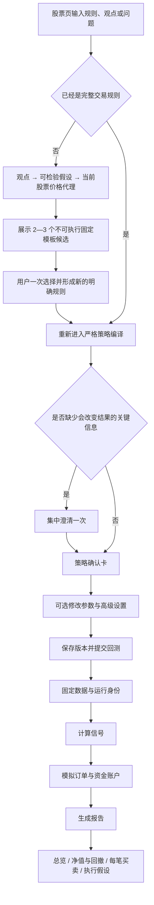
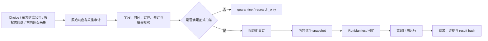
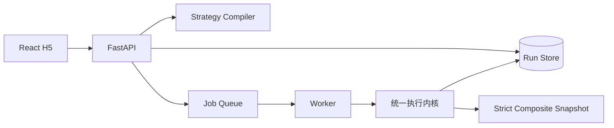
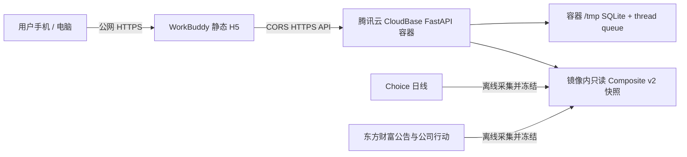

# A 股单股自然语言策略回测 Spec

> 文档状态：Living Spec（持续维护）
> 当前版本：`spec@2026.08.31`
> 当前工程范围：A 股、单股、只做多、日线 research demo
> 主要读者：产品、设计、数据、算法、后端、前端，以及持续参与开发的 Vibe Coding Agent
> 最后更新：2026-08-31

本文是当前项目的总规范。它不只回答“要做什么”，还固定为什么做、用户怎么走、数据何时可得、算法如何计算、哪些已经实现、怎样才算验收，以及下一步按什么顺序建设。

当前仓库只建设“单股自然语言策略回测”纵切：用户在一只 A 股页面可以直接说买卖规则，也可以先说一个观点或问题。完整规则直接编译为受限策略；纯观点先进入不可执行的假设引导，用户选择后才重新进入同一条严格编译链。只有形成完整 StrategySpec 的内容，才能用版本化数据、A 股执行规则和资金账本完成历史回测与因果解释。

快速阅读：第一次接手先读 0、2、4、10、14 节；查单股指标直接读 7.1；改语言/DSL 读 5；改数据或事件读 6—7；改撮合/收益读 8；准备验收读 11；生成 Vibe Coding 任务卡直接使用 16.4 模板。0.4 和 10 是随工作树变化的状态快照，其余章节优先表达持久产品与工程语义。

---

## 0. 一页结论

### 0.1 项目要解决的问题

普通 A 股用户能说出“MACD 金叉买、死叉卖”，却很难把这句话准确翻成指标参数、信号确认时点、订单时间、A 股 T+1、涨跌停、费用和公司行动规则。传统回测工具通常让用户先学表单和代码，或者给出一条漂亮曲线，却解释不清每笔交易为什么发生、当时是否真的能成交。

本项目把这条链路做成：

```text
用户原话
→ 完整规则直接编译；纯观点先整理为可检验候选并由用户选择
→ 受限、可编辑的策略规则
→ 固定数据与执行假设
→ A 股订单与资金账本模拟
→ 收益、风险、基准与逐笔因果轨迹
```

AI 在这里是受约束的理解与翻译层，不是收益预测器。它可以把观点整理成可检验方向，但不能凭空创造股票、事件因果或交易规则；用户确认后的策略必须确定、版本化、可重放。

### 0.2 当前真实状态

| 能力 | 当前结论 |
|---|---|
| 单股日线技术策略 | `implemented / fixture-tested / local-real-data-verified / Live-unverified`：主链和 37 个透明日线定义已实现；换手率已使用 BaoStock 原始字段完成本地真实回测；旧公网 revision 的技术 API run 已通过，最终 clean-SHA H5 技术旅程未完成 |
| 单股日线事件策略 | `implemented / fixture-tested / local-real-data-verified / Live-unverified`：五类定期报告共有 26 条真实秒级观察，当前 producer 为 `composite:1f26…`、strict loader pin 为 `snapshot:4bd9…`；旧公网 revision 的事件 API run 已通过，最终 clean-SHA H5 事件旅程未完成 |
| 定期报告正文词频 + 成交后持有期 | `implemented / fixture-tested / Mock-verified / Live-unverified`：初始完整正文确定性计数和首次真实买入成交后第 N 个 A 股交易日退出已落地；当前 `1f26…` 的 26 条 observation 均为 `document_text=0`，需 opt-in 重采后才能 Live |
| 自然语言与观点引导 | 完整策略的确定性快路、受限 CandidateAst 与严格编译保持不变；模型 transport/bootstrap 路径已配置，较早版本有公网冒烟记录，但当前 revision 仍为 `Live-unverified`。不可执行的 `idea-route.v1` 已达到 `implemented / fixture-tested`：任意有意义输入先被理解；纯观点只生成“观点 → 可检验假设 → 当前权威 A 股页价格代理 → 2—3 个固定模板候选”，用户一次选择后才重新编译；本轮没有 Live 证据 |
| H5 | `implemented / Mock-verified / Live-unverified`：唯一入口、策略确认、运行、结果和因果轨迹已实现；154 个前端自动化测试已有 fresh 记录，最终 clean-SHA 公网 H5 的真实 API 浏览器验收尚未完成 |
| 分钟数据层 | `implemented / fixture-tested / Live-unverified`：分钟模型、Choice 解码/探针、双价格发布器/读取器已落地；没有真实分钟快照 |
| MACD 盘中策略链 | `decided / Live-unverified`：产品语义和默认执行政策已冻结；minute DSL、信号 runtime 与 matcher 未实现，前台禁用 |
| 生产上线 | `production-unavailable`：数据授权、不可变存储、权限、审计、生产演练和 A 股全标的覆盖均不足 |

### 0.3 当前最重要的交付目标

先关闭一个可信的日线 Demo，而不是继续横向堆功能：

1. 使用已经冻结的东方财富、两条策略、用户区间 2021-08-06 至 2026-08-06，以及预热/结算扩展区间 2021-02-07 至 2026-08-20；
2. 由主线程形成 clean integration commit，并在该 SHA 上重跑全部代码与文档门禁；
3. 在 final clean SHA 下加载已经通过当前 strict loader 的 `composite:1f26…` / `snapshot:4bd9…` 并通过 `/ready`；
4. 在该 SHA、同一份快照、同一 1,000,000 元资金和同一执行规则下，重跑一条技术策略和一条“秒级可得时间、日线撮合”的年度报告策略；
5. 在 320/390/768/1280px H5 上完成真实 API 的输入、策略确认、运行、结果和逐笔因果验收；
6. 再开始分钟 MACD、更多透明指标和更多真实事件覆盖。

### 0.4 本次交付的证据边界

截至 2026-08-31 本次收口检查，Spec 不预填最终 Git SHA；可重放身份以交付后的 clean 40 位提交和运行证据为准：

- strict readiness 对 dirty 或伪 revision 正确 fail closed；正式运行必须来自 clean 40 位 Git SHA；
- 后端自动化、Ruff/format、Pyright、Catalog、schema export、Alembic 和 diff check 已有本轮 fresh 记录；精确测试数不在本 Spec 固化，最终提交后的同批重跑结果由交付报告记录；
- 当前真实五年 producer 为 `composite:1f26afb8b1223b656397abd5c99ce5a0ac9ed6593c3dbf7bdc46fb5a61bb9b8b`，当前代码的 strict loader pin 为 `snapshot:4bd9ae887af1cac159bf2d831313c73d839a313b11a746c015ea19fa3d5728cd`；本地 `.env` 已指向该 Composite；
- 该工件覆盖 2021-02-07 至 2026-08-20，执行价、信号价和 session 各 1,340 行、公司行动 9 条，五类定期报告共有 26 条 `vendor_observed + validated` 秒级观察：年报 6、半年报 5、季报 10、业绩预告 3、业绩快报 2；并保留 9 页/862 条公告查询 hash；
- 当前 26 条 observation 的 `document_text` 全部为 0；这不影响标题级五类事件回测，但正文词频策略仍必须 fail closed；
- 较早公网 revision `4dc55904f38d4d26b6ed3e29fe8a729f529da66c` 上的技术 `run:b2778dc334cc4eb3b39ac9eab2efd54f` 与事件 `run:12fe45b6624249d5a6bba3458751cc98` 已再次通过，且引用 `1f26…/4bd9…`；它们只证明旧 revision 的公网 API，不替代当前工作树或老板实际使用的 H5 浏览器验收；
- 前端 TypeScript、ESLint、154 个 Vitest、diff check 与 production build 已有本轮 fresh 记录；Mock 仅是开发期“界面预览”，最终交付入口必须使用真实 API，不得显示或回退为 Mock；
- 当前没有最终 clean-SHA Live run ID、result hash 或真实 API 浏览器 Network/后端日志证据。

这些状态区分的是代码、夹具、本地真实数据、Mock 与 Live 证据，不代表产品语义发生变化。新 exact 快照与 Live E2E 完成后再更新本节。

### 0.5 不允许出现的“完成假象”

- Coverage Catalog 共登记 182 个 A 股单股指标/数据项：技术、价格行为、量能与流动性 132 项中只有 37 个 `stable`、74 个 `research_only`、21 个 `unavailable`，另有 50 个不可用的单股基本面/估值条目；目录登记不等于可回测。
- Event Taxonomy 有 160 个事件代码，不等于 160 个事件已经有真实历史数据；当前 69 个代码路径也不等于 69 类都完成了 strict E2E。
- Mock 页面跑通不等于真实 API、真实数据和真实撮合跑通。
- 有 checksum 不等于原始数据已经进入不可变对象存储。
- 有一条事件样例不等于该股票、该区间、该事件类型已经查全。
- 日线 MACD 结果不能冒充盘中 MACD 回测。
- 旧 run 证明过链路，但使用过已经废止的容量、基准或公司行动口径，不能继续当本轮验收证据。

---

## 1. 文档治理与状态词

### 1.1 真相源优先级

发生冲突时按以下顺序处理：

1. 本 Spec 中已经确认的产品语义和 ADR 中已冻结的技术决策；
2. 当前 JSON Schema、Catalog、领域模型和 API 契约；
3. 可复查的自动化测试、数据快照、run manifest 和真实运行证据；
4. [验收标准](00-acceptance.md)与[当前状态](status.md)；
5. [SPARK 决策与问题台账](SPARK.md)；
6. Mock、截图、历史 run 和口头描述。

代码与已确认 Spec 冲突时，不能默认“代码就是对的”。先判断是 Spec 已变更但未落代码，还是代码缺陷；结论必须同时更新实现、测试和文档。

### 1.2 状态词

| 状态 | 含义 | 可以怎么说 |
|---|---|---|
| `decided` | 产品或工程语义已经冻结，未必已实现 | “口径已确认” |
| `implemented` | 代码与契约已经落地 | “代码已实现” |
| `fixture-tested` | 确定性夹具或自动化测试已通过；不说明真实数据状态 | “夹具与自动化已验证” |
| `local-real-data-verified` | 本地真实物理数据、内容身份与正式 loader 校验/Pin 已通过 | “本地真实数据已验证；不等于 Live E2E 或生产授权” |
| `Mock-verified` | Mock 交互已通过浏览器验证 | “仅交互演示已验证” |
| `Live-unverified` | 仍缺最终 clean SHA 的真实 API、真实数据与浏览器闭环 | “Live 尚未验收” |
| `production-unavailable` | 生产授权、存储、安全或运维条件尚不具备 | “不可生产放行” |

同一能力可以同时拥有多个状态，例如 `implemented / local-real-data-verified / Live-unverified`。Catalog 自己的 `stable / research_only / unavailable` 是数据定义发布级别，不属于本表，不能互相替代。运行时的 `unsupported / rejected / quarantine` 是处理结果，也不属于本表。

本轮不设单一“已证明”标签。只有第 11.5 节全部成立后，才可用普通中文写“最终验收通过”；目录里有、页面能点、旧 run 曾经跑过或测试全绿都不足以得到该结论。

### 1.3 变更规则

- 产品语义变化：先更新本 Spec，再更新 Schema、Catalog、实现和测试。
- 算法公式变化：必须升级 `definition_version`，旧 run 不得静默重算。
- 数据口径变化：必须产生新 snapshot ID/checksum，旧结果保留但标为旧口径。
- 执行假设变化：必须进入配置 hash、RunManifest 和结果页。
- 已验收规则被替代：新增 ADR 或明确替代关系，不能直接改掉历史说明。
- 每次发布前同步更新本文件的实现矩阵、验收状态和路线图。

### 1.4 开源优先与胶水代码

项目采用“成熟能力解决通用问题，胶水代码连接业务流程，自研只服务不可替代业务差异”的复用策略。
FastAPI、Pydantic、Pandas、PyArrow、DuckDB、SQLAlchemy、Alembic、RQ、React 等已经承担通用基础能力；
定期报告 PDF 内嵌文本抽取也已通过薄 adapter 实际复用 `pypdfium2`，不自行重写 PDF 解析器，当前不提供 OCR；
标准指标已经建立可替换 `IndicatorBackend`，首个 MOSS/pandas adapter 只将 EMA、MACD 放入通过夹具对拍的
采用白名单，RSI 因初始化与零损失语义不一致明确不接管；该 adapter 仍不是运行时默认。交易日历和统计
下一步继续优先通过可替换 provider 复用成熟库，先与现有透明实现双跑对齐，再逐项迁移，不直接重写或
整体替换主引擎。Vibe 风格的受限候选生成与日线采集 adapter 也只停留在端口层，不把上游领域模型带入主链。

A 股历史可得时间、不可变快照、T+1、停牌/涨跌停、集合竞价、公司行动、因果轨迹、受限 DSL 与运行身份
属于本项目不可替代的业务差异，仍由领域层裁决。完整候选、许可证、接入和回滚门禁见
[开源复用与胶水代码](reference/reuse-first.md)、
[MOSS 与 Vibe-Trading 胶水化采用方案](reference/oss-adoption-moss-vibe.md)和仓库根目录
`THIRD_PARTY.yml`。

---

## 2. 产品边界：单股策略回测

### 2.1 当前用户任务

用户最终要回答的问题固定为：“如果当前股票按这条规则买卖，过去会怎样？”用户不必一开始就会写规则；他也可以先说一个观点或问题，由系统帮助把它收敛成可检查的策略候选。

输入是当前权威 A 股页面上下文、自然语言规则或观点、回测区间和可编辑执行假设。观点在用户选定候选前没有收益结果；完整规则确认后，输出才是策略收益、同约束买入持有基准、风险、交易列表和完整交易因果轨迹。现有回测纵切为 `implemented / fixture-tested / Mock-verified / Live-unverified`；新增 `idea-route.v1` 仅为 `implemented / fixture-tested`。

### 2.2 当前仓库范围

当前 `astock-backtest-engine` 的产品和引擎契约只承诺：

- A 股；
- 单只股票；
- 只做多；
- 单标的仓位；新建指标策略每次新的买入触发可继续买入，受剩余现金与执行约束限制（见 8.2）；
- 当前可执行主链为日线；
- 任意有意义的自然语言先进入理解层；纯观点只生成不可执行的固定模板候选；
- 自然语言生成受限 Strategy DSL；
- 初始完整定期报告正文确定性词频，以及首次实际买入成交后第 N 个 A 股交易日退出；
- 历史研究回测，不下真实订单；
- H5/WebView 手机优先。

当前不承诺：股票池、组合、融资融券、实盘下单、自动寻优、用户 Python/SQL、Tick/L2 队列、任意表达都能直接变成可执行策略、收益预测或投资建议。产品承诺的是“有意义的输入先被理解或明确解释边界”，不是“任何一句话都自动回测”。

“单只股票”表示一次只运行一个规范标的，不表示产品固定东方财富。H5/WebView 必须接收宿主股票页传入的任意合法 A 股规范代码，并把它送入编译、快照覆盖检查和回测；非法、缺失、非 A 股或交易所后缀错配必须 fail closed，不能静默切回另一只股票。

当前前端已实现 URL/宿主参数入口：`instrument_context` 或 `symbol` 传规范代码，`market` 如提供只能为 `CN_A`。URL 的 `instrument_name` 或 `name` 只是未校验文本，不能作为证券身份、编译上下文或回测路由依据；在证券主数据 resolver 接通前，无可信名称时只展示规范 symbol。独立打开且宿主没有传股票时，东方财富 `300059.SZ` 仅作为演示默认值。本轮 11.6 继续用 `300059.SZ` 做可重放的 golden fixture；这只是固定验收样本，不是产品范围。某只股票缺少行情、session、公司行动或事件 acquisition coverage 时，应明确返回“当前数据未覆盖该股票/区间”，不能借用 fixture 数据，也不能据此声称任意 A 股都已有真实数据能力。当前状态为 `implemented / fixture-tested / Mock-verified / Live-unverified`。

---

## 3. 用户、场景与成功标准

### 3.1 目标用户

核心用户是能用普通中文描述交易想法、但不愿学习量化代码和复杂撮合设置的 A 股个人研究用户。用户可能知道 MACD、均线、RSI 或“年报发布”，但不一定理解复权、信号确认、T+1、成交容量和公司行动。

### 3.2 核心任务

用户应当能够：

1. 在某只股票页面输入一句规则、观点或问题；完整规则直达确认，纯观点只需从 2—3 个可检验候选中选择一次；
2. 10 秒内看懂系统还原的买入、持有、卖出逻辑；
3. 不展开高级设置也能使用可信默认值开始回测；
4. 看懂最后赚还是亏、相对基准、最大回撤和完整交易数；
5. 点开任意交易，知道信号何时确认、何时委托、是否成交以及为什么；
6. 看到数据来源、时间质量和运行身份，而不是只相信 AI 结论。

### 3.3 北极星体验

不是“让不会量化的人一键发现赚钱策略”，而是：

> 让普通用户用一句话建立一条可检查、可复现、不过度乐观的历史交易规则。

### 3.4 产品原则

1. AI 负责理解、收敛和翻译，不负责自由发挥；观点可以变成候选假设，但不能凭空变成事件因果或可执行策略。
2. 完整策略不追问；纯观点只做一次候选选择；只有缺失信息会实质改变结果时，集中澄清一次。
3. 用户原话、规范化策略和实际执行规则同时保存。
4. 收益、风险、基准和逐笔原因必须同时出现。
5. 未成交和订单过期与成交一样重要。
6. 所有时间都遵守“当时实际可获得”，禁止未来信息。
7. 不确定时保守拒绝，不用乐观假设把曲线补完整。
8. 首屏简单，专业参数渐进展开。
9. 研究回测、模拟资金账本和实盘交易是不同产品状态；当前只做研究回测。
10. 不使用“稳赚”“战胜市场”“AI 选出最佳策略”等诱导文案。

---

## 4. 用户流程与交互状态

### 4.1 主流程



### 4.2 初始输入状态

首屏只保留：

- 当前股票名称与代码；
- 一块明显的自然语言策略输入框；
- 2—3 个可点击示例；
- 一个主按钮“识别交易规则”；
- “仅做历史回测，不构成投资建议”的简短说明。

首屏不能出现完整参数表、成交成本表、数据来源长说明、运行证据或多张独立悬浮卡。它应有对话感，但不是与虚拟人格闲聊：输入框允许规则、观点或问题；系统用规整的“理解 → 候选 → 策略确认”推进，不用开放式长对话代替产品状态。

默认演示：

```text
东方财富 MACD 金叉买入，死叉卖出，回测近 5 年
```

事件演示：

```text
东方财富年度报告发布后买入，MACD 死叉卖出，回测近 5 年
```

### 4.3 识别中

- 文案：“正在还原交易规则”；
- UI 演示等待控制在 600—1000ms；
- 不循环播放虚假的长思考过程；
- 真实 API 的快慢由请求状态决定，不伪造算法进度。

### 4.4 澄清

当前真实后端在缺少股票、缺买入条件或缺卖出条件时，分别只返回一次方向正确的集中澄清，并让用户编辑原话。纯观点的 2—3 个固定模板候选也是一次集中选择，不是多轮追问；选择只是生成一条新的明确规则，仍要重新经过现有编译器。系统没有“金叉买、死叉卖”等统一默认交易策略；统一的只有资金、费用、容量、有效期等版本化执行默认。产品目标还允许在“盘中还是收盘确认”等会改变执行语义的问题上集中澄清一次，但前提是两个选项都存在真实可执行链路。

规则：

- 一次只呈现一组集中问题；
- 观点候选一次最多 2—3 个，且只能来自当前能力投影中真实可编译的服务端固定模板；
- 每个问题说明为什么需要确认；
- 有安全默认时标注推荐项；
- 不把内部阈值或实现细节推给用户；
- 未发布的“大跌反弹”等模板直接说明暂不支持，不反复问用户阈值；
- 当前分钟引擎未接通，不能让用户选择“盘中触发”后跑一条日线假结果。
- 用户没有选定观点候选前，不生成 StrategySpec、strategy hash 或 run，也不自动提交回测。

### 4.5 策略确认卡

首层必须收拢成一条一眼能看懂的因果轨道：

```text
MACD 金叉 → 买入 → 持有 → MACD 死叉 → 卖出
```

当前日线执行细节放在“参数与回测设置”中：

```text
收盘确认 → 下一可交易 session 使用日线开盘价代理尝试
```

事件策略：

```text
年度报告首次可获得
→ 按 09:15 cutoff 选择当日或下一可交易 session 的开盘价代理尝试买入
→ 持有
→ MACD 死叉
→ 下一可交易 session 的开盘价代理尝试卖出
```

日线 OHLCV 只有当天开盘价，没有集合竞价逐笔、排队和精确成交状态。结果中的 `filledAt=09:30` 只是统一记录边界，必须同时显示 `daily_bar_open_proxy / not_exact`，不能解释为真实发生在 09:25 或 09:30 的成交。

卡片首层只显示股票、策略标题、核心轨道和一行“参数与回测设置”。参数、成本、数据来源和专业解释默认折叠。手机端主操作可吸附到底部并适配 iOS safe area。

### 4.6 可编辑设置

普通设置：

- 指标参数；
- 回测开始/结束日期；
- 初始资金，默认 1,000,000 元。

高级设置：

- 分配比例，默认 100%；
- 佣金率，默认 0.03%；
- 最低佣金，默认 5 元；
- 单边滑点，默认 5 bps；
- 成交量参与率，默认 5%；
- 成交容量模式，默认 point-in-time volume；
- 涨跌停处理，默认等待可交易证据；
- 未完成退出是否重试及最多次数；
- 是否运行固定的执行压力测试。

修改任一项都必须生成新的精确策略或配置 hash，不能只改页面显示。

### 4.7 回测运行状态

只展示真实阶段：

```text
queued
→ running:data
→ running:signal
→ running:execution
→ running:report
→ succeeded | failed | cancelled
```

对应中文：等待计算资源、固定并读取数据、计算技术与事件信号、模拟 A 股订单与成交、生成回测报告。用户可请求取消；取消不是立即删除，状态必须经过 `cancel_requested/cancelled` 或任务终态。

### 4.8 成功结果

首屏固定回答四个问题：

1. 策略最后赚了还是亏了；
2. 相比同约束的同期持有跑赢还是跑输；
3. 最大回撤多大；
4. 一共完成多少笔往返交易。

结果分为：

- 总览；
- 净值与回撤；
- 每笔买卖；
- 执行假设与运行证据。

净值图同时展示策略资金账户、同期持有资金账户、买点、卖点和未成交点。手机端默认降低点位密度，点击后再展示时间、信号、委托、成交价/量、涨跌停、容量和 T+1 影响。

### 4.9 交易因果轨迹

这是核心视觉与解释能力：

```text
用户原话
→ 规范化条件
→ 信号确认
→ 决策
→ 委托
→ 成交 / 部分成交 / 未成交 / 过期
→ 资金与净值变化
```

一条活动至少保留 `chain_id`、`decision_id`、`order_id`、`fill_id` 和父子关系。信号、委托、成交、部分成交、未成交、订单过期必须有不同文字和形状，不能只靠颜色。

### 4.10 空、失败与拒绝状态

| 状态 | 必须告诉用户什么 | 下一步 |
|---|---|---|
| 观点已理解、待选择 | 系统如何理解观点、把它改写成了什么可检验假设、为什么只把当前股票当价格代理；候选尚不可执行 | 从 2—3 个固定模板候选中选择一个，再检查完整策略 |
| 已理解但不可执行 | 已理解的意思，以及分钟、做空、非 A 股、操纵性要求、无可靠事件数据等哪一条硬边界阻止执行 | 查看最接近的诚实改写；不得伪造可执行结果 |
| 空输入或协议无效 | 输入为空、只有噪声或请求格式错误 | 补充一句有意义的规则、观点或问题 |
| 模型服务暂不可用 | 观点引导服务暂时不可用，不等于系统“无法理解” | 保留原话并重试，或直接输入完整交易规则 |
| 缺少股票 | 当前无法确定标的 | 输入 6 位代码或从股票页重试 |
| 数据不完整 | 缺哪个数据集、时间区间或覆盖证明 | 缩短区间或等待数据修复 |
| 事件时间质量不足 | 只有日期/分钟、来源未验证或记录冲突 | 作为研究证据查看，但不能正式回测 |
| 区间内没有交易 | 没有信号、信号无法成交或持仓未闭合 | 展示信号/未成交原因，不把 0 笔写成系统错误 |
| 回测失败 | 稳定错误码、可理解原因、run ID | 修正参数或联系数据/工程负责人 |
| 用户取消 | 已取消到哪个阶段 | 修改后重新提交 |
| 盘中策略未接入 | 当前缺少分钟数据与执行模型 | 可改用日线收盘确认，或等待分钟能力 |

### 4.11 响应式与可访问性

- 以 390px 为主要宽度，兼容 320、768、1280px；
- 320px 不允许横向滚动；
- 不依赖 hover；
- 关键按钮适合单手触控；
- 输入和设置有明确 label，键盘焦点可见；
- 支持 `prefers-reduced-motion`；
- 桌面端可使用左侧策略、右侧结果，但信息层级不因宽屏而全部展开；
- 沿用当前新版东方财富橙色语义、规整对话和渐进卡片风格，涨跌仍配合文字、符号和形状表达；
- 不回退旧红白主题，不因工程修复整体换皮；
- Spec 只固定可信度、信息层级、核心因果轨迹、响应式和可访问性，不写死像素、字体、圆角或卡片尺寸；
- 避免通用后台、黑底荧光终端、紫色 AI 渐变、玻璃拟态、过度圆角和满屏互不关联的卡片。

---

## 5. 自然语言、编译器与 Strategy DSL

### 5.1 当前实现

当前语言入口有两条明确分工、最终汇入同一严格编译器的路径。

#### 5.1.1 已经是完整策略：快路与受限翻译

确定性中文规则解析器仍是默认快路：

```text
utterance + instrument_context + as_of_date
→ Candidate AST
→ Catalog ID / 参数 / trigger
→ StrategySpec
→ Schema + Catalog 校验
→ canonical JSON + SHA-256
```

37 个可执行指标定义不等于任意中文说法都能直接变成 StrategySpec；每个新增同义词、参数表达和组合语法都需要 golden case 和回归测试。完整策略的最终执行仍只允许落入受限 DSL 的合法候选，不能为了显得灵活而猜错规则。

只输入“MACD”“RSI”这类裸指标时，买入、卖出方向都不完整，必须集中澄清一次，不能静默补成产品预设策略；只有补齐关键交易方向后才进入确认卡。这是当前 P0 真实入口验收项。

方向语义检查曾因 `_has_unmodeled_direction` 缺失出现回归；当前工作树已补齐 helper，并通过编译矩阵和本轮全量 Python 门禁。当前状态是 `implemented / fixture-tested / Live-unverified`，仍需在最终 clean integration SHA 上复验。

为了让产品既灵活又不让模型自由编策略，冻结 `deterministic_fast_path_llm_bounded_candidate.v1`：

```text
常见、明确表达
→ 继续走确定性解析器快速通道

其余自然表达
→ LLM 只做“翻译”，生成 1—3 个受限 Candidate AST
→ 服务端按 JSON Schema、Catalog、参数类型、时间语义、数据能力和矛盾规则逐项校验
→ 唯一高置信候选进入策略确认卡
→ 会实质改变结果的歧义集中澄清一次
→ 没有合法候选就明确拒绝
```

股票简称不单独增加确认轮次：如“茅台网格”，完整证券目录或证券搜索可唯一对应贵州茅台时，直接沿用原始交易要求生成方案，在现有股票字段展示全名和代码并允许修改。“东财”等非字面简称可使用证券搜索的唯一已核实结果；模型自行猜测的代码不能作为身份依据。只有多只匹配（如“平安”）、结果截断或身份查询未完成时才澄清；不把简短代码前缀或单字自动绑定。目录采集时间不等于歧义或历史可交易性证明，后续证券详情和行情校验保持不变。

股票身份容错贯穿新建、灵感、补充确认与换股入口，不靠个股特例：忽略名称内部的输入法横向空白，将模型提取的紧凑名称定位回原文中的唯一片段，并保留真实字符区间作为证据；不删除标点合并两只股票、不跨行拼接、不同名称或多处匹配仍拒绝自动对齐。名称与代码同时给出时仍须一致。规则条件、比较方向、数值和交易顺序不因股票名归一化而改写。

股票身份匹配只关注 A 股，基金、债券、指数、港股、美股等不参与简称的唯一性判定。证券搜索的分页标志不能直接代表 A 股歧义。混合资产满页结果仅含零只或一只 A 股时，最多核对 5 页；过滤其他资产之后，只有确认无后续页的唯一 A 股可自动绑定。若后续发现第二只 A 股、达到页数上限或查询失败，仍保留不确定性。旧版首屏缓存按需重新核对，记录已核对页数，避免反复查询。

未指定突破边界的“放量突破买”按量价两个条件校验，不能把价格条件硬编码为某一个指标：受支持的创新高或通道突破等表达须保留方向、量能条件和 AND 关系，未说的周期仍走既有默认/建议披露。不因此宣称创新高、均线和通道公式等价；用户明确指定突破均线、固定价格或历史边界时继续核对原指标、周期和阈值。只剩放量、方向相反或改成 OR 均不能通过。

小白解释：LLM 像翻译员，不像基金经理。它可以把“跌得很深后反弹就买”翻译成系统认识的候选规则，但不能自己发明指标、事件、参数或成交方式。最终能不能运行，仍由确定性白名单和用户确认决定。

`VibeBoundedCandidateGenerator` 与 `HybridCandidateGenerator` 已实现上述受限 JSON 候选、最多 3 个候选、
置信度阈值、确定性快路和 fail-closed provider 错误，并通过夹具验证；候选仍必须进入现有 Catalog、Schema、
股票和时间语义门禁。模型 transport 与 bootstrap 配置路径已经存在；较早 provider 版本曾有公网冒烟，
但这只作普通历史证据。当前 revision、完整持久化 provenance 和真实 API/H5 仍需重新验收，
因此执行链整体仍为 `Live-unverified`。模型不能生成或执行 Python、SQL、Pine Script 或任意代码。

#### 5.1.2 还不是策略：`idea-route.v1`

任意有意义的自然语言都先被接住。纯观点、情绪或问题不会直接进入 StrategySpec，而是进入独立、不可执行的
`idea-route.v1`：

```text
观点或问题
→ 复述用户真实意思
→ 形成一个“尚未证明”的可检验投资假设
→ 只把当前权威 A 股股票页映射为价格行为代理
→ 从当前能力投影中选择 2—3 个服务端固定模板候选
→ 用户一次选择
→ 形成新的明确策略原话
→ 重新走 5.1.1 的现有严格编译、确认与提交链
```

这条路线借鉴 Vibe-Trading“需求模糊时给 2—3 个方向让用户选择”的工作流，但不复制其任意代码生成或
多市场执行语义。模型只能复述观点、提出待检验假设并选择固定模板 ID；候选中的买卖条件、参数和建议原话都
来自服务端模板注册表。模型不得发明股票、公式、事件、参数或成交语义，也不得自动选择历史表现最好的候选。

第一版资产映射只信任宿主传入并通过校验的当前 A 股规范 symbol。它仅表示“用当前股票的历史价格行为检验这
个假设”，不表示观点与该股票存在真实业务或因果关系；没有可信页面标的时继续走既有缺股票澄清，绝不猜热门股。
在用户选择前，候选只处于 `understood / guidance` 的产品阶段，不包含 StrategySpec、strategy hash 或 run；
用户选择后还必须再次通过现有硬门禁并显式点击开始回测。该能力当前仅为 `implemented / fixture-tested`，没有
当前版本的真实 API/H5 Live 证据。

### 5.2 编译状态

现有编译 API 的可执行状态保持不变：

- `ready`：得到完整 StrategySpec 和 strategy hash；
- `needs_clarification`：缺少股票、缺入场条件或缺退出条件；每种情况只集中询问一次，并准确说明需要补哪一侧；
- `unsupported`：没有候选或模板未发布；
- `invalid`：参数、Catalog 或 Schema 校验失败。

`understood` 与 `guidance` 是 `idea-route.v1` 的非执行产品阶段，不是 StrategySpec 成功态；API 可在
`needs_clarification` 中携带该引导。只有用户选择并重新编译为 `ready` 后，才生成策略身份。普通有意义输入不再
落入模糊的“无法识别”；如果语言服务瞬态不可用，应返回可重试的服务状态，而不是把它描述成用户的话没有意义。
`unsupported` 用于“意思已经理解，但当前硬边界或数据能力无法诚实执行”；`invalid` 主要保留给空输入、协议与
参数/Schema 错误。

每个默认值都应写入 provenance，例如股票来自原话或页面上下文、开始日期来自默认五年、资金来自默认 1,000,000 元、指标参数来自 Catalog。

#### 5.2.1 有主题但不构成策略的口语输入

`"我讨厌特朗普"` 这类输入表达了主题和负面态度，但没有给出可执行交易规则。系统先用中性文字复述该态度，
说明它只能形成待检验假设；若页面已有可信 A 股 symbol，则只给出 2—3 个完整、固定且当前可编译的价格行为候选，
例如趋势确认、超跌反转和动量确认。每个候选必须明确标注“用当前股票价格做代理”，不能写成“特朗普导致该股
涨跌”。用户选择一个候选后，系统把服务端模板原话重新送入现有编译器；未选择前没有策略、hash 或回测任务。

当前没有已发布、具备严格点时覆盖的“特朗普/关税/政治主题”事件数据，因此不得构造 `event.trump`、不得把新闻
搜索结果冒充历史事件信号，也不得宣称完成了政治事件因果回测。若未来获得可靠事件快照，仍需按 Event v2 的来源、
时间质量、覆盖与 revision 门禁另行发布。当前 `idea-route.v1` 状态仅为 `implemented / fixture-tested`；模型
transport 的旧版本公网冒烟不证明这条新路线已经 Live。

### 5.3 DSL v1 约束

| 项目 | 约束 |
|---|---|
| 市场 | `CN_A` |
| 标的 | 一个 `000000.SH/SZ/BJ` 规范代码 |
| 方向 | `long_only` |
| 条件 | indicator、event、all、any、not |
| 入场 | 一个有界条件树 |
| 退出 | `first_of` 条件集合 |
| 复杂度 | 最多 64 个节点、深度最多 8 |
| 指标参数 | 每个条件最多 16 项，必须满足 Catalog 类型和范围 |
| 事件属性 | 每个条件最多 8 项标量过滤 |
| 当前 timeframe | 仅 `1d` |
| 当前确认 | `bar_close_confirmed` |
| 当前成交 | `published_daily_open_proxy`；技术信号用下一可交易 session，事件按 09:15 cutoff 选择当日或下一 session；不声明精确集合竞价成交 |
| 持仓 | 单标的；新策略按新买入触发累加，旧版显式不加仓策略保留原口径，见 8.2 |
| T+1 | 固定开启 |

技术策略示例：

```json
{
  "schema_version": "strategy.v1",
  "catalog": {
    "catalog_id": "cn_a.signals",
    "release_version": "2026.08.29"
  },
  "instrument": {
    "market": "CN_A",
    "symbol": "300059.SZ",
    "position_mode": "long_only"
  },
  "entry": {
    "type": "indicator_condition",
    "indicator_id": "technical.macd",
    "definition_version": "1.0.0",
    "params": {"fast": 12, "slow": 26, "signal": 9},
    "timeframe": "1d",
    "evaluation_mode": "bar_close_confirmed",
    "trigger": "golden_cross",
    "value": null
  },
  "exit": {
    "op": "first_of",
    "children": [{
      "type": "indicator_condition",
      "indicator_id": "technical.macd",
      "definition_version": "1.0.0",
      "params": {"fast": 12, "slow": 26, "signal": 9},
      "timeframe": "1d",
      "evaluation_mode": "bar_close_confirmed",
      "trigger": "death_cross",
      "value": null
    }]
  },
  "execution": {
    "timezone": "Asia/Shanghai",
    "entry_policy": "next_tradable_session_open",
    "exit_policy": "next_tradable_session_open",
    "data_capability": "daily_ohlcv",
    "execution_resolution": "1d",
    "evaluation_frequency": "1d_close",
    "position_policy": "single_position_no_pyramiding",
    "t_plus_one": true
  },
  "backtest": {
    "start": "2021-08-06",
    "end": "2026-08-06",
    "initial_cash_cny": 1000000
  }
}
```

### 5.4 自然语言扩展规则

新增表达必须满足：

1. 先有可执行 Catalog ID 和稳定算法；
2. 明确买入句和卖出句，不把一个指标默认复制到另一侧；
3. 用户明说的周期、方向、比较符和阈值优先于默认值；
4. 否定、歧义和不完整表达无法精确表示时拒绝，不反向猜测；
5. 同一句规则的规范化 JSON 必须确定；
6. 每个新增表达至少包含正例、歧义例、否定例、参数边界和组合例；
7. 语言层不能偷偷改变执行时点。
8. LLM 候选只有完全落入现有 Catalog/Schema 才能进入确认卡；任何未注册名称、公式、事件或参数都拒绝。
9. 同一句原话、相同股票上下文、Catalog、模型和提示版本必须保存可追溯候选；用户最终确认的 canonical JSON 才是回测身份。
10. `idea-route.v1` 只负责“观点 → 待检验假设 → 当前股票价格代理 → 固定模板候选”；候选必须来自当前能力投影中真实可编译的服务端注册表，模型只选择模板 ID，不能改写模板。
11. 观点候选最多 2—3 个；用户一次选择后必须作为新的明确原话重新走完整编译，不允许从引导对象直接构造 StrategySpec 或 run。
12. 当前页面的权威 A 股 symbol 是首版唯一资产映射；页面展示名、模型建议和用户情绪都不能替换它。缺标的就集中澄清，不猜股票。
13. 没有可靠点时事件快照时，只能把观点映射为价格行为代理，不能伪造主题事件、新闻因果或“观点导致股价”的结论。
14. 语言服务不可用是可重试的服务故障，不是“用户表达无法理解”；做空、分钟、非 A 股、操纵性要求等则在理解后按硬边界明确拒绝或给出诚实改写。

### 5.5 指标与包装能力的边界

能由固定输入、公开公式和黄金样例稳定复算的指标，可以发布为本地透明定义。只能由供应商提供的估值、财务、资金流、筹码、龙虎榜等序列，必须原样保存供应商、字段、单位、版本和 point-in-time 语义。

“彩带”“四合一”“主力介入强度”“彼得林奇 0—100”等无法从名称唯一还原的包装能力，在没有供应商原始序列或可验证公式前不做同名仿制。可以设计透明、不同名的新指标，但不能声称复刻了原产品算法。

### 5.6 定期报告正文词频与持有期表达

首版支持的目标表达是：

```text
完整年报正文里“AI”出现超过 5 次就买入，首次实际买入成交后第 3 个 A 股交易日卖出
```

编译器必须把“报告正文”“词项”“比较符/阈值”和“首次实际成交后的 A 股交易日数”分别写入受限策略对象，不能把标题、搜索摘要或报告期当成正文，也不能把“3 天”偷偷解释成自然日。词频与退出条件都进入 canonical JSON、provenance 和策略 hash。

当前这条确定性自然语言、DSL、服务端校验、执行和策略确认卡已达到 `implemented / fixture-tested / Mock-verified`。Mock 只证明用户能看懂规则，不证明真实报告已经下载、词频已经在真实正文上计算，或订单真实成交；当前 `composite:1f26…` 的 26 条 observation 均为 `document_text=0`，所以正文词频能力仍为 `Live-unverified`。

---

## 6. 数据架构与 point-in-time 口径

### 6.1 数据链路



运行时不访问供应商 API，也不临时搜索网页。采集、校验、快照生成和回测执行是四个独立阶段。

### 6.2 strict composite 内容

当前代码契约为 `ashare-lab.event-snapshot.v2` 与 `ashare-lab.composite-research-snapshot.v2`。旧 v1 composite 即使文件仍在磁盘，也不能被当前 strict 运行时接受。

Registry 的正式选择语义是：提交端携带 `producer_snapshot_id` 或等价显式内容身份时，只校验并 pin 该目标；旧 v1 或其他坏条目不能毒化无关 v2，目标自身缺失、损坏或不满足 coverage 时仍 fail closed。无显式目标的全扫描继续对任一坏条目 fail closed。当前有效 producer 为 `composite:1f26…`，由 strict loader pin 为 `snapshot:4bd9…`；较早 `composite:1b3d…` 是“目标自身不满足最新公司行动 coverage”的迁移反例，不因历史上曾 pin 成功而放行。

| 文件 | 用途 | 关键原则 |
|---|---|---|
| `daily_ohlcv.parquet` | 模拟成交、账户估值 | 不复权；不能用信号价成交 |
| `signal_daily_ohlcv.parquet` | 技术指标计算 | 后复权连续价格；只用于相对信号 |
| `corporate_actions.parquet` | 分红、送转、拆并股、配股事实 | 独立经济条款，不从复权价反推 |
| `instrument_sessions.parquet` | 板块、交易状态、前收、涨跌停、整手、tick、T+1、ST | 每根日线必须恰好匹配一行 |
| `events.parquet` | 可执行 canonical 事件 | 只含通过严格时间与来源门禁的事件 |
| `event_observations.parquet` | 多源原始观察与可选完整正文层 | 审计来源、冲突、修订和未入选记录；正文策略还要求冻结文本、文本 hash、抽取器与页面完整性元数据 |
| quarantine | 不可执行证据 | 日期级、时间冲突、实体不明或验证失败 |
| `snapshot_manifest.json` | 文件、来源、schema、覆盖与 hash | v2 还固定 `acquisitionCoverage.coverageByEventCode`；Worker 运行前重算 |

### 6.3 时间字段

| 字段 | 含义 | 不能替代成什么 |
|---|---|---|
| `fact_at` / `occurred_at` | 现实业务事实发生时间 | 不能当作投资者已知时间 |
| `source_released_at` | 来源声明的首次发布时间 | 不能被抓取时间覆盖 |
| `vendor_first_available_at` | 供应商首次可见时间 | 不能事后选多个源中的最早值 |
| `replay_available_at` | 严格回放实际使用的首次可得时间 | 不能用报告期或公告日期零点代替 |
| `ingested_at` | 系统收到该版本的时间 | 只做审计，不能倒填历史信号 |
| `revision_no` | 同一事实的修订序号 | 不能只保留最新版本 |

所有可执行时间使用 `Asia/Shanghai` aware timestamp。严格事件 Demo 只接受 `validated + exact/vendor_observed` 的秒级记录；只有日期、只有分钟、搜索收录时间、网页更新时间和今天抓到旧页面的时间都不能回填成历史可交易时间。

### 6.4 事件来源与融合

历史公告源的固定优先级为：

```text
eastmoney → ifind → rqdata → tushare
```

优先级在读取观察值前固定，绝不按事后最早时间挑选。搜索只负责发现候选 URL；不属于公告链的网页事件只能用 `web_archive` 从采集器上线后的真实 `collector_observed_at` 向前积累，不能补造过去十年的秒级历史。

当前数据状态：

| 来源 | 当前用途 | 状态 |
|---|---|---|
| Choice 个人研究账号 | 日线、交易日历、数据链探查 | Demo 可用；不是公司产品授权 |
| 东方财富公开公告 | 历史公告、秒级供应商观测、原文证据 | 当前 `1f26…/4bd9…` 固定五类定期报告 26 条秒级观察与 9 页/862 条查询 hash；原始公告页字节尚未进入不可变存储 |
| iFinD / RQData / Tushare 事件适配器 | 可插拔校验与降级 | 契约和测试已实现；本机无对应真实授权联网证据 |
| `web_archive` | 非公告网页事件前向积累 | 可用于上线后新观察；不能历史倒填 |
| 东方财富 Push2 资金流 | 研究探查 | `research_only + methodology_unknown`，不进入五年正式主链 |
| 东方财富 Push2 日线 OHLCV | 采集候选 | AKShare-shaped 请求协议与本地校验已 `implemented / fixture-tested`；当前直连被远端断开，无真实 batch/snapshot 或生产授权，不能进入运行期 |

事件产品默认回看近 5 年。2017 年至今只有可信 `eiTime/display_time`、正文证据、秒级时间质量和完整区间 coverage 同时通过时才条件开放；不先承诺完整 10 年。2017 年以前存在时间字段历史回填风险，2016 段需要交易所、监管或其他更权威来源交叉证明。

### 6.5 数据覆盖证明

“区间内 0 条事件/公司行动”也必须有成功查询、股票、时间区间、数据类型和原始响应 hash，才能解释为可信的零。没有覆盖证明时必须解释为“未知”，不能解释为“没有发生”。

公司行动覆盖证明必须包住完整 snapshot 区间；事件覆盖证明还应按标的、区间和请求的事件代码声明。任何查询失败、分页不完整、范围不足或冲突都 fail closed。

事件 v2 的每个 event code 还要固定 lane、required sources、source status、query success、row count、zero result 与 coverage basis。普通公告和重大中标需要东方财富区间查询成功；许可获批若走 `web_archive`，必须证明采集器在完整区间持续工作。单条网页观察不能冒充完整历史覆盖。历史五类工件保留了 9 页逐页 response SHA-256、862 条唯一公告与分页状态，但没有归档原始响应字节，且其 Composite 已因公司行动 coverage 升级而对当前 strict 验收失效。这些 hash 只是历史数据审计证据；新 strict coverage、不可变原始存储、授权和按 hash 找回仍未完成。

### 6.6 数据对照、缺失和冲突门禁

冻结 `cn_a.snapshot_dependency_exact_reconciliation.v1`。这里的阈值是本项目的保守工程默认，不冒充交易所统一标准：

| 数据 | 自动通过条件 | 拒绝/隔离条件 |
|---|---|---|
| 标的、交易所、交易日 | 规范身份和日期完全一致 | 任一预期正常交易 session 缺失、重复或错市场；停牌没有显式状态 |
| 不复权 OHLC | 按该证券当日有效 `price_tick` 归一后完全同档 | 相差一个价格档也不自动平均；先回到交易所/第三源裁决，仍不明则隔离 |
| 成交量 | 统一为“股”后为整数且完全一致 | 任意差异；不允许靠猜测“手/股”单位补齐 |
| 成交额 | 策略或容量使用时，统一为人民币后精确到分一致 | 只有万元/亿元舍入值，或两源冲突 |
| 复权因子 | 公司行动输入一致，供应商因子与独立计算相对误差 `<= 1e-8` | 登记/除权日、分红、送转、配股价或比例冲突，或超阈值 |
| 财务字段 | 同报告期、口径、币种和 revision 后一致 | 不用百分比容差吞掉冲突；回到正式公告裁决 |
| 事件时间 | 固定来源优先级下，时间质量与 observation 一致 | 日期级冒充秒级、时间来源不明、错股票或未解决冲突 |

OHLCV、session 和公司行动是正式运行的关键依赖，snapshot 用户区间加 warm-up/尾部结算区间内必须做到零未知缺失、零重复键、零未解决冲突。成交额、财务和事件属性实行“依赖字段门禁”：策略不用时可以记录为未验证；一旦用于信号、容量或账户，就必须达到对应完整性门槛。停牌不能用前值填充成可成交日，缺量不能自动切 `unlimited`。Choice 即使是主源也不能压过已发现的冲突。

当前发布器已实现单源完整性、日历对齐、OHLC 合法性、整数成交量和复权前缀门禁；上述跨源逐字段 reconciliation policy 为 `decided / partially implemented`，在独立对照源和全量 diff 报告接入前不能称已完成。

### 6.7 数据与复权修订

冻结 `immutable_snapshot_superseding_rerun.v1`：

1. 原 snapshot、run、result hash 永不原地覆盖；
2. 数据商修复错值、错日期或错发布时间时发布新 snapshot，并找出依赖该字段、日期及 warm-up 的受影响 run；
3. 受影响 run 创建新的重跑记录，旧结果标记“数据版本已更新”，页面默认展示新版但允许查看旧版和差异；
4. 复权因子只要在信号 warm-up 或回测区间发生变化就重跑，不设“收益差得不多就不跑”的豁免；
5. 公司后来正式发布更正/重述时，不把新数字倒灌到旧时点，而是在它真实可得时新增 revision；只有数据商纠错才改写历史数据版本；
6. 当前阶段自动重跑固定 golden 策略；普通历史用户 run 先标记并提供显式重跑，直到 run 依赖索引和资源治理完成。

该政策为 `decided / unimplemented`。当前已有不可变内容地址和 revision 字段，但尚无受影响 run 索引、superseded 关系、自动重跑任务和前端差异页。

### 6.8 数据身份与保存

每个 run 固定：

- data snapshot ID、schema version 和 checksum；
- 每个文件的 SHA-256；
- Catalog hash；
- strategy/config hash；
- 市场规则、费用、公司行动和基准政策 ID；
- engine version；
- 精确 40 位 clean Git SHA；
- random seed。

当前内容寻址目录和 checksum 只证明执行前后内容一致，不代表原始响应、快照和结果已经永久归档。生产必须增加不可变对象存储、保留策略、发布/回滚权限和按 hash 找回能力。

---

## 7. 指标与事件算法

### 7.1 A 股单股指标总账（132 项）

本节只登记可绑定到当前 A 股单只标的的技术指标、价格行为、成交量与流动性数据；基本面估值和事件代码分别列账。

Canonical 来源为 `catalogs/coverage/cn_a.v1.catalog.json`；真正允许写入 Strategy DSL 的发布清单为 `catalogs/signals/cn_a_technical.v1.manifest.json`。两者不能混读成“目录里有就能回测”。

#### 7.1.1 数量与状态

| 家族 | 总数 | `stable` 可执行 | `research_only` 研究候选 | `unavailable` 当前不可用 |
|---|---:|---:|---:|---:|
| 技术指标 `technical` | 63 | 24 | 39 | 0 |
| 价格行为 `price_action` | 39 | 6 | 33 | 0 |
| 量能与流动性 `volume_liquidity` | 30 | 6 | 2 | 22 |
| **合计** | **132** | **36** | **74** | **22** |

另外 50 个 `fundamental_valuation` 基本面/估值条目不计入本节；它们仍在 Coverage Catalog 中，但没有通过 PIT 数据门禁，不能借目录登记混入当前策略回测。事件信号另见 7.4。

每个 Catalog 条目只能有一个 canonical `status`，下列状态按 Catalog 枚举值互斥计数；不能根据一个条目同时存在“公式未完成”和“数据不足”两个 blocker 就重复计数：

- `stable`：固定公式、版本、参数、触发器、预热和时间语义已接入权威运行时，当前 DSL 可执行；
- `research_only`：Catalog 已把它登记成研究候选，但尚未发布为可执行定义；它仍可能同时缺公式或更细粒度数据，前端不得让用户开始正式回测；
- `unavailable`：Catalog 尚未接受它成为研究运行候选，通常被 PIT 数据、授权、快照或上游序列阻塞；禁止用相似的日线字段伪造；
- `rejected`：黑盒包装名、无法解释的评分或证据不足的数据，不进入 Catalog；只有取得原公式或合规的供应商原样历史序列后才能重新评审。

当前 36/74/22 数量严格反映现有 Catalog 状态，不按本 Spec 自行改写。`technical.volume_profile` 是已知元数据例外：它当前仍计入 74 个 `research_only`，但真实价位分布缺分钟/逐笔输入，运营上按 P4 阻塞处理；若后续修正为 `unavailable`，必须同时更新生成器、Catalog、测试和本节数量，不能只改文档。

三个“覆盖数”必须分别表达：

| 层次 | 当前数量 | 准确含义 |
|---|---:|---|
| 权威运行时 | 36 | DSL 已可执行的 `stable` 定义 |
| 受限候选投影 | 36 | 可由确定性快路或受限 Candidate AST 映射；并不表示任意中文表达都已验收 |
| 前端 Mock 技术策略生成 | 3 | 当前生成并演示 `technical.ma`、`technical.rsi`、`technical.macd` |
| 前端 Mock 事件策略生成 | 1 | 当前只演示 `event.financial_results.annual_report`，并持续标记为 Mock |

因此不能说“37 个指标已经在前端完整演示”，更不能说“132 项已接入”。

#### 7.1.2 37 个 `stable` 指标的共同契约

- 当前版本全部为 `1.0.0`，只支持 `1d + bar_close_confirmed`；指标事实时间为交易日 `15:00 Asia/Shanghai`，最早在下一可交易 session 使用日线开盘价代理尝试；
- 除固定名义价格 `price.close` 外，价格类技术指标读取后复权 `signal_daily_ohlcv` 以保持序列连续；`price.close`、成交、费用、持仓和估值使用不复权执行价格；成交量和成交额原样复制，不做复权；
- 所有计算使用确定性 `Decimal`；预热不足返回未知值，不把未知当 0；
- 运行时剔除成交量为 0 的停牌观察：它不推进有效窗口、不产生信号，但输出仍与原始交易日对齐；
- 除非某个定义另有明确声明，公式中的 N 根、`t-N`、连续天数、前 N 日和预热 bars 都按过滤后的“有效信号观察”计数，而不是按日历日或包含停牌的原始 session 数；
- 价格公式中的 `previous_close` / `P_(t-N)` 使用前一条或第 N 条有效的后复权信号价格；不复权 session 前收只服务涨跌停、成交和账本，不能混入技术指标；
- 上穿统一为“前值 `≤`、当前值严格 `>`”，下穿统一为“前值 `≥`、当前值严格 `<`”；持续位于一侧不重复产生交叉；
- 下表的预热是默认参数下的 Catalog 安全值。提交时仍根据实际参数、交叉需求和复合条件动态重算；
- 供应商技术序列只可用于黄金值对拍，不能静默覆盖本地透明定义。

#### 7.1.3 37 个 `stable` 指标明细

| 分组 | 定义 ID / 中文能力 | 公式与默认参数 | 可执行触发 | 默认预热与关键边界 |
|---|---|---|---|---|
| 趋势线 | `technical.ma` 移动平均线 | 最近 N 根价格的 SMA；`period=20`、`price_field=close` | 价格上穿/下穿、持续高于/低于 MA | 21 根；均值包含当日，不支持“均线向上”这类斜率语义 |
| 趋势线 | `technical.ema` 指数移动平均线 | `α=2/(N+1)`，首根价格初始化，递归等价 `ewm(adjust=False)`；`period=28` | 价格上穿/下穿、持续高于/低于 EMA | 29 根；前 N 根不暴露，不支持“EMA 向上” |
| 趋势线 | `technical.ma_cross` 双均线 | 两条包含当日的 SMA；`fast=5`、`slow=20`、`close` | 金叉、死叉、快线持续高于/低于慢线 | 21 根；必须 `fast < slow` |
| 通道 | `technical.bollinger` 布林带 | 中轨 SMA20；上下轨为中轨 `±2×` 总体标准差，`ddof=0` | 价格分别上穿/下穿上、中、下轨 | 21 根；只支持穿越，不支持“贴近轨道” |
| 趋势线 | `technical.bbi` BBI | `mean(MA3, MA6, MA12, MA24)` | 价格上穿/下穿、持续高于/低于 BBI | 25 根；四周期必须严格递增，完整参数进入策略身份 |
| 动量 | `technical.macd` MACD | 首值初始化 EMA；`DIF=EMA12-EMA26`，`DEA=EMA9(DIF)`，柱=`2×(DIF-DEA)` | DIF 金叉/死叉 DEA、DIF 上穿/下穿零轴 | 35 根；当前只在日线收盘后确认 |
| 摆动 | `technical.rsi` RSI | Wilder RSI；`period=14` | 上穿/下穿阈值、持续高于/低于阈值 | 16 根；平坦=50、无跌幅=100、无涨幅=0，阈值限 0—100 |
| 摆动 | `technical.kdj` KDJ | 9 日 RSV，K/D 平滑 3/3，K/D 初值 50，`J=3K-2D` | K 金叉/死叉 D、J 高于/低于阈值 | 10 根；零振幅 RSV=50，J 不强制在 0—100 |
| 摆动 | `technical.cci` CCI | `TP=(H+L+C)/3`；`(TP-SMA(TP))/(0.015×总体平均绝对偏差)`；`period=14` | 上穿/下穿阈值、持续高于/低于阈值 | 15 根；平坦窗口 CCI=0 |
| 乖离 | `technical.ema_bias` EMA 乖离率 | `100×(price/EMA28-1)` | 上穿/下穿阈值、持续高于/低于阈值 | 29 根；数值 5 表示 5 个百分点，EMA 依赖完整历史前缀 |
| 价格 | `price.close` 固定收盘价阈值 | 直接比较不复权日线收盘价与人民币阈值 | 上穿/下穿阈值、持续高于/低于或不低于/不高于阈值 | 2 根；收盘后确认，最早下一可交易时点执行；不以后复权价格偷换用户的名义价位 |
| 价格 | `price.return_pct` 区间涨跌幅 | `100×(P_t/P_(t-N)-1)`；默认 5 条有效日线收盘价 | 上穿/下穿阈值、持续高于/低于阈值 | 7 根；与第 5 条此前有效观察比，单位为百分点 |
| 价格 | `price.rolling_high` 滚动新高 | 当日价格严格高于此前 N 条完整有效观察的最高值；`period=20` | 创新高 | 21 根；当日不进入基线，相等不触发 |
| 价格 | `price.consecutive_up` 连续上涨 | 收盘价连续严格上涨；`days=3` | 至少连续 N 天 | 4 根；平盘或下跌都清零 |
| 价格 | `price.amplitude` 振幅 | `100×(high-low)/previous_close` | 上穿/下穿阈值、持续高于/低于阈值 | 3 根；前收是上一条有效后复权信号收盘，第一条无前收；这是收盘后日振幅而非盘中实时振幅 |
| 量能 | `market.volume` 旧版成交量倍数 | 当日量与“包含当日”的 20 日均量比较 | 大于等于/小于等于均量倍数 | 20 根；只为旧策略兼容，不是推荐 RVOL 口径 |
| 量能 | `market.amount` 单日成交额 | 快照原始成交额，单位人民币元 | 上穿/下穿金额、持续高于/低于金额 | 2 根；不以价格×成交量反推 |
| 量能 | `amount.average` 平均成交额 | 包含当日的成交额 SMA；`period=20` | 上穿/下穿金额、持续高于/低于金额 | 21 根；单位人民币元 |
| 量能 | `volume.relative` 相对成交量 RVOL | 当日量 ÷ 前 20 个正成交量交易日均量；基线排除当日，`consecutive_days=3` | 大于等于/小于等于倍数、连续 N 日放量 | 23 根；零量日不进基线；不是盘中“量比” |
| 量价 | `volume.price_confirmation` 放量涨跌 | 前 20 个有效日 RVOL；`volume_multiple=1.5`、相对前一有效收盘涨跌阈值 5% | 放量上涨、放量下跌 | 21 根；量与价必须同时满足 |
| 量价 | `technical.obv` 能量潮 | 首个有效日以自身成交量初始化；涨加量、跌减量、平盘不变 | OBV 严格上升、严格下降 | 2 根；“上升”只比较上一有效日，不是 OBV 均线趋势 |
| 量价 | `volume.price_divergence` 量价背离 | 左/右枢轴各 3；间隔 5—60；价格差 2%；OBV 差至少前 20 日均量的 1 倍 | 顶背离、底背离 | 84 根；只在右侧 K 线完成的确认日发信号，绝不回填枢轴日 |
| 状态 | `technical.trend_regime` 阶段趋势 | SMA20/60、SMA20 的 5 日斜率、Wilder ADX/+DI/-DI(14)、ADX 25、连续确认 2 日、稳定期 120 日 | 上涨、下跌、震荡三态 | 121 根；是透明状态规则，不是强弱评分；状态持续时条件可每日为真 |
| 波动 | `price.true_range` 真实波幅 | `max(high-low, abs(high-prev_close), abs(low-prev_close))` | 上穿/下穿阈值、持续高于/低于阈值 | 3 根；使用上一有效信号收盘，不是盘中实时值 |
| 波动 | `technical.atr` ATR | Wilder 平滑真实波幅；`period=14` | 上穿/下穿阈值、持续高于/低于阈值 | 16 根；单位与价格一致 |
| 波动 | `technical.natr` NATR | `100×ATR14/close` | 上穿/下穿阈值、持续高于/低于阈值 | 16 根；单位为百分点 |
| 趋势 | `technical.adx` ADX | Wilder DMI/ADX；`period=14` | 上穿/下穿 0—100 阈值、持续高于/低于阈值 | 29 根；只描述趋势强度，不单独给方向 |
| 趋势 | `technical.dmi` DMI | Wilder `+DI/-DI`；`period=14` | `+DI` 上穿/下穿 `-DI`、持续位于其上/下 | 29 根；方向来自两线关系 |
| 乖离 | `technical.bias` BIAS | `100×(price/SMA20-1)`；默认 `close` | 上穿/下穿阈值、持续高于/低于阈值 | 21 根；单位为百分点 |
| 动量 | `technical.roc` ROC | `100×(P_t/P_(t-12)-1)`；默认 `close` | 上穿/下穿阈值、持续高于/低于阈值 | 14 根；单位为百分点 |
| 动量 | `technical.momentum` MOM | `P_t-P_(t-10)`；默认 `close` | 上穿/下穿阈值、持续高于/低于阈值 | 12 根；单位与价格一致 |
| 摆动 | `technical.stochastic` 随机指标 | 14 日 `%K` 与 3 日 `%D` | K 金叉/死叉 D、K 高于/低于 0—100 阈值 | 17 根；零振幅窗口按确定性边界处理 |
| 摆动 | `technical.williams_r` Williams %R | 14 日高低区间中的收盘位置 | 上穿/下穿阈值、持续高于/低于阈值 | 15 根；范围 -100—0 |
| 通道 | `technical.donchian` Donchian | 前 20 个有效观察的最高/最低通道 | 价格上穿上轨、下穿下轨、持续在轨道外 | 22 根；基线不包含当日，避免自我比较 |
| 波动 | `technical.return_stddev` 收益标准差 | 最近 20 个日收益的总体标准差；默认 `close` | 上穿/下穿阈值、持续高于/低于阈值 | 22 根；不年化 |
| 波动 | `technical.historical_volatility` 历史波动率 | 最近 20 个日收益标准差乘 `sqrt(252)` | 上穿/下穿阈值、持续高于/低于阈值 | 22 根；年化 session 默认 252 |

`technical.trend_regime` 的上涨态必须同时满足 `close > SMA20 > SMA60`、SMA20 相比 5 日前上升、`ADX >= 25`、`+DI > -DI` 并连续成立 2 个有效交易日；下跌态完全反向；其余完成预热的情况归为震荡。

#### 7.1.4 当前自然语言默认值与运行时边界

| 用户表达 | 当前确定性映射 |
|---|---|
| RSI 超卖买、超买卖 | RSI `<30` 买、`>70` 卖 |
| CCI 低位买、高位卖 | CCI `<-100` 买、`>100` 卖 |
| EMA 乖离低位买、高位卖 | EMA 乖离 `<-5%` 买、`>5%` 卖 |
| KDJ 低位/高位 | 只有明确使用 J 值语义时才采用 20/80；笼统“KDJ 超买”不猜 K、D 或 J |
| 放量 / 缩量 | 推荐映射为 `volume.relative`：默认 RVOL `>=1.5` / `<=0.7` |
| 连续或持续放量 | 默认连续 3 个有效交易日且 RVOL `>=1.2` |

37 个运行时定义不等于任意中文都能调用：当前中文解析通常固定使用 `close`；`market.volume` 只保留旧策略兼容；“RSI 上涨”“20 日均线向上”“OBV 不下降”等未建模方向或否定表达必须 fail closed。每个定义后续还要维护“可执行 Trigger”和“已验收中文说法”两列，不能把 DSL 能力写成自然语言能力。

#### 7.1.5 74 个 `research_only` 指标完整清单

以下条目都是候选，不是当前回测能力。它们升级前必须冻结公开公式、初始化、参数、缺失值、触发器、动态预热和无未来数据测试；Catalog 中现有的摘要或参数不能直接当作产品承诺。

| 子类 | 完整清单 |
|---|---|
| 均线扩展（8） | 加权均线 `technical.wma`；成交量加权均线 `technical.vwma`；双重 EMA `technical.dema`；三重 EMA `technical.tema`；Hull 均线 `technical.hma`；KAMA `technical.kama`；ALMA `technical.alma`；三角均线 `technical.trima` |
| 动量/摆动/乖离（11） | PPO `technical.ppo`；PVO `technical.pvo`；TRIX `technical.trix`；Stoch RSI `technical.stoch_rsi`；Ultimate Oscillator `technical.ultimate_oscillator`；AO `technical.awesome_oscillator`；CMO `technical.cmo`；DPO `technical.dpo`；Fisher Transform `technical.fisher_transform`；Connors RSI `technical.connors_rsi`；ARBR `technical.arbr` |
| 通道/波动率（3） | Keltner `technical.keltner`；Parkinson `technical.parkinson_volatility`；Garman-Klass `technical.garman_klass_volatility` |
| 趋势/结构（8） | Aroon `technical.aroon`；SAR `technical.parabolic_sar`；Ichimoku `technical.ichimoku`；Supertrend `technical.supertrend`；Vortex `technical.vortex`；Mass Index `technical.mass_index`；Choppiness `technical.choppiness`；分形维数 `technical.fractal_dimension` |
| 量价衍生（9） | ADL `technical.ad_line`；CMF `technical.chaikin_money_flow`；MFI `technical.money_flow_index`；Force Index `technical.force_index`；EMV `technical.ease_of_movement`；NVI `technical.negative_volume_index`；PVI `technical.positive_volume_index`；Chaikin Oscillator `technical.chaikin_oscillator`；Volume Profile `technical.volume_profile` |
| 价格与状态（10） | 对数收益 `price.log_return`；日内收益 `price.intraday_return`；收盘位置值 `price.close_location_value`；滚动新低 `price.rolling_low`；历史新高 `price.all_time_high`；历史新低 `price.all_time_low`；开盘缺口 `price.opening_gap`；涨跌停状态 `price.limit_state`；一字涨跌停 `price.one_price_limit`；连续下跌 `price.consecutive_down` |
| K 线形态（23） | 十字星 `price.doji`；锤头 `price.hammer`；倒锤头 `price.inverted_hammer`；射击之星 `price.shooting_star`；上吊线 `price.hanging_man`；看涨/看跌吞没 `price.bullish_engulfing` / `price.bearish_engulfing`；看涨/看跌孕线 `price.bullish_harami` / `price.bearish_harami`；早晨/黄昏之星 `price.morning_star` / `price.evening_star`；光头光脚阳/阴线 `price.bullish_marubozu` / `price.bearish_marubozu`；纺锤线 `price.spinning_top`；刺透 `price.piercing_pattern`；乌云盖顶 `price.dark_cloud_cover`；红三兵 `price.three_white_soldiers`；三只乌鸦 `price.three_black_crows`；内包/外包线 `price.inside_bar` / `price.outside_bar`；NR4/NR7 `price.nr4` / `price.nr7`；宽幅 K 线 `price.wide_range_bar` |
| 量能基础（2） | 日线 VWAP `market.vwap`；平均成交量 `volume.average` |

`technical.volume_profile` 当前只声明日线 OHLCV，无法还原真实“各价位成交量分布”；除非改成明确的日线近似算法并换名，或取得分钟/逐笔/供应商原样序列，否则不得升级为 `stable`。

#### 7.1.6 21 个 `unavailable` 单股数据项完整清单

这些指标不是“以后补一个公式”就能使用。升级时必须把所需数据集、PIT 可得时间、授权、修订政策和回放快照一起交付。

| 数据门槛 | 完整清单 |
|---|---|
| 可从日线候选数据推导、但尚未完成权威实现与测试（10） | 成交量 Z 分数 `volume.zscore`；成交量分位 `volume.percentile`；成交额分位 `amount.percentile`；成交量 ROC `volume.roc`；成交量新高 `volume.rolling_high`；成交量枯竭 `volume.dry_up`；Amihud 非流动性 `liquidity.amihud`；零收益日占比 `liquidity.zero_return_ratio`；Corwin-Schultz 价差 `liquidity.corwin_schultz_spread`；Roll 隐含价差 `liquidity.roll_spread` |
| 需要 PIT 股本/流通盘参考序列（2） | 换手速度 `liquidity.turnover_velocity`；自由流通股换手率 `liquidity.free_float_turnover` |
| 需要分钟、逐笔或 L2/供应商原样序列（9） | 委托不平衡 `liquidity.order_imbalance`；买卖价差 `liquidity.bid_ask_spread`；盘口深度 `liquidity.depth`；成交笔数 `liquidity.trade_count`；平均单笔成交额 `liquidity.average_trade_size`；大单成交占比 `liquidity.large_order_ratio`；撤单率 `liquidity.cancel_ratio`；涨跌停排队量 `liquidity.limit_queue`；冲击成本 `liquidity.impact_cost` |

日线可推导的 10 项可以作为下一批透明指标候选，但当前仍是 `unavailable`，不能因“公式常见”就绕过 Catalog 发布门禁。

#### 7.1.7 非 `stable` 指标的候选评审批次

下表用于安排“先评审什么”，不是已经承诺的版本排期或待实现清单，也不改变 96 项当前的 `research_only` / `unavailable` 状态。任何一项只有单独通过发布门禁才能进入开发，不能整批一次性改成 `stable`。

| 候选批次 | 数量与当前状态 | 范围 | 选择理由 |
|---|---:|---|---|
| P1：主要基于日线，可透明复算 | 31 = 21 `research_only` + 10 `unavailable` | 技术 8、价格 11、量能 12 | 大多不依赖新的供应商体系；涨跌停状态项先补准确 session/limit 数据，再评审公式、边界和无未来数据测试 |
| P2：日线可算但重复度或定义争议较高 | 52 `research_only` | 技术 30、价格/K 线 22 | 先避免堆同质指标和模糊 K 线包装 |
| P3：必须增加单股 PIT 参考数据 | 2 `unavailable` | 换手速度、自由流通股换手率 | 需要完整历史流通股本、可得时间、修订和授权快照；普通换手率已改为使用带来源证明的供应商原始字段 |
| P4：必须有分钟、逐笔或 L2 | 10 = 1 `research_only` + 9 `unavailable` | `technical.volume_profile` 和 9 个单股流动性微观结构指标 | 当前日线无法还原，严禁近似冒充 |

P1 的完整候选为：

- 技术 8：`technical.stoch_rsi`、`technical.keltner`、`technical.parabolic_sar`、`technical.supertrend`、`technical.vwma`、`technical.ad_line`、`technical.chaikin_money_flow`、`technical.money_flow_index`；
- 价格 11：`price.log_return`、`price.intraday_return`、`price.close_location_value`、`price.rolling_low`、`price.consecutive_down`、`price.opening_gap`、`price.limit_state`、`price.one_price_limit`、`price.nr4`、`price.nr7`、`price.wide_range_bar`；
- 量能 12：`market.vwap`、`volume.average`、`amount.percentile`、`liquidity.amihud`、`liquidity.corwin_schultz_spread`、`liquidity.roll_spread`、`liquidity.zero_return_ratio`、`volume.dry_up`、`volume.percentile`、`volume.roc`、`volume.rolling_high`、`volume.zscore`。

其中 `price.limit_state` / `price.one_price_limit` 还需要逐日准确涨跌停价、ST/板块制度和证券 session；`market.vwap` 必须先明确是当日 `amount/volume` 还是跨日 VWAP。它们不能仅凭“已有 OHLCV”直接发布。P2 是 7.1.5 中除 P1 外剩余的 30 个技术指标和 22 个价格/K 线指标；历史新高/新低必须有 IPO 至当前的完整历史。

P4 的 10 项是：`technical.volume_profile`、`liquidity.average_trade_size`、`liquidity.bid_ask_spread`、`liquidity.cancel_ratio`、`liquidity.depth`、`liquidity.impact_cost`、`liquidity.large_order_ratio`、`liquidity.limit_queue`、`liquidity.order_imbalance`、`liquidity.trade_count`。其中成交笔数、平均单笔和大单占比需要逐笔成交，只有 order book 仍然不够。

#### 7.1.8 当前 Coverage Catalog 的元数据缺口

非 `stable` Coverage Catalog 目前只能做“名称与状态总账”，不能直接充当算法实现说明：

- 39 个技术和 33 个价格候选大量沿用占位式公式摘要、统一 `lookback`、通用 `above/below/crosses` 触发和 20 根预热；这些对 SAR、Ichimoku、Supertrend 和 K 线形态并不构成可执行规格；
- 10 个已有日线数据可推导的量能/流动性条目被统一写成“数据不足”，实际核心 blocker 是公式、边界、运行时和测试未冻结；
- `technical.volume_profile` 缺分钟/逐笔数据依赖，`liquidity.free_float_turnover` 缺 PIT 流通股本依赖；
- `price.limit_state` / `price.one_price_limit` 缺逐日证券状态和准确涨跌停制度依赖；
- `liquidity.trade_count`、`liquidity.average_trade_size`、`liquidity.large_order_ratio` 需要逐笔成交，不能只声明 order book；
- 旧原子映射只用于迁移溯源，不证明新旧公式等价。

修复这些元数据属于指标建设任务本身。Agent 不得根据 Coverage JSON 的占位字段直接生成实现。

#### 7.1.9 数据/API 路由与不可替代关系

| 数据主题 | 当前或候选路由 | 在本项目中的口径 |
|---|---|---|
| 单股日线 OHLCV/成交额/换手率 | Choice、BaoStock 快照；东方财富 Push2 日线为采集候选 | 当前 37 个稳定指标的主要输入仍是已校验快照；换手率只使用带 provider/methodology 的供应商原始字段；采集返回必须先通过身份、单位、session、公司行动和 coverage 校验并发布不可变快照，回测运行时不直接请求 API |
| 换手率、流通股本、市值等 | Choice `cfc` 验证后的字段，或 Tushare `daily_basic` 候选 | 尚未形成全区间 PIT 快照与授权验收，当前不可用 |
| 主力/资金流 | Tushare `moneyflow_dc`、`moneyflow`，以及独立 Push2 研究快照 | 不同供应商、不同方法学的序列禁止拼接；Push2 当前每行均不得进入历史回测 |
| 筹码分布 | Tushare `cyq_perf` / `cyq_chips` 或 Choice 对应原样序列候选 | 需要供应商原样历史、首次可得时间和修订政策；不能由日线 OHLCV 反推 |
| 龙虎榜/机构席位 | Tushare `top_list` / `top_inst` 或 Choice 对应原样序列候选 | 必须固定发布日期、证券映射和历史可得时间；当前不可用 |
| 集合竞价、盘口、逐笔、排队与撤单 | 经授权的分钟/Tick/L2 供应商 | 当前没有可用于正式回放的快照；日线数据不得冒充 |

Choice 个人研究账号只用于 Demo 建链；生产必须换公司授权。任何候选字段先通过命令生成器/`cfc` 或供应商正式文档确认代码、单位、频率和可得时间，再进入 raw snapshot。东方财富 Push2 资金流继续只作研究；Push2 日线 OHLCV 也只能在采集期形成候选 batch，经独立校验和不可变发布后才可能被离线读取。H5 不直连 Choice、Tushare、任何 Push2 接口或搜索。

#### 7.1.10 黑盒包装指标的处理

以下名称来自竞品/截图，只证明存在一种产品包装，不证明有公开公式或可回放数据：

- 策略/评分：策略精选、估值擒龙、趋势策略、价值策略、业绩超预期、彼得林奇成长指标 0—100；
- 资金叙事：资金流入榜单、各路资金抢筹、主力介入强度、主力流入；
- 消息包装：扫雷、事件驱动、消息观测台；
- 技术包装：蓝粉彩带、中期彩带、紧贴彩带、四合一、底部出击、操盘提醒；
- 机构与筹码：机构新进、机构连续增持、筹码集中度、平均持仓成本、获利盘比例。

其中估值擒龙、价值策略、业绩超预期、彼得林奇成长指标属于基本面/估值候选；扫雷、事件驱动、消息观测台属于事件产品包装；它们记录在这里是为了防止误仿造，不计入 132 项 A 股单股指标。

处理原则只有三种：

1. 能获得公开、稳定、可测试的公式：拆成透明定义，以新的中性名字发布；
2. 能合法获得供应商原样 PIT 序列：保留供应商、字段、版本和方法学，不冒充自研公式；
3. 两者都没有：保持 `rejected`，不根据名字“猜一个差不多的算法”。

每个新指标从候选升级为 `stable` 时，必须同时交付：definition ID/version、中文可用说法、公式与初始化、参数/关系/单位、输入数据与复权口径、`available_at`、默认和动态预热、触发器、停牌/零值/缺失值规则、黄金值对拍、前缀不变性、自然语言编译矩阵和结果解释文案；缺一项都不能发布。

当前 37 个定义的主要工程证据位于 `tests/unit/signals/test_indicators.py`、`tests/unit/signals/test_runtime.py`、`tests/unit/signals/test_turnover_rate_runtime.py`、`tests/unit/strategy/test_catalog.py`、`tests/unit/application/test_backtest_submission.py` 和 `tests/unit/application/test_compile_strategy.py`。指标/Catalog/动态预热与中文编译矩阵已有定向夹具证据；本轮不沿用旧测试数量，最终仍须在 clean integration SHA 重跑，且这些测试不替代当前 strict composite 下的 Live E2E。

### 7.2 指标确认与预热

- 当前 37 个定义全部是 `1d + bar_close_confirmed`；
- 交叉必须比较两个已经完成的指标点；
- 停牌/零量日按各指标的显式规则处理，不用前值冒充新信号；
- 枢轴背离只在右侧 K 线全部完成后的确认日产生，绝不回填到历史高低点；
- 实际预热按策略最长依赖计算，再按 `ceil(required_bars × 8 / 5) + 14` 换成保守自然日；
- 有效预热取用户/系统最小预热和动态值的较大者，超过 3650 个自然日时提交失败，不带着截断历史继续运行。

### 7.3 MACD 时间语义

必须同时保留三个清楚、不可混用的产品状态：

**当前可执行基线**

```text
日 K 定义的 MACD
→ 当日 15:00 收盘后确认
→ 下一可交易 session 使用已发布的日线开盘价代理尝试
```

这是日线价格代理，不是集合竞价逐笔回放。日线结果必须标记 `daily_bar_open_proxy / not_exact`；`filledAt=09:30` 只是活动记录边界，不能写成实际在 09:25 或 09:30 成交。

**首个分钟目标：日线 MACD 盘中估算**

```text
使用每根已完成 1 分钟 K 线的收盘价
→ 从上一交易日最终日线 EMA/DIF/DEA 状态重新估算当日日线 MACD
→ 分钟结束后产生“盘中估算金叉/死叉”
→ 下一可交易分钟开盘尝试成交
```

该模式的产品名称固定为“日线 MACD 盘中估算”，不得简称为“确认金叉”。用户只说“盘中 MACD”时默认解释为该模式，不再反复澄清；用户明确说“1 分钟 MACD”或“5 分钟 MACD”时才进入下面的分钟周期模式。

每个分钟点都必须从上一交易日已经固定的日线状态重新估算一次当日值，不能把同一天的 240 个分钟收盘连续当成 240 个日线周期推进 EMA。盘中估算值允许金叉后又消失；结果页必须同时展示触发时间和“收盘是否仍成立”，不能把临时信号改写成收盘确认信号。

目标契约标识冻结为：

- `timeframe = 1d`；
- `evaluation_mode = intraday_daily_estimate_1m_close`；
- `execution_resolution = 1m`；
- `entry_policy / exit_policy = next_tradable_minute_open`；
- `data_capability = minute_ohlcv`。

这些标识仍是目标运行契约。当前代码只支持分钟数据模型、严格快照和本地读取，不支持策略编译、信号或撮合，不能提前写进真实 run evidence。

**后续独立能力：分钟周期 MACD**

```text
在 1 分钟或 5 分钟 K 线上计算 MACD
→ 参数周期单位是分钟 K 线根数
→ 完整分钟 K 线收盘确认
→ 下一可交易分钟尝试成交
```

分钟周期 MACD 与日线 MACD 盘中估算的公式状态、预热、信号数量和用户含义不同，必须使用独立 timeframe/策略身份，不共用一个“盘中 MACD”开关。

#### 7.3.1 分钟可见性与成交政策

- 只使用已经结束且带 `available_at` 的 1 分钟 K 线；未完成分钟、当天最终日线和当天最终成交量都不可见；
- 信号在分钟结束后确认，禁止使用触发分钟的收盘价回填成交；默认最早在下一可交易分钟开盘尝试；
- 11:30 后的下一可交易分钟为 13:00；15:00 产生的信号顺延到下一交易日 09:30；停牌继续顺延；
- 默认分钟容量政策为“上一已完成分钟成交量 × 参与率”，并保存来源分钟和 `known_at`；缺失或零量不成交；
- 如果未来选择用“成交分钟整根成交量”计算容量，订单必须建模为在该分钟内持续参与，成交时间不得再写成该分钟开盘；
- 没有 Tick/L1/L2 时，不模拟队列位置；一字涨停买入和一字跌停卖出默认不成交；
- “同一分钟收盘成交”只允许作为明确标注的乐观研究选项，默认关闭，不进入首版正式结果；
- 买入成交后继续遵守 A 股 T+1，费用、滑点、公司行动和 funded benchmark 与日线账户共用同一账本口径。

#### 7.3.2 分钟数据合同与验收

首版分钟快照至少固定：`instrument_id`、`bar_start_at`、`bar_end_at`、`available_at`、OHLCV、成交额、价格基准、交易状态、前收/涨跌停事实、供应商请求、原始响应 hash、清洗版本和内容地址。执行价格使用不复权分钟序列；信号价格必须与历史日线信号序列处于同一复权基准，不能直接把不复权分钟价接到后复权日线 EMA 状态上。

当前 `choice.minute-research-snapshot.v1` 已实现其中的双价格分钟序列、显式可见时间、供应商请求/解码响应 hash、内容寻址、完整 240 根普通会话、日线聚合对账和首会话严格前缀不变性。它尚未包含可用于分钟撮合的逐分钟交易状态、前收与涨跌停事实，因此只是数据层阶段，不是可执行分钟回测快照。2026-08-29 真实单日探针在登录后收到 `10000017 overseas ip is restricted`，个人账号权限和历史深度仍未验证，磁盘上没有可验收的真实分钟快照。

分钟链路的最小验收包括：分钟聚合与日线对账、前缀不变性、午休、尾盘、缺失/零量分钟、临时交叉又消失、重复交叉、停牌、涨跌停、T+1、费用/容量、公司行动日和不使用完整日线结果的测试。第一版不要求 Tick 或 L2；只有在提供真实 Tick/L1 后，才新增“下一 tick/报价 + 处理延迟”的高精度撮合档位。

行业参考只用于说明取舍，不替代本项目契约：TradingView 默认在 bar 收盘计算并在下一 tick/下一 bar 成交，逐 tick 实时策略存在历史重绘风险；Bar Magnifier 只用更低周期改善历史成交路径；RQAlphaPlus 明确提供当前 bar 收盘与下一 bar 开盘两种撮合；MetaTrader 5 把真实 Tick、模拟 Tick、1 分钟 OHLC 和仅开盘价分成不同精度档。本项目首版采用其中更保守、可重放的“完整分钟确认 + 下一分钟尝试成交”。

### 7.4 事件信号：当前支持总账

产品口语里可以称为“事件指标”，但工程上它不是连续数值指标，而是一个带首次可得时间和证据的离散事件条件。当前 DSL 使用 `EventCondition(event_code, definition_version, published, attributes)`；事件只有在 `replay_available_at` 才能进入策略可见集，`fact_at`、搜索收录时间和本次抓取时间都不能直接触发历史交易。

所有事件还必须明确绑定当前 A 股 `instrument_id` 并通过点时实体映射。行业、政策或价格类资料如果只有行业级摘要、无法证明在当时已经明确指向该股票，就不得进入策略可见集；业务许可等明确指向上市公司或其受控主体的事件可以按同一证据门禁保留。

#### 7.4.1 “支持”必须分四层表达

| 层级 | 当前数量 | 准确含义 | 能否对外说“已有真实历史回测” |
|---|---:|---|---|
| 事件分类词典 | 160 | `decided`：16 个家族的统一命名、状态与规划总表 | 否 |
| Catalog / 编译 / 目录代码路径 | 69 | `implemented`：确定性规则可编译到受限 EventCondition，且存在适配/运行时代码路径 | 否；不是 69 类真实历史覆盖 |
| 当前有效 strict 事件代码 | 5 | `1f26…/4bd9…` 对业绩预告、业绩快报、年报、半年报、季报固定完整区间 coverage | 只能说本地真实数据已验证；final clean-SHA H5 尚未验收 |
| 当前定期报告观察 | 26 | 东方财富 `vendor_observed + validated` 秒级观察；年报 6、半年报 5、季报 10、业绩预告 3、业绩快报 2 | 只能证明该股票、区间和数据切片，不能证明达到逐码样本门槛或策略有效 |

> **口径护栏：**下表的 69 项是 Catalog、编译和目录代码路径，不是 69 类真实历史数据均已覆盖，也不表示 69 类都跑过 runtime 或 E2E。当前 strict `1f26…/4bd9…` 只覆盖五类定期报告，其余 64 类不得冒充已有真实数据。

69 项的构成为：5 个财务披露 + 1 个重大中标 + 1 个业务许可获批 + 62 个明确生命周期公告事件。它们共同使用 `EventCondition@1.0.0` 和 `published` 触发语义；这里只描述代码契约。

#### 7.4.2 69 个代码编译与目录路径（非真实历史覆盖）

表内“数据状态”描述采集入口，不代表指定股票和区间一定存在样本。每次回测仍必须由快照里的 `acquisitionCoverage` 证明对应事件码已完成区间查询；未请求、查询失败和缺少覆盖证明必须拒绝运行，不能当成“历史上没有事件”。

**A. 财务披露（5）**

| 事件名称 | Event code | 当前数据状态 |
|---|---|---|
| 业绩预告发布 | `event.financial_results.earnings_forecast_published` | 当前 strict 快照；3 条秒级观察 |
| 业绩快报 | `event.financial_results.earnings_flash_report` | 当前 strict 快照；2 条秒级观察 |
| 年度报告 | `event.financial_results.annual_report` | 当前 strict 快照；6 条秒级观察 |
| 半年度报告 | `event.financial_results.semiannual_report` | 当前 strict 快照；5 条秒级观察 |
| 季度报告 | `event.financial_results.quarterly_report` | 当前 strict 快照；11 条秒级观察 |

**B. 分红与公司行动（7）**

| 事件名称 | Event code | 当前数据状态 |
|---|---|---|
| 现金分红预案 | `event.dividends_corporate_actions.cash_dividend_proposal` | 可显式采集；需事件码区间覆盖 |
| 现金分红获批 | `event.dividends_corporate_actions.cash_dividend_approved` | 可显式采集；需事件码区间覆盖 |
| 现金分红除息 | `event.dividends_corporate_actions.cash_dividend_ex_date` | 可显式采集；需事件码区间覆盖 |
| 送股预案 | `event.dividends_corporate_actions.stock_dividend_proposal` | 可显式采集；需事件码区间覆盖 |
| 送股除权 | `event.dividends_corporate_actions.stock_dividend_ex_date` | 可显式采集；需事件码区间覆盖 |
| 资本公积转增 | `event.dividends_corporate_actions.capitalization_issue` | 代码可编译；自然语言与采集端生命周期阶段待统一，不得用于当前验收 |
| 配股 | `event.dividends_corporate_actions.rights_issue` | 代码可编译；自然语言与采集端生命周期阶段待统一，不得用于当前验收 |

**C. 回购与资本变动（8）**

| 事件名称 | Event code | 当前数据状态 |
|---|---|---|
| 回购预案 | `event.repurchase_capital.repurchase_proposal` | 可显式采集；需事件码区间覆盖 |
| 回购获批 | `event.repurchase_capital.repurchase_approved` | 可显式采集；需事件码区间覆盖 |
| 首次实施回购 | `event.repurchase_capital.repurchase_first_execution` | 可显式采集；需事件码区间覆盖 |
| 回购进展 | `event.repurchase_capital.repurchase_progress` | 可显式采集；需事件码区间覆盖 |
| 回购完成 | `event.repurchase_capital.repurchase_completion` | 可显式采集；需事件码区间覆盖 |
| 回购股份注销 | `event.repurchase_capital.repurchase_cancellation` | 可显式采集；需事件码区间覆盖 |
| 回购方案变更 | `event.repurchase_capital.repurchase_change` | 可显式采集；需事件码区间覆盖 |
| 回购终止 | `event.repurchase_capital.repurchase_termination` | 可显式采集；需事件码区间覆盖 |

**D. 股东持股（9）**

| 事件名称 | Event code | 当前数据状态 |
|---|---|---|
| 重要股东增持计划 | `event.shareholder_holdings.major_holder_increase_plan` | 可显式采集；需事件码区间覆盖 |
| 重要股东增持进展 | `event.shareholder_holdings.major_holder_increase_progress` | 可显式采集；需事件码区间覆盖 |
| 重要股东减持计划 | `event.shareholder_holdings.major_holder_decrease_plan` | 可显式采集；需事件码区间覆盖 |
| 重要股东减持进展 | `event.shareholder_holdings.major_holder_decrease_progress` | 可显式采集；需事件码区间覆盖 |
| 董监高增持 | `event.shareholder_holdings.executive_increase` | 可显式采集；需事件码区间覆盖 |
| 董监高减持 | `event.shareholder_holdings.executive_decrease` | 可显式采集；需事件码区间覆盖 |
| 持股达到百分之五 | `event.shareholder_holdings.ownership_reaches_five_percent` | 可显式采集；需事件码区间覆盖 |
| 持股降至百分之五以下 | `event.shareholder_holdings.ownership_below_five_percent` | 可显式采集；需事件码区间覆盖 |
| 实际控制人变更 | `event.shareholder_holdings.actual_controller_change` | 可显式采集；需事件码区间覆盖 |

**E. 限售股（2）**

| 事件名称 | Event code | 当前数据状态 |
|---|---|---|
| 限售股解禁 | `event.restricted_shares_pledges.restricted_shares_unlock` | 可显式采集；需事件码区间覆盖 |
| 解禁安排变更 | `event.restricted_shares_pledges.unlock_schedule_change` | 可显式采集；需事件码区间覆盖 |

**F. 监管与信披风险（5）**

| 事件名称 | Event code | 当前数据状态 |
|---|---|---|
| 监管立案调查 | `event.regulation_risk.investigation_opened` | 可显式采集；需事件码区间覆盖 |
| 行政处罚 | `event.regulation_risk.administrative_penalty` | 可显式采集；需事件码区间覆盖 |
| 纪律处分 | `event.regulation_risk.disciplinary_action` | 可显式采集；需事件码区间覆盖 |
| 公开谴责 | `event.regulation_risk.public_censure` | 可显式采集；需事件码区间覆盖 |
| 信息披露违规 | `event.regulation_risk.information_disclosure_violation` | 可显式采集；需事件码区间覆盖 |

**G. 合同与订单（8）**

| 事件名称 | Event code | 当前数据状态 |
|---|---|---|
| 重大合同签署 | `event.contracts_orders.major_contract_signed` | 可显式采集；需事件码区间覆盖 |
| 重大中标 | `event.contracts_orders.major_contract_won` | 代码可编译；只有最终中标阶段与重大性证据合格才进入 canonical；不在当前 strict 快照 |
| 框架协议 | `event.contracts_orders.framework_agreement` | 可显式采集；需事件码区间覆盖 |
| 重大订单取得 | `event.contracts_orders.purchase_order_received` | 可显式采集；需事件码区间覆盖 |
| 合同履约进展 | `event.contracts_orders.contract_progress` | 可显式采集；需事件码区间覆盖 |
| 合同完成 | `event.contracts_orders.contract_completed` | 可显式采集；需事件码区间覆盖 |
| 合同变更 | `event.contracts_orders.contract_changed` | 可显式采集；需事件码区间覆盖 |
| 合同终止 | `event.contracts_orders.contract_terminated` | 可显式采集；需事件码区间覆盖 |

**H. 并购重组（10）**

| 事件名称 | Event code | 当前数据状态 |
|---|---|---|
| 收购预案 | `event.m_and_a_restructuring.acquisition_plan` | 可显式采集；需事件码区间覆盖 |
| 重大资产出售 | `event.m_and_a_restructuring.asset_sale_plan` | 可显式采集；需事件码区间覆盖 |
| 重组停牌 | `event.m_and_a_restructuring.restructuring_suspension` | 可显式采集；需事件码区间覆盖 |
| 重组复牌 | `event.m_and_a_restructuring.restructuring_resumption` | 可显式采集；需事件码区间覆盖 |
| 重组获董事会通过 | `event.m_and_a_restructuring.restructuring_approved_board` | 可显式采集；需事件码区间覆盖 |
| 重组获股东大会通过 | `event.m_and_a_restructuring.restructuring_approved_shareholders` | 可显式采集；需事件码区间覆盖 |
| 重组获监管批准 | `event.m_and_a_restructuring.restructuring_regulatory_approval` | 可显式采集；需事件码区间覆盖 |
| 重组完成 | `event.m_and_a_restructuring.restructuring_completed` | 可显式采集；需事件码区间覆盖 |
| 重组终止 | `event.m_and_a_restructuring.restructuring_terminated` | 可显式采集；需事件码区间覆盖 |
| 分拆上市 | `event.m_and_a_restructuring.spin_off_listing` | 可显式采集；需事件码区间覆盖 |

**I. 治理与人员（8）**

| 事件名称 | Event code | 当前数据状态 |
|---|---|---|
| 董事长变更 | `event.governance_personnel.chairman_change` | 可显式采集；需事件码区间覆盖 |
| 总经理变更 | `event.governance_personnel.ceo_change` | 可显式采集；需事件码区间覆盖 |
| 财务负责人变更 | `event.governance_personnel.cfo_change` | 可显式采集；需事件码区间覆盖 |
| 董事会秘书变更 | `event.governance_personnel.board_secretary_change` | 可显式采集；需事件码区间覆盖 |
| 董事辞任 | `event.governance_personnel.director_resignation` | 可显式采集；需事件码区间覆盖 |
| 监事辞任 | `event.governance_personnel.supervisor_resignation` | 可显式采集；需事件码区间覆盖 |
| 股权激励计划 | `event.governance_personnel.equity_incentive_plan` | 可显式采集；需事件码区间覆盖 |
| 股权激励授予 | `event.governance_personnel.equity_incentive_grant` | 可显式采集；需事件码区间覆盖 |

**J. 诉讼与信用（6）**

| 事件名称 | Event code | 当前数据状态 |
|---|---|---|
| 重大诉讼 | `event.litigation_credit.major_litigation` | 可显式采集；需事件码区间覆盖 |
| 诉讼进展 | `event.litigation_credit.litigation_progress` | 可显式采集；需事件码区间覆盖 |
| 重大仲裁 | `event.litigation_credit.arbitration` | 可显式采集；需事件码区间覆盖 |
| 债务违约 | `event.litigation_credit.debt_default` | 可显式采集；需事件码区间覆盖 |
| 信用评级下调 | `event.litigation_credit.credit_rating_downgrade` | 可显式采集；需事件码区间覆盖 |
| 破产重整 | `event.litigation_credit.bankruptcy_reorganization` | 可显式采集；需事件码区间覆盖 |

**K. 政策与行业许可（1）**

| 事件名称 | Event code | 当前数据状态 |
|---|---|---|
| 业务许可获批 | `event.macro_policy_industry.license_approval` | 代码可编译；需 `web_archive`/监管源完整区间覆盖，已移出默认 strict 采集 |

除业务许可外，东方财富公告适配器已有上述 68 个事件码的分类/采集路径；固定公告源优先级为东方财富 > iFinD > RQData > Tushare，不能在回测后挑选最早时间。iFinD、RQData、Tushare 当前只有离线字段适配和测试，没有本机真实授权联网证据。

#### 7.4.3 事件属性与当前自然语言边界

事件条件的固定版本、触发方式与允许属性如下：

| 事件范围 | 当前允许的结构化属性 |
|---|---|
| 业绩预告发布 | `report_type`、`stat_date`、`report_period_quality`、`forecast_direction`、`source`；方向只有标题证据充分时填写，否则为 `unspecified` |
| 年报、半年报、季报、业绩快报 | `report_type`、`stat_date`、`report_period_quality`、`source` |
| 重大中标 | `award_stage`、`contract_type`、`counterparty`、`is_consortium`、`issuer_role`、`materiality_basis`、`materiality_status`、`project_name`、`source_kind` |
| 业务许可获批 | `approval_status`、`jurisdiction`、`license_type`、`product_or_scope`、`regulator`、`source_kind` |
| 其余 62 个明确生命周期公告事件 | 暂无属性过滤；只按事件码和 `published` 触发 |

当前自然语言解析器只输出事件码，尚不从用户原话抽取上述属性。属性过滤仅能通过受限 DSL/API 显式传入，并由 Catalog 白名单校验；未知属性必须拒绝，不能透传任意字段。

自然语言识别必须遵守以下边界：

- 财务披露支持“年报/年度报告、半年报/半年度报告、季报/季度报告、业绩预告、业绩快报”等明确名称；
- 重大中标只接受“最终中标、正式中标、确定为中标人、获标”或明确“重大项目中标”；单独“中标”、候选/预中标/入围/未中标/落标不发布事件；
- 业务许可只接受明确“已经获批/核准”；单独“获批”、受理、待批、审批中、审核中不发布事件；
- 其余生命周期事件必须同时识别事件家族和明确阶段，例如“回购完成”与“回购预案”是两个不同事件；
- “公告、回购公告、利润分配、重组、重大合同公告”等宽泛表达，以及否认传闻、澄清或否定表达，必须返回不可执行，不得猜阶段；
- 缺少股票、缺完整买卖规则或只有买入没有关键退出条件时进入一次集中的 `NEEDS_CLARIFICATION`；事件阶段不明确仍返回 `UNSUPPORTED / event_not_executable`，不让用户反向猜系统内部口径。

最终中标只有同时满足明确生命周期阶段、实体映射和重大性依据时才发布；允许的重大性依据固定为 `issuer_major_contract_disclosure`、`exchange_materiality_review` 或 `regulatory_materiality_rule`。普通小额采购、候选中标、未评估重大性或多源身份冲突进入隔离。业务许可必须同时满足权威发布者、实体映射、批准状态和秒级首次可得证据。

#### 7.4.4 事件组合与交易语义

- 事件既可以作为买入条件，也可以作为卖出条件；
- 多个买入条件按 `AllCondition` 组合；多个卖出条件按 `FirstOfExit` 组合；
- 产品主演示路径仍是“事件买入 + 技术指标卖出”，例如“年度报告首次可得后买入，MACD 死叉卖出”；
- 每次自然语言必须决定买入、卖出和用户明确给出的参数。只说“MACD”等名称时返回 `strategy_rule_incomplete`，只有买入条件时返回 `exit_rule_not_recognized`；两者都只集中澄清一次，不能偷偷补默认金叉/死叉、持有天数或止盈止损；
- 产品没有统一默认交易策略；统一的只有执行默认，如资金、费用、容量、信号有效期和保守成交时点，且都可见并进入运行身份；
- 技术和事件都进入相同的 `Signal → Order → Fill → Ledger → Analytics` 执行内核，事件策略不能绕过资金、整手、费用、滑点、容量、停牌、涨跌停和 T+1；
- 同一 session 出现多条事件观察时，信号因果证据只包含该 session 最早可得时点当时已经可见的观察；更晚证据不得被合并回早先信号；
- 一份公告当前只输出一个最高优先级事件；一文多事件拆分、合同金额/收入占比/主体/对手方抽取和完整修订链仍未完成。

#### 7.4.5 首次可得时间与最早成交

严格事件只接受 Asia/Shanghai 秒级的 `exact` 或可信 `vendor_observed` 时间，并且必须是 `validated`。日期级、分钟级、估算、未验证和多源冲突记录进入观察/隔离层，不得交易；`ingested_at` 只用于审计，不能倒填历史首次可得时间。首次对策略可见的合格修订产生信号，后续修订不得重写当时已经形成的交易决定。

冻结 `cn_a.event_decision_latency.next_observation.v1`。Demo 基础处理延迟为 1 秒，并固定 1/3/30/60 秒压力档；它是可见的研究假设，不是假装知道某家券商的真实延迟。正式接券商后必须用真实日志 p95/p99 更新，不能沿用一个拍脑袋常数。

| `decision_ready_at = replay_available_at + latency` | 日线策略最早尝试 |
|---|---|
| 不晚于交易日 09:15:00 | 可使用当日已经发布的日线开盘价代理尝试；不证明集合竞价逐笔成交 |
| 09:15 后、盘中或收盘后 | 顺延至下一可交易 session 的日线开盘价代理 |
| 非交易日 | 下一可交易 session 的日线开盘价代理 |
| 日期/分钟级、估算、未验证或冲突 | 不交易，进入观察/隔离 |

09:15 是本 Demo 的保守信息 cutoff，不是“已经还原券商竞价成交”的声明。当前没有集合竞价订单簿、逐笔成交、排队、撤单状态或分钟内路径，不能把日线 `open` 解释成某张订单在 09:25 的真实成交，也不能让 09:29:59 才知道的事件回填成当日开盘。活动统一记录 `filledAt=09:30` 只为保持日线事件顺序可排序，并必须附带非精确时间质量。

未来分钟引擎按“下一可观察完整分钟”处理：先加延迟，再取下一交易所可接受申报时点，成交只能使用严格位于提交之后的完整分钟。09:25—09:30 可得的事件最早 09:30 提交、09:31 尝试；09:30:00 附近可得的事件加延迟后也最早 09:31 尝试。没有 Tick/L1/L2 时不得声称毫秒撮合。

当前日线代码已实现 09:15 cutoff、固定 1 秒处理延迟和“已发布日线开盘价代理 + 09:30 记录边界 + 非精确时间质量”，并有边界回归测试；政策 ID 为 `cn.a_share.daily.published_open_proxy.latency_1s.cutoff_0915.recorded_0930.not_exact.day_order.v2`，状态为 `implemented / fixture-tested / Live-unverified`。1/3/30/60 秒完整压力档、可配置延迟和未来分钟路径仍未实现，旧 run 也不满足本节新口径。

#### 7.4.6 当前数据证据、前端差异与 P0 缺口

| 事件范围 | 数量 | Acquisition lane | 必需的区间来源与当前正式状态 |
|---|---:|---|---|
| 五类定期报告 | 5 | `announcement` | 当前 `1f26…/4bd9…` 固定 26 条真实秒级观察与完整区间查询证据；达到本地真实数据验证，不等于样本门槛或最终 H5 验收 |
| 其余明确生命周期公告 | 62 | `announcement` | 代码路径存在；需逐事件码显式采集、完整区间覆盖与真实正反例 |
| 重大中标 | 1 | `major_contract` | 代码路径存在；需东方财富区间查询 + 合格外部事实证据，不在当前 strict 快照 |
| 业务许可获批 | 1 | `license_approval` | 代码路径存在；需监管源/`web_archive` 完整区间覆盖，当前不具备历史回测条件 |

| 项目 | 当前事实 |
|---|---|
| 当前 strict Event/Composite | `composite:1f26afb8b1223b656397abd5c99ce5a0ac9ed6593c3dbf7bdc46fb5a61bb9b8b`；当前代码 strict loader pin 为 `snapshot:4bd9ae887af1cac159bf2d831313c73d839a313b11a746c015ea19fa3d5728cd` |
| 历史 Event/Composite | `events:f22b9a…a1171fef` / `composite:1b3dbee…f5a6f053` 及旧 pins；当前 loader 因公司行动 coverage 不完整而拒绝，只作迁移审计 |
| 当前事件数据 | 五类定期报告；26 条东方财富 `vendor_observed + validated` 秒级观察：年报 6、半年报 5、季报 10、业绩预告 3、业绩快报 2；9 页/862 条公告查询 hash |
| 当前正文数据 | `1f26…` 的 26 条 observation 均为 `document_text=0`；需要正文的策略必须 fail closed，直到 opt-in 重采并发布新 v2 |
| 当前本地真实数据 | expanded 2021-02-07 至 2026-08-20；执行/信号/session 各 1,340 行、公司行动 9 条，运行时禁止供应商联网 |
| 原始归档限制 | 原始公告列表响应字节尚未归档；当前本地快照目录也不随 Git integration commit 固化 |
| 其他事件 | 必须显式请求并为每个事件码生成完整区间 acquisition coverage；成功查询 0 条可以成为零结果证明 |
| 业务许可 | 需要监管源或 `web_archive` 的前向真实抓取与完整区间覆盖；当前日期级示例只会隔离 |
| 搜索与 Push2 资金流 | 只能用于发现/研究，不能直接成为历史交易信号 |
| Push2 日线 OHLCV | 仅为 `implemented / fixture-tested / Live-unverified` 的采集候选；必须先校验并发布不可变快照，当前无真实联网数据或生产授权 |

能力发现合同不得把供应商/采集器就绪与已有快照混为一谈。固定 composite 仅在当前 pinned snapshot 的逐事件码 coverage 合格时返回 `backtest_available=true + availability_scope=pinned_snapshot`。on-demand 在收到具体 `instrument + period` 之前没有可宣称的事件快照，只能对受支持事件返回 `preparation_available=true + availability_scope=request_preparation`；提交后必须先采集、校验、生成不可变 v2 快照并精确 pin，再进入回测。前端 Live 的编译、修订和提交均动态读取 `/api/v1/capabilities`；某事件既不可回测也不可按请求准备时必须 fail closed。

前端当前真实边界：

1. `/capabilities` 将 69 个 Catalog 可编译事件、on-demand 按请求准备能力与当前 pinned strict snapshot 的逐码运行可用性分开；当前只有五类定期报告可返回 `pinned_snapshot`，其余 64 类不得冒充已有真实数据。Mock 主演示仍只提供年度报告，并以“界面预览”与 `data-api-mode=mock` 隔离；老板验收入口必须是 Live，不能回退为 Mock；
2. 前端没有事件选择器和属性编辑器；Catalog 名称不能绕过当前 pinned snapshot 的逐码覆盖门禁；
3. 未来扩事件时必须按 strict snapshot 实际覆盖动态开放：没有该事件码覆盖证明时显示“当前数据未覆盖”，不能显示“区间内没有发生”；
4. `capitalization_issue` 与 `rights_issue` 的自然语言阶段和公告采集阶段仍需统一或拆分，且公司行动账户侧遇到未支持经济条款会 fail closed。

这 69 项之外，29 项 `research_only` 与 62 项 `unavailable` 只能进入路线图，不得出现在“当前支持”清单。典型未开放项包括质押/解押/司法冻结、ST/退市状态、龙虎榜、融资融券、指数调整、沪深股通、产能开工/量产/达产、产品涨价、政府补助、客户认证与供应商资格等。

#### 7.4.7 每个事件代码的真实验证门槛

事件识别质量、历史区间完整性和“这个策略是否有效”是三件事，不能用一笔成功回测同时证明。冻结以下最低门槛。OpenAI 的 eval 建议强调尽早检查真实输出并持续加入罕见、高损边界；本项目把第一轮真实样本审阅固定为每类至少 30+30，并要求完整因果 E2E。NIST 所述零失败近似 `rule of three` 意味着 30 个零失败样本只能把 95% 失败率上界约束到 10%，60 个约束到约 5%；这只是工程风险护栏，不是监管标准，也不意味着真实错误率就是 0。

| 状态 | 每个 event code 的独立真实正例 | 真实困难负例 | 完整因果 E2E | 可以怎么说 |
|---|---:|---:|---:|---|
| 工程 Demo | `>=30`，至少 10 个发行人、3 个年份 | `>=30`，必须覆盖更正、撤回、错股、候选、传闻及相邻阶段 | `>=10`，覆盖成交、未成交/过期、时间边界和失效分支 | 只说“该事件链路已达到 Demo 样本门禁” |
| 生产声明候选 | `>=60`，独立复核且无关键错误 | `>=60`，独立复核并覆盖全部困难类型 | 每个关键执行分支均有真实终态；总数不得低于 10 | 只能说“达到生产声明候选门槛”，仍需授权、SLA 与运行验收 |

同一经济事件被东方财富、Choice、交易所记录三次只算一个正例；修订、重复公告也不能增加独立样本数。正例必须跨股票、年份、板块、公告格式和来源版本。困难负例不是随机无关公告，而是候选/预案/受理/待批/更正/撤回/取消/否定/传闻/错股票/错市场/错报告期/只有日期等容易误判的相邻阶段。任何造成未来信息、错股票或错生命周期的关键错误都按零容忍阻断升级，不能靠平均准确率或样本总量掩盖。

每个正式回测的 `instrument × event_code × interval` 仍要求 100% acquisition coverage：逐页成功、0 条也有证明、修订去重和来源 hash 完整。样本数达标不能替代区间覆盖；稀有事件不足门槛时保持 Demo/研究状态，不能降低阈值。

策略效果另做统计功效分析，按去重、聚类或块 Bootstrap 后的有效独立样本 `n_eff` 判断：`<30` 只演示路径，30—89 只能探索性展示置信区间，`>=90` 才评估普通效应；要识别小效应通常需要约 200 个有效事件，并做时间外验证与多重试验修正。原始交易笔数不等于独立样本数。

当前五类定期报告工件合计只有 26 条本地真实观察，各类分别为 3/2/6/5/10（业绩预告、业绩快报、年报、半年报、季报），连任何单一 event code 的 30 条正例 Demo 门槛都未达到；也没有基于当前执行政策和 final clean SHA 的 10 条完整因果 E2E。它们是当前 strict 本地真实数据身份，但不能因此宣称任何一类事件已达到样本门槛或策略有效。旧 v1 的一笔事件交易只能作为迁移/历史贯通证据，不能写成当前 v2 已完成最终 Live 闭环。

#### 7.4.8 初始完整定期报告正文词频

正文词频不是标题关键字，也不是 LLM 阅读理解。它只接受冻结在 Event/Composite v2 中、同时满足“初始完整主文档身份 + provider 页数一致 + 每页非空嵌入文本 + 可重放逐页证据”的观察；缺正文、缺 hash、页面证据不一致或版本身份不唯一时均 fail closed。现有 `complete_text_layer` 是兼容历史快照的 wire value，不得解释为“已证明 PDF 语义全文完整”。

版本选择门禁如下：

- 摘要、英文/外文版、更正、修订、取消、撤回、撤销、更新版、补充公告和补充说明不属于“初始完整主文档”；
- 同一 `instrument + event_code + report_period/stat_date` 若出现两个候选初始完整版本，不猜哪份正确，整批拒绝；
- PDF 内嵌文本通过薄 adapter 实际复用 `pypdfium2`，保存来源格式、抽取器/库版本、总文本 hash、逐页文本/hash/字符数和页面统计；runtime 重新验证逐页编号并重建总文本。该证据能证明固定产物未被篡改，不能让单一 extractor 自证语义完整；当前不做 OCR，生产仍不可用；
- 规范化固定为 NFKC（`unicode_nfkc_lf_strip.v1`）；ASCII term 采用 token 边界且默认不区分大小写，中文采用 literal 子串；不做分词扩义、不展开同义词，也不让 LLM 补算；
- 当前只允许 `gt/gte` 下限条件。文本层若漏字，下限条件最多漏掉交易；`eq/lt/lte` 可能因漏字产生假阳性，编译器和 DSL 必须 fail closed；
- 计数结果固定 metric/version、term、match mode、比较符、阈值和来源文档身份，确保同一快照可重放。

当前代码、确定性夹具和 Mock 策略卡已经覆盖该契约，状态为 `implemented / fixture-tested / Mock-verified`。历史五事件 Event 中 `document_text` 为 0，当前又无有效 strict Composite；默认采集不会隐式下载 PDF。要升级为 Live，必须显式 opt-in 正文抽取，重新采集、校验并发布新的内容寻址 Event v2 + Composite v2，然后在新 pins 上跑 strict API/H5。在此之前任何需要正文的策略都必须 fail closed。

---

## 8. A 股执行、资金账户与绩效算法

### 8.1 统一执行顺序

技术和事件策略必须经过同一主链：

```text
Signal
→ Decision
→ Order created / submitted / accepted
→ Matching
→ Fill / Partial Fill / No Fill / Expired
→ PositionLot + T+1
→ Double-entry Ledger
→ Corporate Actions
→ Equity Curve
→ Analytics
```

禁止技术策略和事件策略各自维护一套“简化成交逻辑”。

### 8.2 仓位与资金

- 默认初始资金 1,000,000 元；
- 默认分配 100% 可用资金；
- 买入数量按不复权预期成交价、费用、可用现金、参与率和当日板块申报规则向下计算；
- 沪深主板/创业板通常为 100 股及其整数倍；科创板为至少 200 股、超过后按 1 股递增；北交所为至少 100 股、超过后按 1 股递增。卖出可提交账户实际持有的任意整数股数量，包括 50、150、299 股这类非整手整数余额；
- 新建指标策略显式声明 `accumulate_on_new_entry_signal`，已有持仓不单独构成拒绝后续买入的理由；
- 资金不足一手时拒绝订单并记录 `insufficient_cash_for_one_lot`；
- 初始资金、分配比例和实际执行配置进入 run identity。

资金大小会改变可买手数、最低佣金占比、参与率造成的部分成交和最终资产，但不改变指标信号本身。100 万只是 Demo 的标准模拟基准，不代表策略需要或建议投入 100 万。

当前 `InstrumentSession.lot_size` 只能完整表达“最小数量 = 递增单位”的市场。撮合层已经修复卖出整数零股被按买入单位截断的问题；但科创板和北交所的“最小买入数量 + 1 股递增”仍需要把 session schema 拆成 `minimum_buy_quantity` 与 `buy_quantity_increment`。在此升级并取得对应逐日规则前，相关股票页面可以进入策略识别，但正式回测必须返回执行规则未覆盖，不能套用 100 股整手假算。

#### 8.2.1 买入信号、委托与加仓（2026-09-15 修订）

本节是本批修订的验收口径；代码落地和公网验证状态以发布报告为准。指标数量不决定是否允许加仓。信号表示条件成立，仓位策略决定是否提出委托，实际成交仍由共享资金、持仓及撮合账本决定。

- 新建普通指标与混合分钟策略默认按新买入触发累加。金叉等离散触发每次发生可买入；阈值或状态条件连续成立只触发一次，明确不成立后再次成立才形成新触发。缺失数据不能把同一个状态重新计作新触发，预热期已有状态也必须纳入判断。
- 状态组合以整个买入条件树的不成立到成立作为新触发；明确的事件按独立事件证据去重。重复扫描、重试和跨日剩余委托不算新的买入事件。
- 审阅页按最终执行口径标注：根条件明确上穿/下穿、金叉/死叉时使用对应触发说明；普通阈值和复合条件标为“新满足时买入，持续满足不重复买入”。不得把“低于”改称“上穿”，也不得给旧单仓位策略或网格、定投计划套用该标注。
- 每次预算为当时剩余可用现金 × `allocation_ratio`。该字段展示为“每次买入资金比例”，不是总持仓上限。例如 50% 的两次充分成交约占初始资金的 50% 和 25%（未计费用及价格变化）。默认 100% 可能在首笔充分成交后没有现金继续买入；不得为凑加仓次数额外注资。
- 现金、费用、申报数量、成交量参与率、可卖库存与 T+1 继续约束成交；计划中已有的持仓上限仍有效。买卖同一时点同时触发且已有持仓时，卖出优先，不在同一时点重新买入。
- 日线持有期及日线风险条件保留 DSL 明示的首次实际买入锚点；加仓不重置持有期。分钟保护继续按其明示的加权买入成本观察。审阅页应保留各退出规则的实际锚点，不能把首次买入锚点称作加权成本。
- 历史策略显式 `single_position_no_pyramiding` 或缺省该字段时仍按原口径读取，不能通过变更反序列化默认值改写历史策略。`bounded_inventory` 继续用于网格、定投与组合计划，不因本次指标默认修订而改义。
- 不加仓策略过滤的重复入场信号属于“未生成委托”，不计入未成交委托数量。实际提交后因资金、停牌、涨跌停等未成交的订单应保留真实原因与订单链路。

最低验收覆盖：持仓中两次独立金叉可两次买入；持续阈值只触发一次；`真→缺失→真`不重复；`真→假→真`可再买；卖出使用实际累计库存；旧策略成交保持；网格与定投不受影响。

竞品依据：[TradingView 策略订单与 pyramiding](https://www.tradingview.com/pine-script-docs/concepts/strategies/)和[Backtrader SignalStrategy 的 accumulation](https://www.backtrader.com/blog/posts/2016-08-01-signal-strategy/signal-strategy/)均将是否加仓设为独立执行配置。它们的默认值不统一代表本产品选择；本产品采用以上用户已确认口径。

### 8.3 成交时点与订单有效期

订单有效期和信号有效期必须分开：

- 每张 A 股订单默认都是 `DAY`；15:00 后未成交余额过期，绝不暗中把同一订单跨日；
- 只有原信号仍有效、失败原因允许重试且预算未耗尽时，下一交易时点才创建一张新订单，并保存 `origin_signal_id / attempt_no / retry_reason`；
- 完全未成交的停牌、一字涨停、点时容量不足可重试；非法标的、数据门禁失败、资金不足、事件撤回、出现相反信号不可自动重试；
- 已部分买入的该笔 DAY 剩余量到期后不重新提交原始全量；后续新的买入触发按 8.2 的仓位策略独立判断，不能与旧单补报混淆；
- 有效期从首个具备提交资格的交易 session 开始计算，不从公告自然日计算。

冻结默认信号有效期：

| 信号语义 | 默认有效期与处理 |
|---|---|
| 分钟/分时边沿信号 | 1 个源周期；只在下一完整可交易 bar 尝试，未成交不跨 bar 追单 |
| 简单日线边沿信号（MACD/均线交叉） | 最多 3 个交易 session；每次新 DAY 单前按当时可得状态检查反向信号和允许重试原因 |
| 长期事件信号（年报、重大合同等） | 当前单次有效；尚无点时修订/撤回/quarantine 失效链，故不允许跨日重试 |
| 持续状态（RSI<30、价格高于 MA） | 每个完成 session 重新计算条件事实；按 8.2.1 仅在新满足时生成一次买入触发，持续为真不逐日重复生成买单；该触发单次有效，不跨 session 追单 |
| 复合条件（All/Any/Not） | 当前单次有效；无法在后续 session 安全重建所有 state/edge 语义时 fail closed，不凭原信号跨日买入 |

用户明确说“三天买不到就放弃”等表达可以覆盖简单日线边沿默认值，并进入 strategy/config hash。当前 event/state/composite 固定为 1；在 revision-aware invalidation 和复合条件点时重建完成前，服务端拒绝把它们调大。3 日是产品研究默认，不是交易所规定。

当前代码状态：DAY 过期、简单日线边沿 3 个 session、state/event/composite 单次有效和相应执行假设已 `implemented / fixture-tested`；结果 API/UI 展示 edge=3、event=1、state=1、composite=1。分钟 1 周期仍是 `decided / unimplemented`。旧 run 不代表本节新政策。

#### 8.3.1 首次实际成交后的交易日持有期

`HoldingPeriodExit` 的语义固定为：

1. 锚点是第一笔真实 BUY fill，不是入场信号、委托日或事件日；如果买入一直未成交，持有期不会开始；
2. 买入成交所在 session 不计数，按该 run 已 pin 的 A 股 `instrument_sessions` 计算后续第 N 个交易 session；自然日、周末、节假日和停牌日不能凭日历猜测替代；
3. 目标 session 一经确定不随之后的数据漂移；信号在目标 session 的决策边界形成，并使用 `target_session_open_proxy` 尝试卖出；
4. 目标日停牌、一字跌停、容量不足或部分成交时不伪造成交，后续仍按统一 DAY 订单和剩余持仓规则处理；因此“目标退出日”和“实际卖出成交日”可以不同；
5. 其他 `first_of` 卖出条件若更早触发，则先卖出；回测区间结束时目标尚未到达或仍未成交，不强制平仓。

该语义已经进入策略 hash、因果证据与回归夹具，状态为 `implemented / fixture-tested`。前端年度报告词频 + 3 个交易日退出卡为 `Mock-verified`；真实正文数据和 Live 因果链仍未验收。

### 8.4 点时成交容量

默认 `point_in_time_volume`：

```text
可成交上限 = 上一已完成交易日成交量 × participation_rate
```

上一日成交量的来源交易日、`known_at` 和原因码必须进入审计。它是保守容量代理，不是对当日真实盘口的还原。缺少点时观察时返回 `point_in_time_capacity_unknown`，不得改用当天收盘后才知道的全天量。

`unlimited` 只允许用户在高级设置显式选择，并进入配置 hash、RunManifest 和结果假设；它不能成为数据缺失时的自动兜底。

### 8.5 滑点、费用与取整

- 买入滑点向上、卖出滑点向下，并按价格 tick 取整；
- 默认 5 bps；
- 佣金默认成交额的 0.03%，每笔最低 5 元；
- 买入无印花税；卖出印花税在 2023-08-28 前为 0.1%，此后为 0.05%；
- 过户费按历史规则区分日期，2022-04-29 后统一为成交额的 0.001%；
- 每项费用独立按分四舍五入，不能先加总再取整；
- 当前费用政策 ID：`cn.a_share.cash_equity_fees.2015_present.v1`；不支持的更早区间必须拒绝。

### 8.6 T+1、停牌和证券状态

- 买入形成持仓批次，可卖日为下一交易 session；
- 当日买入不能当日卖出；
- 停牌、退市等状态不成交；
- 每根日线必须有唯一的 `instrument_sessions` 记录；
- board、ST、前收、涨跌停价、lot size、tick size 和 T+1 都来自逐日事实，不只靠代码前缀推断。

### 8.7 涨跌停

默认 `wait_for_unlock`：日线数据无法证明封板时的排队位置和开板时刻，所以一字涨停买入、一字跌停卖出不假装成交；即使当天后来开板，只知道日线 OHLC 时，主结果仍返回 `daily_unlock_timing_unknown`。

这个名字目前容易造成误解：实现不会让同一买单持续排队到开板。该次 DAY 买单保守不成交并在收盘过期；未来是否创建新单由 8.3 的信号有效期决定。当前入场重试尚未落代码，页面必须标明“本次订单过期”与“信号仍有效/已失效”，不能用一句“等待开板”混在一起。

其他显式研究模式：

- `strict_no_fill_at_limit`： adverse limit 一律不成交；
- `allow_limit_volume`：乐观地按限制价和容量成交，成交时间只能落在日线完整可得后，并明确标记为研究假设。名称中的 “limit volume” 不是实际涨跌停队列量；当前容量仍来自上一交易日成交量代理，前端不得写成“按当日限价成交量估算”。

所有模式都把滑点价格钳制在当日法定涨跌停范围内。没有逐笔、撤单和队列序号前，不发布 `l2_queue` 结论。

### 8.8 公司行动

当前政策 ID：`cn.a_share.timeline_entitlement_receivable_settlement.date_only_cash_after_close_conservative.v2`。

`reference/corporate-actions-v1.md` 中的 `v1` 是契约文档/schema 的版本名，不是当前运行 policy ID。当前 README、SPARK、Mock、代码和相关测试已经统一写入上述 v2 policy；开发者不能根据文件名把运行配置降回 v1。

```text
登记日收盘持仓
→ entitlement 锁定权益
→ 除权日前一瞬 accrual 形成现金/股份应收
→ settlement：日期级现金派息在当日收盘后结算；股份按明确到账/可卖日期盘前处理
```

- 现金应收计入净值，到账前不能下单。来源只有现金派息日期、没有日内到账时间时，派息日盘中继续作为应收，15:00 收盘后才转为可用现金，最早下一交易日可用于下单；不得声称存在开盘前或盘中到账证据；
- 股份应收计入经济持仓估值；股份仍按明确到账日、上市日和可卖日盘前处理，达到可卖日后才可卖；
- 税前现金分红政策为 `gross_research_no_withholding.v1`，未模拟个人持有期补税；
- 账户持仓数量始终为整数。送转/拆并股计算如果出现不足 1 股的权益尾数，单账户无法还原中国结算依赖全体投资者排序的最终整数登记；只有取得最终登记结果或可重放的登记分配证据后才能处理，否则 fail closed。不得把 0.5 股留在账户，也不默认现金补偿；
- 配股默认政策冻结为 `decline_no_external_cash.v1`：用户没有明确选择时不认购、不注入外部资金，策略账户与同期持有账户保持一致。高级候选为 `subscribe_full_if_funded` 和用户显式开启的 `subscribe_max_affordable`；必须具备登记日、比例/基数、认购价、起止日/代码、实际整数权利、成功或失败、退款日/利息和新股上市可卖日，缺一项就拒绝；
- 每个 `action_id + revision_no + phase` 只能应用一次。

当前账本已强制整数股、支持非整手整数余额并在不足 1 股尾数无证据时 fail closed；配股默认“识别后拒绝”的 `decline_no_external_cash.v1` 已进入时间线、策略账户和 funded benchmark，并保留拒绝原因。因此整数股与默认不认购均为 `implemented / fixture-tested`；配股认购、缴款、退款与上市可卖链仍未实现。

### 8.9 同期持有基准

政策 ID：`funded_buy_and_hold.same_execution_ledger.v1`。

同期持有不是后复权价格首尾比。它与策略账户使用相同初始资金，在首个可成交日尝试买入后持有，并复用相同的不复权价格、费用、滑点、整手、涨跌停、停牌、容量和公司行动规则。无法建立同口径账户时，结果必须显示不可比较，不能退化成理想化价格曲线。

账户净值：

```text
可用现金
+ 现金应收
+ (已到账股份 + 股份应收) × 当日不复权收盘价
```

### 8.10 绩效指标

| 指标 | 当前口径 |
|---|---|
| 总收益 | `期末权益 / 期初权益 - 1` |
| 年化收益 | 按实际自然日 `365.2425 / elapsed_days` 年化 |
| 最大回撤 | 账户曲线相对历史峰值的最小值 |
| 年化波动 | 日收益样本标准差 × `sqrt(252)` |
| Sharpe | 日收益均值 / 日收益样本标准差 × `sqrt(252)`；当前未扣无风险利率 |
| 基准收益 | funded benchmark 期末/期初权益 |
| 超额收益 | 策略总收益 - 基准总收益 |
| 完整交易数 | 已完成的买入到清仓 round trip 数量 |
| 胜率 | 净 PnL 大于 0 的完整交易占比 |
| 平均持有天数 | round trip 的自然日均值 |

完整交易少于 30 笔时必须显示 `sample_too_small_for_strong_inference`，不能基于少量交易宣称策略有效。事件策略还必须使用 7.4.7 的有效独立样本 `n_eff` 和功效分析；“30 笔原始交易”不是策略有效的统一门槛。

回测区间结束时不强制平仓。若仍有经济持仓，期末权益按最后一个不复权收盘价加现金/股份应收估值，不虚构卖出成交，也不提前扣一笔不存在的退出费用；该持仓不计入完整 round trip。结果页必须明确显示“期末仍持有”及数量，避免用户把交易数和期末资产误解为已经清仓。

### 8.11 固定压力测试

当前代码声明六个候选配置：base、1.5×滑点、2×滑点、2.5%参与率、5%参与率、10%参与率，并按完整 execution config hash 去重。默认 base 的参与率是 5%，因此默认实际输出五个不同配置：base、1.5×滑点、2×滑点、2.5%参与率、10%参与率；非默认 base 也会删除任何完整配置重复项。文档和页面不得固定声称“六个独立场景”。

这些场景用于判断执行假设敏感性，`selectionPolicy=predeclared_scenarios_no_optimization`；系统不能从中挑收益最高的一组当作正式结果。

这只能回答“换一组滑点或容量假设，结果会不会明显变化”，不能回答策略是否具有统计稳健性。参数邻域、训练/验证区间、样本外、滚动回测和 walk-forward 当前均未实现；结果页不得把这组执行场景写成“策略已经通过稳健性检验”。

---

## 9. 技术架构与 API

### 9.1 架构

采用模块化单体，不在首版提前拆微服务：



依赖方向：

```text
API / Worker / Adapters → Application → Domain + Ports
```

`domain` 不得依赖 FastAPI、SQLAlchemy、Redis、RQ 或供应商 SDK。新主链不得调用 `astock_backtest` legacy 包，也不得建立第二套技术/事件执行内核。

### 9.2 工程目录

```text
ashare_lab/
├── api/             HTTP 契约与错误映射
├── application/     编译、提交、执行、结果、基准和压力测试
├── domain/          策略、信号、事件、订单、撮合、账户、绩效
├── ports/           数据、队列和持久化边界
├── adapters/        Parquet、供应商、SQL、RQ、中文规则解析
├── worker/          Worker 入口
└── bootstrap.py     唯一装配点

web/                 React H5
catalogs/            可执行 Catalog 与覆盖计划
contracts/           JSON Schema 和示例
tests/               单元、契约、架构、集成与 legacy 对照
docs/                Spec、验收、ADR、数据契约和运行手册
```

### 9.3 API v1

| 方法 | 路径 | 用途 |
|---|---|---|
| POST | `/api/v1/strategy-drafts` | 从自然语言创建草稿 |
| POST | `/api/v1/strategy-drafts/{draft_id}/revisions` | 保存精确 StrategySpec 修订 |
| POST | `/api/v1/backtest-runs` | 固定 manifest 并异步提交 |
| GET | `/api/v1/backtest-runs/{run_id}` | 查询状态 |
| POST | `/api/v1/backtest-runs/{run_id}/cancel` | 请求取消 |
| GET | `/api/v1/backtest-runs/{run_id}/summary` | 摘要、指标与运行证据 |
| GET | `/api/v1/backtest-runs/{run_id}/series` | 账户、基准与回撤曲线 |
| GET | `/api/v1/backtest-runs/{run_id}/trades` | 因果活动 |
| GET | `/api/v1/capabilities` | 当前真实 Catalog 与运行可用性 |
| GET | `/api/v1/health` | 进程存活 |
| GET | `/api/v1/ready` | 数据、存储、队列、代码身份等依赖就绪 |
| GET | `/api/v1/version` | 服务、API 和 Catalog 版本 |

### 9.4 幂等与重放

- 相同 RunManifest fingerprint 复用同一个 run；
- queued 状态的重放可再次入队，修复入库成功但投递失败；
- 客户端只对传输层断连、超时和可重试 5xx 做最多 3 次有限重试；认证、Schema、能力不足和其他业务错误不重试；
- 创建/修订/提交类 POST 在重试期间必须复用稳定幂等键，不能每次生成新 run；
- Worker 原子抢占 queued，重复投递不能重复执行；
- Worker 重算策略、配置、manifest 和数据 checksum；
- completed run 的幂等复用必须先重读 summary、series、trades 与证据字段并重算完整 bundle hash；缺页、身份漂移或 hash 不一致时拒绝 replay，不能只看数据库状态；
- 结果 hash 覆盖摘要、曲线、活动、事件 provenance 和压力测试；
- dirty revision、临时内容指纹和伪造 Git SHA 不能成为 strict 验收证据。

### 9.5 本地与部署形态

#### 当前实际公网拓扑（2026-08-31）



| 项目 | 当前实际值 | localhost / VPN 依赖 |
|---|---|---|
| 前端 | `https://8ae96e06a2b3404ea1b9470810cccd7c.app.workbuddy.link/`；已发布 Live `web/dist`；原 `59ac…` 链接由于平台绑定限制未能覆盖 | 线上运行不依赖 localhost；服务设计不依赖 VPN |
| API | `https://ashare-backtest-api-305722-11-1330091763.sh.run.tcloudbase.com`；FastAPI/Uvicorn；CORS 仅开放明确列出的新旧 WorkBuddy origins | 线上运行不依赖 localhost；服务设计不依赖 VPN |
| 回测数据 | 容器镜像内固定 `composite:1f26afb8…`，由 Choice 日线和东方财富公告/公司行动离线组成；运行时禁止联网和自动回退 | 不依赖 localhost/VPN；运行时不调用 Choice、Push2 或公告 API |
| 数据库 / 队列 | 当前是容器 `/tmp/ashare-demo.db` 的 SQLite 与进程内 thread queue；容器重建后不保证保留 run | 不依赖 localhost/VPN，但不是持久化生产形态 |
| 已创建的 PostgreSQL | CloudBase 环境已创建，但尚无证据表明当前 FastAPI 服务已连接它 | 当前不在请求链路中 |
| 本机验收 | 当前开发机访问上述公网地址时使用 `127.0.0.1:1082` 代理 | 这是本机网络路由，不是线上服务依赖；最终大陆直连仍须关闭 VPN 实测 |

当前公网 API 已返回 `/ready=ready`，但代码仍是较早公网 revision；本地最新 UI 与后端修复尚未形成 final clean SHA、重新部署和浏览器 Network/后端日志闭环，因此不得把上图写成最终老板验收完成。

#### 目标生产形态

- 本地开发：SQLite + thread queue；
- 正式生产：PostgreSQL + Redis/RQ + Docker；
- `/health` 只证明进程活着；
- `/ready` 才证明当前配置所需数据、session、公司行动、事件、数据库、队列和代码身份满足启动门禁。

当前有 Dockerfile、Compose、Alembic 和 CI 材料；公网容器已部署，但 PostgreSQL/Redis、持久化备份恢复、final clean-SHA Live H5 仍未完成，不得写成生产可用。

阶段决定（2026-08-31）：云端持久 PostgreSQL/CFS、数据库不可变 ACL/trigger 与云端重启恢复验收延期到后续生产化阶段。本轮继续验证服务端按需取数、固定快照和回测链路，但不得把本地持久化或容器内 SQLite 写成生产级跨重启恢复；该延期项不阻塞本轮功能收口。

---

## 10. 当前实现矩阵

| 模块 | 当前证据状态 | 已有事实 | 尚缺事实 |
|---|---|---|---|
| 规则输入、标的身份与受限 DSL | `implemented / fixture-tested / Live-unverified` | 编译、修订、hash、Schema 与契约测试存在 | 最终 clean-SHA Live 双策略 |
| Vibe 风格受限策略候选 adapter | `implemented / fixture-tested / Live-unverified` | 确定性快路、严格 JSON CandidateAst、最多 3 个候选、置信度门槛、模型 transport/bootstrap 配置路径与一次集中澄清已落地；旧 provider 路径曾做公网冒烟 | 当前 revision 的完整 provenance、真实 API/H5 复验；旧冒烟不证明当前版本 |
| 观点假设引导 `idea-route.v1` | `implemented / fixture-tested` | 任意有意义输入先被理解；纯观点只映射当前权威 A 股页价格代理，并从服务端固定模板给出 2—3 个不可执行候选；选择后重新走原编译器 | 当前版本真实 API/H5、provider 故障态与全链 provenance 复验；本轮不得写成 Live |
| 37 个日线指标 | `implemented / fixture-tested / local-real-data-verified / Live-unverified` | 公式或供应商字段契约、黄金值、预热、停牌和前缀测试通过；换手率本地真实 run 已完成 | 最终 clean-SHA 技术 run 与真实常用问句验收 |
| MOSS/pandas 指标 adapter | `implemented / fixture-tested / Live-unverified` | `IndicatorBackend` 已建立；EMA/MACD 通过显式容差与前缀门禁，RSI 因口径不兼容被排除 | 尚非运行时默认；其余指标需逐项对拍和版本化迁移 |
| Vibe/mootdx 日线采集 adapter | `implemented / fixture-tested / Live-unverified` | 注入式 A 股日线 Protocol、session 完整性、单位转换和证据形状已用 fake client 验证 | `mootdx` 商业/数据条款待审，未安装、未联网、未发布不可变快照 |
| AKShare-shaped Push2 日线采集 adapter | `implemented / fixture-tested / Live-unverified` | 固定 AKShare commit 的完整请求协议；A 股身份、raw hash、量纲、区间与 session/公司行动交叉校验已有夹具 | 直连被远端断开；无真实 batch、不可变 snapshot 或生产授权；AKShare 不作为运行依赖 |
| 182 项覆盖目录 | `implemented` 的 Catalog | 仅 37 个单股指标为 `stable`；其他仍为 Catalog 的 `research_only/unavailable` | 不能称 182 项可执行 |
| 160 项事件 Taxonomy | `decided` | 统一分类词典 | 不代表代码或真实数据覆盖 |
| 69 个事件代码路径 | `implemented / Live-unverified` | Catalog、编译、适配/运行时代码路径存在；`/capabilities` 另按 pinned snapshot coverage 逐码给出运行可用性 | 当前 `1f26…/4bd9…` 只允许五类定期报告；不能称 69 类 E2E |
| 四源事件观察与融合 | `implemented / fixture-tested / Live-unverified` | 固定优先级与隔离有测试；东方财富有本地真实观察 | iFinD/RQData/Tushare 缺授权实网验证 |
| Event/Composite v2 | `implemented / fixture-tested / local-real-data-verified / Live-unverified` | 当前 `1f26…/4bd9…` 固定 expanded 区间、五类定期报告 26 条观察及 9 页/862 条查询证据 | final clean-SHA `/ready`、双 run 与 H5 浏览器闭环 |
| 定期报告正文词频 + 持有期退出 | `implemented / fixture-tested / Mock-verified / Live-unverified` | 初始完整主文档门禁、NFKC/ASCII token/中文 literal 计数、首次真实成交后第 N 个 pinned A 股 session 退出；PDF 内嵌文本复用 `pypdfium2` | 当前 `1f26…` 的 `document_text=0`；需 opt-in 重采、新 v2 pins 与 Live API/H5 |
| 日线撮合、公司行动和 funded benchmark | `implemented / fixture-tested / Live-unverified` | PIT 容量、T+1、费用、三阶段账本、整数股/非整手余额、配股默认不认购、同约束基准均有代码与测试 | 双 run 对账；配股认购路径与个人税制未闭环 |
| 执行压力测试 | `implemented / fixture-tested / Live-unverified` | 候选场景按完整 config hash 去重且不选最优 | 最终双 run 中的真实报告 |
| H5 | `implemented / fixture-tested / Mock-verified / Live-unverified` | 唯一入口；TypeScript/ESLint/Vitest/build 已有 fresh 记录；技术 Mock 四档，年报/unsupported/一次澄清为 390px | 四档真实 API 旅程 |
| 分钟数据层 | `implemented / fixture-tested / Live-unverified` | 分钟数据模型、Choice 解码/探针、双价格快照发布器与读取器 | 无真实分钟快照与授权网络验证 |
| MACD 盘中策略链 | `decided / Live-unverified` | 产品语义和默认执行政策已冻结 | minute DSL、signal runtime、matcher 未实现，前端禁用 |
| 生产化 | `production-unavailable` | Docker/Alembic/CI 等材料存在 | 授权、不可变存储、认证、审计、限流、运维演练 |

当前仍需在最终 Live 验收确认：

- Live 缺股票澄清能把用户回答写入 `instrument_context`；“MACD 收盘/盘中”目前只是 Mock 交互，不能泛化成 Live v2 能力；
- 四个报告分区、失败/空状态、长活动分页和完整因果轨迹在真实 API 数据下仍与 Mock 一致；
- 结果证据同时能区分 producer composite ID 与运行时 strict slice ID，并展示完整 checksum 和 Git 身份。

### 10.1 中间运行证据，不是当前验收

较早公网 revision `4dc55904f38d4d26b6ed3e29fe8a729f529da66c` 已用当前 `1f26…/4bd9…` 数据身份再次通过两条真实 API run：

| 类型 | Run ID | 证据边界 |
|---|---|---|
| MACD 技术策略 | `run:b2778dc334cc4eb3b39ac9eab2efd54f` | 真实公网 API、固定 producer/slice；不是当前 dirty 工作树或 final clean-SHA H5 浏览器证据 |
| 年报事件 → MACD 死叉 | `run:12fe45b6624249d5a6bba3458751cc98` | 同上；只能证明该旧 revision 的 API 链路，不证明事件样本门槛或策略有效 |

运行库还留有两条更早迁移记录：

| 类型 | Run ID | 中间结果 | 为什么不能作为当前正式结果 |
|---|---|---|---|
| MACD 技术策略 | `run:d11c9425fd0b4d19a91efe171c7a3c16` | 总收益约 +51.79%，39 笔完整交易 | 产生于后续 Event/Composite v2 与当前 dirty 修改之前；producer composite 仍是旧 schema，当前门禁未全绿 |
| 年报事件 → MACD 死叉 | `run:b11a00f5912945898c68142cc162e90a` | 总收益约 -6.62%，1 笔完整交易 | 同上，且一条事件/一笔交易只能证明旧链路曾贯通，不能证明事件覆盖或策略有效 |

更早两条记录只用于迁移审计和定位回归。上面的 4dc 公网 run 可以作为真实 API 历史证据，但四条都不能替代本 Spec 11.5 要求的 final clean Git + 公网 H5 双策略证据包。Mock 的 -2.54%、-39.23%、-58.19% 和 37 笔只是开发期界面预览数据，禁止出现在老板验收入口。

---

## 11. 验收标准

### 11.1 产品与交互

- [x] `Mock-verified`：第一次打开可找到输入框，10 秒内可读懂买入/持有/卖出，不展开高级设置也能开始演示；
- [x] `Mock-verified`：技术旅程覆盖 320/390/768/1280，年报/unsupported/一次澄清覆盖 390；所有已执行旅程无横向溢出，console/page error 为 0；
- [x] `implemented`：盘中能力未实现时选项禁用，不生成日线替代结果；
- [ ] `Live-unverified`：技术和年度报告两个入口在四档宽度走完真实 API；
- [ ] `Live-unverified`：真实 API 的失败、空状态和因果轨迹均说明原因与下一步。
- [ ] `Live-unverified`：老板在公网 Live 入口使用常见、口语化但属于已发布 Catalog/事件范围的问句随机试用；页面不得显示“演示数据”、发出 Mock 请求或在真实 API 失败时静默回退。

### 11.2 策略与语言

- [x] `implemented / fixture-tested`：用户原话、StrategySpec、provenance、revision、strategy hash 和受限执行契约有自动化覆盖；
- [x] `implemented / fixture-tested`：不执行任意代码；同义词、参数、否定、歧义和复合条件有 golden set；
- [x] `implemented / fixture-tested / Mock-verified`：完整表达不追问；缺买入或缺卖出分别只展示一次方向正确的集中澄清；盘中选项禁用；
- [ ] `Live-unverified`：只输入“MACD”“RSI”等裸指标时，公网入口集中澄清一次买入和卖出方向，不静默补默认策略；这是老板随机试用前的 P0。
- [x] `implemented / fixture-tested / Mock-verified`：可把“初始完整年报正文中某词超过阈值买入，首次实际买入成交后第 N 个 A 股交易日退出”还原为可编辑策略；Mock 不冒充真实正文或真实词频；
- [ ] `Live-unverified`：Live 缺股票澄清写入 `instrument_context`，页面编辑值与服务端最终 StrategySpec 完全一致。

### 11.3 数据与时间

- [x] `local-real-data-verified`：当前 `composite:1f26…` 已包含执行价、信号价、session、公司行动、canonical events、observations/quarantine 和全部 manifest，并被当前 loader pin 为 `snapshot:4bd9…`；
- [x] 当前数据记录：五类定期报告保留 9 页/862 条查询 hash 和 26 条 strict 秒级观察；
- [x] `fixture-tested`：搜索、抓取时间、报告期和日期级字段不能进入历史信号；Worker 重算 checksum，篡改稳定失败；
- [x] `fixture-tested`：正文只接受初始完整主文档；摘要/英文版/更正/修订/取消等版本排除，同报告期双初始完整候选 fail closed；计数固定 NFKC、ASCII token/中文 literal，无同义词和 OCR；
- [ ] `Live-unverified`：当前 `1f26…` 的 26 条 observation 均为 `document_text=0`；需要显式 opt-in 重采、发布新 Event/Composite v2 并在新 pins 上验证正文 hash 与抽取元数据；
- [ ] `production-unavailable`：公告列表原始响应字节和结果尚未进入不可变存储；
- [ ] `Live-unverified`：最终 run 记录精确 clean Git SHA、producer composite 与 strict slice 身份。

### 11.4 算法与执行

- [x] `fixture-tested`：指标黄金值、前缀不变性和停止/零量边界通过；
- [x] `fixture-tested`：日线开盘容量不读取当日全天量；停牌、T+1、整手、tick、费用、涨跌停、部分成交和过期有边界用例；
- [x] `implemented / fixture-tested`：日线使用开盘价代理且标记时间非精确；`filledAt=09:30` 只作记录边界；simple edge=3、event=1、state=1、composite=1 进入结果执行假设；
- [x] `implemented / fixture-tested`：持有期从首次真实 BUY fill 起算、成交 session 不计、目标 session 由 pinned A 股日历固定、第 N 日使用日线开盘价代理；受撮合限制可晚于目标日成交，区间末不强平；
- [x] `fixture-tested`：公司行动按 entitlement/accrual/settlement 幂等重放；策略和基准共用资金、执行和公司行动；
- [x] `implemented / fixture-tested`：少于 30 笔显示样本不足；压力场景按完整 config hash 去重且不选择最优场景；
- [ ] `Live-unverified`：上述口径全部进入最终技术与年报双 run 的 manifest 和结果。

### 11.5 最终 Demo 证据包

本轮只有同时具备以下内容才可写“最终验收通过”；当前全部为 `Live-unverified`：

1. final clean SHA 下加载并验证 strict producer `1f26…`、slice `4bd9…`、checksum、schema、覆盖证明与原始响应 hash；若数据内容变化则必须产生新身份，不能改旧快照；
2. 一条 1,000,000 元技术策略 run；
3. 一条 1,000,000 元、事件可得时间精确到秒且仍按日线撮合的事件策略 run；
4. 两条 run 的 strategy/catalog/config/data/engine/Git identity；
5. summary、series、trades、固定压力测试，以及携带受支持 `hashSchemaVersion`、由四个读取接口对完整持久化 bundle 重算一致的 result hash；legacy 无版本结果不得冒充该证据；
6. 320/390/768/1280px 真实 API 浏览器证据与控制台/page error 0；
7. Python Ruff/format/Pyright/pytest、Catalog/Schema、Web typecheck/lint/test/build 的同一提交结果；
8. `git diff --check` 和 clean worktree；
9. 已知限制与数据授权说明。

旧 snapshot、旧 run、Mock 数字和开发中的 dirty fingerprint 只能进入迁移记录。

### 11.6 本轮唯一验收夹具

为了避免不同 Agent 各跑一套“形式上正确”的结果，本轮固定以下输入：

| 项目 | 技术策略 | 事件策略 |
|---|---|---|
| 股票 | 东方财富 `300059.SZ` | 东方财富 `300059.SZ` |
| 原话 | “东方财富 MACD 金叉买入，死叉卖出，回测 2021-08-06 至 2026-08-06” | “东方财富年度报告发布后买入，MACD 死叉卖出，回测 2021-08-06 至 2026-08-06” |
| 入场 | `technical.macd@1.0.0 / golden_cross / 12,26,9` | `event.financial_results.annual_report / published` |
| 退出 | `technical.macd@1.0.0 / death_cross / 12,26,9` | `technical.macd@1.0.0 / death_cross / 12,26,9` |
| 当前时点 | 15:00 收盘确认，下一可交易 session 使用日线开盘价代理 | 事件秒级 `replay_available_at`；按 09:15 cutoff 使用当日或下一 session 的日线开盘价代理；时间非精确 |
| 资金 | 1,000,000 元，100% allocation | 1,000,000 元，100% allocation |
| 用户回测区间 | 2021-08-06 至 2026-08-06 | 2021-08-06 至 2026-08-06 |
| expanded 数据区间 | 2021-02-07 至 2026-08-20，用于预热与尾部结算 | 同左 |
| 本轮 strict producer | `composite:1f26afb8b1223b656397abd5c99ce5a0ac9ed6593c3dbf7bdc46fb5a61bb9b8b` | 同左 |
| expanded loader pin | `snapshot:4bd9ae887af1cac159bf2d831313c73d839a313b11a746c015ea19fa3d5728cd` | 同左 |
| 用户区间 loader pin | 由同一 producer 按固定用户区间切片；最终 run 必须记录实际 slice 身份 | 同左 |

两个 canonical StrategySpec、strategy hash 和完整 execution config 必须保存为版本化验收 fixture。上表 producer 与 expanded pin 是已存在的本地真实数据身份，不是最终 Live 结果；必须在 clean integration SHA 下重新通过 `/ready` 并完成双策略和公网 H5 验收。

首次新口径运行前不预设“应该赚钱”或手填收益数字。验收值是：相同 manifest 重跑得到相同 result hash，且该 hash schema 受支持并在状态、摘要、曲线、交易读取时对完整持久化 bundle 重算一致；指标、费用、公司行动和小型撮合黄金样例在各自容差内与独立实现一致。浏览器验收固定从 `/` 进入，显式 `VITE_USE_MOCK=false`，依次跑上述两句并核对 summary、series、trades、事件来源和运行证据。

正式 run 必须发生在验收代码、契约、Catalog 和数据生成器已经固定为 clean SHA 之后。运行证据可以写入仓库外的不可变证据包；若运行后再提交 `status.md` 等纯文档更新，必须保留并明确引用 `acceptance_engine_revision`，不能声称后续文档提交本身已经运行。任何受治理的代码、契约、Catalog 或数据生成逻辑变化都要求重跑。

---

## 12. 竞品与开源参考

项目不完整模仿任何一家，而是组合借鉴：

| 参考 | 学什么 | 不学什么 / 证据边界 |
|---|---|---|
| Public Agents | 人话生成规则、只补关键参数、用户审核后确定性执行、Activity Feed 记录未触发原因 | 当前是研究回测，不使用“自动替你交易”的超范围文案 |
| RockFlow | 手机首屏简单、策略卡、渐进展开、单一主动作 | 不采用收益刺激、复制高手和黑盒“优化策略”；其回测算法透明度不足 |
| TradingView | 总览/绩效/交易/属性分层，策略与基准同图，披露撮合假设 | 桌面高密度不直接搬到 H5；其简单 Buy & Hold 不作为本项目公平基准 |
| QuantConnect LEAN | 数据、信号、fill、fee、slippage、公司行动模块化，run 可重放 | 默认模型不是 A 股；T+1、涨跌停和公司行动仍需自研验收 |
| Backtrader | 订单状态机、broker/strategy 分层、成交时点必须显式 | GPL-3.0 商业集成需法务；不能替代最新 A 股规则验证 |
| RQAlpha | DAY 订单收盘过期、策略显式决定是否次日再下单，信号与订单生命周期分离 | 示例重试天数不是行业统一默认；仍需本项目的信号语义和 A 股审计字段 |
| vectorbt | 指标对拍、参数敏感性和批量研究 | 不作为最终订单事实来源；商业集成需审查 Apache 2.0 + Commons Clause |
| 同花顺问财 | 中文同义词、时间窗口、复合条件、解析结果可编辑 | 选股结果不等于订单回放；非公开接口不能成为正式数据链 |
| 东方财富妙想 / Choice | 数据查询、条件、研究回测和模拟账户分层 | 尚无足够证据证明具备本项目完整的秒级事件 + A 股因果撮合链 |
| Vibe-Trading / MOSS（固定版本胶水来源） | Vibe 的受限候选与采集接口形状；MOSS 的 pandas 指标公式与重放一致性方法 | 已完成固定 commit、许可证和窄 adapter 审计；只采用候选/公式路径，不引入完整上游运行时，更不能用夹具证明 Live 或替换 A 股执行内核 |

官方参考：

- Public：[How it works](https://public.com/ai-agents/how-it-works) · [Agents basics](https://help.public.com/en/articles/15435640-agents-the-basics)
- RockFlow：[AI Portfolio guide](https://help.rockflow.ai/docs/innvative-products/ai-portfolio/)
- TradingView：[Strategy Report](https://www.tradingview.com/support/solutions/43000764138-tradingview-strategy-report-how-to-start/) · [Broker Emulator](https://www.tradingview.com/support/solutions/43000786181-broker-emulator/) · [Strategy concepts](https://www.tradingview.com/pine-script-docs/concepts/strategies/)
- QuantConnect：[LEAN](https://github.com/QuantConnect/Lean) · [Order time in force](https://www.quantconnect.com/docs/v2/writing-algorithms/trading-and-orders/order-properties) · [Scheduled Events](https://www.quantconnect.com/docs/v2/writing-algorithms/scheduled-events) · [Reconciliation](https://www.quantconnect.com/docs/v2/writing-algorithms/live-trading/reconciliation)
- Backtrader：[Repository](https://github.com/mementum/backtrader) · [Order validity](https://www.backtrader.com/docu/order-creation-execution/order-creation-execution/) · [Slippage](https://www.backtrader.com/docu/slippage/slippage/)
- RQAlpha：[回测撮合](https://rqopen.ricequant.com/doc/quant/backtest.html) · [策略示例](https://www.ricequant.com/doc/rqalpha-plus/doc/example)
- A 股规则：[上交所 2026 交易规则](https://www.sse.com.cn/lawandrules/sselawsrules2025/stocks/exchange/c/c_20260424_10816482.shtml) · [深交所 2026 交易规则](https://docs.static.szse.cn/www/lawrules/rule/trade/current/W020260424690713155663.pdf) · [北交所交易规则](https://www.bse.cn/jygl_list/200028217.html)
- 验证与公司行动：[OpenAI Evaluation best practices](https://platform.openai.com/docs/guides/evaluation-best-practices) · [NIST 二元性能门槛](https://doi.org/10.6028/NIST.TN.2045) · [NIST 精确二项区间](https://www.itl.nist.gov/div898/handbook/prc/section2/prc241.htm) · [中国结算上海发行人指南](https://www.chinaclear.cn/zdjs/dsh/202503/48f86699863d4b47bed4aa200ccae43e/files/%E4%B8%AD%E5%9B%BD%E8%AF%81%E5%88%B8%E7%99%BB%E8%AE%B0%E7%BB%93%E7%AE%97%E6%9C%89%E9%99%90%E8%B4%A3%E4%BB%BB%E5%85%AC%E5%8F%B8%E4%B8%8A%E6%B5%B7%E5%88%86%E5%85%AC%E5%8F%B8%E8%AF%81%E5%88%B8%E5%8F%91%E8%A1%8B%E4%BA%BA%E4%B8%9A%E5%8A%A1%E6%8C%87%E5%8D%97.pdf)
- vectorbt：[Documentation](https://github.com/polakowo/vectorbt/blob/master/docs/docs/index.md)
- 同花顺问财：[首页](https://www.iwencai.com/unifiedwap/home/) · [`get_iwencai`](https://quant.10jqka.com.cn/view/dataplatform/detail/399)
- 东方财富：[妙想](https://ai.eastmoney.com/nlink/) · [Choice 用户手册](https://choice.eastmoney.com/choicewebfile/UserGuide.pdf)

竞品公开页面或用户提供的产品材料只证明可供研究，不等于本项目已经独立验证其数据或算法。本项目已按
固定 commit 审计 Vibe-Trading 与 MOSS，并将其窄模式/公式路径适配到候选生成、指标差分和采集接口；
没有整体导入上游产品，也没有让第三方类型或执行语义进入领域内核。已实际复用的正文通用能力是
`pypdfium2` 的 PDF 内嵌文本抽取，并由薄 adapter 隔离；A 股版本、点时、快照、交易日与撮合正确性仍由
自有契约、固定数据和验收样例负责。精确来源、许可证、禁止范围和门禁见
[胶水化采用方案](reference/oss-adoption-moss-vibe.md)、`THIRD_PARTY.yml` 与 `THIRD_PARTY_NOTICES.md`。

---

## 13. 风险与护栏

| 风险 | 可能造成什么 | 护栏 |
|---|---|---|
| 未来数据 | 收益虚高、信号提前 | `available_at`、前缀不变性、PIT 容量、离线 snapshot |
| 事件缺失/重复 | 漏信号或同一事件买两次 | 覆盖证明、稳定事实身份、多源冲突隔离、修订链 |
| 复权混用 | 成交价和账户收益失真 | 信号价/执行价分离，公司行动独立记账 |
| 乐观成交 | 一字板、开板、容量被假装成交 | 默认保守不成交，乐观模式显式标记 |
| 基准不公平 | “跑赢”结论失真 | funded benchmark 使用同一账本和限制 |
| 少量样本过度解读 | 一笔交易被包装成有效策略 | `<30` 笔警告、压力测试、不做收益营销 |
| 黑盒包装指标 | 无法复算、供应商算法漂移 | 本地透明公式或原样供应商序列，无法验证就不上线 |
| 个人账号授权 | Demo 数据被误用于产品 | 生产换公司账号并重新做许可和数据验收 |
| Mock 漂移 | 页面展示与真实 API 不一致 | contract test、真实 API smoke、状态标签 |
| Prompt/模型自由发挥 | 规则与用户意图不一致 | 受限 AST、Catalog、Schema、用户确认和服务端校验 |
| 许可风险 | 开源组件无法商业分发 | 引入前做 license/SBOM 审查，不直接把 GPL/Commons Clause 项目作为核心 |

---

## 14. 路线图与待办

### M0：关闭当前日线 Demo

退出条件：本 Spec 11.5 的证据包齐全。

- [x] `decided`：按 11.6 固定股票、两条策略、用户区间、expanded 数据区间、event code、公司行动和成交口径；
- [x] `fixture-tested`：后端自动化与静态门禁已有本轮 fresh 记录；精确数字留待最终 clean integration SHA 同批刷新；
- [x] `local-real-data-verified`：`1f26…/4bd9…` 已通过 Event/Composite v2、五类定期报告 acquisition coverage 与正式 loader pin；
- [x] `implemented / fixture-tested`：压力候选场景已按完整 config hash 去重；
- [x] `implemented / Mock-verified`：无交易、数据不完整、事件时间不足、unsupported、取消等状态已有明确原因和恢复动作；
- [x] `implemented / fixture-tested`：H5 接收规范 A 股 symbol，非法/非 A 股/后缀错配 fail closed；URL name 不作为可信身份；300059 只作 standalone 默认和 golden fixture；
- [x] `implemented / fixture-tested`：日线事件采用 1 秒处理延迟、09:15 cutoff 和非精确日线开盘价代理；09:30 只作记录边界；
- [x] `implemented / fixture-tested`：simple edge=3、event=1、state=1、composite=1 已进入执行与 UI 审计；event/composite 在安全失效重验完成前不跨日重试；
- [x] `implemented / fixture-tested / Mock-verified`：初始完整定期报告正文确定性词频、首次实际成交后第 N 个 A 股交易日退出和策略确认卡已落地；
- [ ] 若将正文策略纳入 Live 演示，显式 opt-in 重采完整报告并发布 `document_text > 0` 的新 Event/Composite v2；当前 `1f26…` 没有正文，必须继续 fail closed；
- [ ] 完成代码、契约、Catalog、文档和数据生成器提交，得到 clean 40 位 Git SHA；
- [ ] 用该 SHA 加载当前已验证的 `1f26…/4bd9…`（或内容变化后生成的新身份），并通过 strict `/ready`；
- [ ] 在同一 composite、同一 100 万和同一 funded benchmark 下重跑技术与年度报告双策略；
- [ ] 以 `VITE_USE_MOCK=false` 完成 320/390/768/1280 真实 API H5 验收；
- [ ] 让 result evidence 直接追溯 producer composite ID、切片 snapshot ID 和全部 checksum；
- [ ] 由主线程独立复核 status、README、SPARK、acceptance 与本 Spec，并在最终 SHA 上重跑全量门禁。

### M1：扩大自然语言与透明指标

- 在当前 clean revision 重新验证已经配置的模型 transport/bootstrap，补齐超时、完整持久化 provenance 与真实 API/H5 证据；旧版本公网冒烟不得复用为当前结论；
- 对 `idea-route.v1` 做“观点 → 假设 → 当前股票价格代理 → 2—3 个固定候选 → 一次选择 → 严格重编译”的真实链路验收；没有可靠政治/主题事件快照时持续禁止因果事件回测；
- 以真实用户问句集扩同义词、参数、比较符、时间窗口和复合条件；
- 建立解析准确率、未支持率、错误拒绝率和策略语义一致性评测；
- 按 7.1.7 的 31 项 P1 日线候选池逐项评审，不承诺一次全部上线；ATR/NATR、ADX/DMI、BIAS/ROC/MOM、Stochastic、Williams %R、Donchian、真实波幅、收益标准差和历史波动率已升级为 `stable`，下一批优先 Keltner、VWMA、ADL/CMF/MFI、滚动新低、连跌、NR4/NR7 与透明量能统计；
- 每个被选中的指标逐项补公式、数据、warmup、黄金值、边界、前缀测试、中文 golden sentence 和解释文案，再从 research-only/unavailable 升级为 stable；
- 供应商财务/估值/筹码/龙虎榜先验证字段、单位、修订与可得时间，再进 snapshot；
- 不为了数量仿造特色包装指标。

### M2：扩展事件真实覆盖

- 完成公告分页、正文/PDF 归档、修订监控和覆盖证明；
- 一份公告支持拆成多个规范事件；
- 补重大合同金额、收入占比、主体角色和重大性抽取；
- 逐类建立真实样本、负例、冲突例与 strict E2E；
- 按 7.4.7 的 Demo 30+30+10 与生产候选 60+60 门槛维护独立金标集和真实终态矩阵；未达标事件只保留本地真实数据切片或研究状态；
- 获得公司授权源后，用 iFinD/RQData/Tushare/Wind 做独立校验，但不事后挑最早时间。

### M3：MACD 盘中与分钟执行

产品决策已冻结：默认“日线 MACD 盘中估算”，明确说 1/5 分钟 MACD 才进入分钟周期策略。随后继续建设：

- 在中国大陆合规网络验证 Choice 分钟权限/历史深度并发布首个真实内容寻址分钟 snapshot；
- 补齐分钟交易状态、前收/涨跌停事实、分钟 session 与午休契约；
- Strategy DSL minute version；
- 分钟信号 runtime；
- 下一可交易分钟撮合；
- 点时分钟容量与保守涨跌停规则；
- 日线/分钟结果不能混用的 UI 和运行身份；
- 完整的无未来数据验收。

### M4：生产化与更大范围

- 公司授权数据账号和使用许可；
- 全 A 股逐日 session、公司行动和事件覆盖；
- 不可变对象存储、发布/回滚和保留策略；
- 认证、用户级 run ownership、审计、限流和数据脱敏；
- 结果分页、草稿持久化和大任务资源控制；
- PostgreSQL/RQ/Docker、监控、备份恢复和滚动发布实演；
- 安全、许可证、SBOM 和浏览器 smoke CI；
- 最后再进入股票池、组合和资金分配。

---

## 15. 已收口与仍待外部输入

本轮已由用户授权开发侧调研并冻结，不再反复追问的事项：

- 任意合法 A 股规范 symbol；URL name 未经证券主数据校验时不可信；300059 仅为 golden fixture；
- 每事件代码 Demo 30 个独立真实正例 + 30 个困难负例 + 10 条完整因果 E2E，生产声明候选 60+60、独立复核和关键时点/错股零容忍，以及 100% 区间覆盖；
- 订单 DAY 与 simple edge=3、event=1、state=1、composite=1 的信号有效期；分钟有效期仍随分钟链实施；
- 1 秒处理延迟、09:15 信息 cutoff、非精确日线开盘价代理和 09:30 记录边界，以及未来分钟最早下一完整分钟；
- 确定性快路 + LLM 受限候选 AST + 服务端硬校验；
- 依赖字段精确数据对照、关键缺失/冲突 fail closed；
- 不可变旧结果 + 新 snapshot 新 run + 受影响结果重跑；
- 账户整数股、不足 1 股尾数需最终登记证据、不默认现金补偿；配股默认不认购且不注入外部资金。

仍需用户/公司以后提供的只有外部事实或治理权限，不阻塞当前工程继续：

| 问题 | 为什么只能以后确认 | 当前处理 |
|---|---|---|
| 正式 Choice 公司账号覆盖哪些数据集、历史区间、调用量、缓存和展示授权 | 用户当前不知道，且需公司账号/合同/供应商文档 | 个人研究账号只做 Demo；不推断生产许可 |
| snapshot 保存多久、谁能发布、审批和回滚 | 取决于公司基础设施、合规和职责分工 | 当前保证内容寻址与完整性，不称永久归档或生产治理完成 |

上述外部问题有新证据时再更新本 Spec 与 SPARK；不得因为暂时未知而放宽数据或执行门禁。

---

## 16. Vibe Coding 工作协议

### 16.1 开工前

每个参与开发的 Agent 必须：

1. 先读本 Spec；
2. 再读与改动相关的 Schema、Catalog、ADR、runbook 和测试；
3. 明确本次影响的是 `decided / implemented / fixture-tested / local-real-data-verified / Mock-verified / Live-unverified / production-unavailable` 中哪一种状态；
4. 写出受影响的产品语义、数据时间、执行假设和验收项；
5. 检查工作树，保留其他人的未提交修改。

### 16.2 实现规则

- 不新增第二套策略、事件或撮合主链；
- 不用 Mock 修复真实 API 问题；
- 不用日线近似冒充分钟结果；
- 不用当天全天数据撮合当天开盘；
- 不用后复权价成交或替代公司行动；
- 不把 Coverage 状态改名成 stable 来“完成数量”；
- 不在数据缺失时自动切到 unlimited 或乐观成交；
- 不吞掉 unsupported、quarantine 和 no-fill 原因；
- 不把业务逻辑堆进 `utils.py/helpers.py`；
- 不执行模型生成的任意代码；
- 不在日志、文档或截图中暴露账号密钥。

### 16.3 一次变更的 Definition of Done

一项能力只有同时完成以下内容才算完成：

- 产品语义和交互状态；
- Schema / 类型 / Catalog；
- 服务端实现；
- 前端真实 API 映射；
- 数据依赖和 point-in-time 规则；
- 单元、契约、边界和回归测试；
- 正例、负例、缺数据和失败状态；
- 运行身份和结果证据；
- 文档与状态矩阵；
- 与风险相称的真实 E2E。

### 16.4 推荐的任务描述模板

```text
目标：对应 SPEC 第 X 节的哪项能力。
当前状态：从 1.2 的统一状态中选择，不自造新层级。
本次范围：明确包含与不包含。
产品语义：用户输入、输出、澄清和失败状态。
数据契约：输入文件、字段、available_at、覆盖证明和版本。
算法口径：公式、参数、确认时点、最早成交点。
执行规则：资金、费用、T+1、涨跌停、容量、公司行动。
接口变更：Schema、API、前端类型和兼容策略。
验收：自动化测试、真实样例、run evidence、浏览器状态。
禁止项：不能用什么近似、Mock 或静默降级。
```

### 16.5 质量命令

后端最终门禁以仓库 Makefile/CI 为准，至少包括 Ruff、format check、严格 Pyright、pytest、Catalog/Schema 检查和 Alembic fresh upgrade/current/check/diff。前端至少包括 TypeScript、ESLint、Vitest 和 production build。涉及真实闭环时还必须运行 API smoke 和 320/390/768/1280 浏览器验收。

构建 warning 必须记录，但不能把 warning 说成失败，也不能因为构建通过就省略真实交互验收。

---

## 17. 相关文件

- [v1 验收标准](00-acceptance.md)
- [当前交付状态](status.md)
- [SPARK 决策与问题台账](SPARK.md)
- [技术方案](architecture/01-technical-plan.md)
- [ADR：PIT 容量、资金基准与公司行动](architecture/adr/0004-point-in-time-capacity-funded-benchmark-and-corporate-actions.md)
- [指标与数据源映射](reference/indicator-source-map.md)
- [Catalog 覆盖清单](reference/catalog-coverage.md)
- [公司行动与资金账户契约](reference/corporate-actions-v1.md)
- [逐日证券状态契约](reference/session-reference-v1.md)
- [Choice Quant API 接入](runbooks/choice-quant-api.md)
- [多源事件数据与回放](runbooks/multi-source-events.md)
- [网页发现事件](runbooks/web-discovered-events.md)

---

## 18. 维护检查表

每次更新本 Spec 时检查：

- [ ] 当前范围、目标范围和非目标是否仍清楚；
- [ ] Mock、代码、真实数据和最终验收是否被正确区分；
- [ ] 自然语言、DSL、数据、算法和交互是否使用同一时间语义；
- [ ] 指标/事件数量是否同时说明代码覆盖与真实样本覆盖；
- [ ] 旧 run 是否被误用为当前验收；
- [ ] 路线图是否有明确退出条件；
- [ ] 新决策是否进入 SPARK/ADR；
- [ ] 相关链接、API 路径和政策 ID 是否仍有效。
