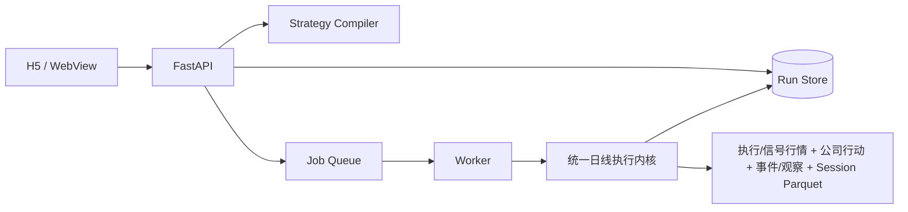

# A 股单股自然语言策略回测：技术方案 v1

> 发布范围：research demo。目标是把“说一句规则 → 形成策略 → 回测 → 看清成交过程”做成可运行闭环；不把分钟、L2、组合或生产数据写成已交付。

## 1. 这版交付什么

| 项目 | v1 结论 |
|---|---|
| 市场 | A 股单只股票、只做多；按需真实链覆盖沪深主板/创业板/科创板，北交所数据链 fail closed |
| 输入 | 一句中文；仅在缺少股票等关键条件时合并澄清一次 |
| 技术信号 | 22 个透明日线定义，覆盖均线/摆动/通道/量价、确认式背离、阶段趋势与价格行为，均按收盘确认 |
| 事件信号 | 五类业绩发布；其他事件按逐码 acquisition coverage 开放；`event.repurchase_capital.repurchase_change` 当前仅 implemented + fixture-tested |
| 执行 | 下一可交易日开盘尝试；T+1、停牌、涨跌停、PIT 容量、费用、滑点、公司行动、部分成交、订单过期 |
| 基准 | 同初始资金、同撮合/成本/公司行动的同期买入持有账户 |
| 结果 | 收益/风险、净值、因果活动、秒级事件来源、运行证据、六组执行压力场景 |
| 交互 | 390px H5/WebView；新口径下技术与事件真实 API 验收待最终收口 |
| 本地样例 | 东方财富 `300059.SZ`，2021-01-04 至 2026-08-20 |

“大跌反弹”保留为固定选股模板：当前没有发布定义时直接返回 `template_not_published`，不向用户追问内部阈值。股票池和组合资金分配不在 v1。

## 2. 总体架构

采用模块化单体：边界清楚，但不为了首版提前拆微服务。



本地使用 `SQLite + thread queue`；部署形态使用 `PostgreSQL + Redis/RQ`。API 和 Worker 复用同一 Python 包、同一执行内核，只改变装配与进程入口。

`on_demand_snapshot` 把联网准备和回测执行分开：fresh submission 按股票、区间和事件码重采 BaoStock/东方财富/Choice，校验后发布内容寻址 producer snapshot；Worker 只按 RunManifest 的精确 identity 从本地 registry 读取，不得调用采集器。已发布目录是不可变审计输入，不是“搜到什么就直接回测”的可变缓存。

## 3. 工程边界

```text
ashare_lab/
├── api/             HTTP 契约与错误映射
├── application/     编译、提交、执行、结果与稳健性用例
├── domain/          策略、事件、信号、订单、撮合、账户、绩效
├── ports/           持久化、队列、数据与证券状态接口
├── adapters/        Parquet、SQLAlchemy、RQ、中文规则解析
├── worker/          Worker 入口
└── bootstrap.py     唯一装配点

web/                 React H5
catalogs/            可执行目录与覆盖清单
contracts/           JSON Schema
tests/               单元、契约、架构、集成与 legacy 对照
docs/                验收、架构、参考契约与运行手册
```

依赖方向固定为：

```text
API / Worker / Adapters → Application → Domain + Ports
```

`domain` 不得导入 FastAPI、SQLAlchemy、Redis、RQ 或供应商 SDK；新主链不得直接导入 `astock_backtest` legacy 包；不得新增承载业务逻辑的 `utils.py`、`helpers.py` 或第二套通用 `services`。

## 4. 自然语言与 Strategy DSL

处理链路：

```text
中文原话 + 当前股票
→ 规则候选
→ Catalog ID / 参数 / 时间语义
→ 受限 StrategySpec
→ Schema 与 Catalog 校验
→ 用户可编辑策略卡
→ 精确策略版本
→ 回测提交
```

核心原则：

- 不执行用户或模型生成的 Python、SQL；
- 指标、事件、触发器只能引用发布过的稳定 ID；
- 明确表达直接使用默认值，不反复询问；
- 缺少股票才澄清；未发布模板直接说明不支持；
- 同一规范策略使用确定性 JSON 和 SHA-256；
- 用户修改参数、区间、资金或成本后，服务端保存并校验精确 `StrategySpec`，回测使用该版本。

覆盖清单用于产品规划，不等于执行能力。目前登记 180 个 A 股单股指标/数据项和 160 个 A 股相关事件，其中真正可执行的是 22 个指标定义；事件可执行数量以同次构建生成的覆盖目录与运行时 `/api/v1/capabilities` 为准。

## 5. 数据与时间语义

每次回测按策略需求固定：

- `daily_ohlcv.parquet`：不复权执行、估值与账户价格；
- `signal_daily_ohlcv.parquet`：后复权相对技术信号价格，不直接成交；
- `corporate_actions.parquet`：公司行动经济条款及可得时间；
- `events.parquet` 与 `event_observations.parquet`：秒级 canonical 事件、来源观察与隔离依据；
- `instrument_sessions.parquet` 使用 `parquet-instrument-sessions.v2`，提供逐证券逐日的板块、交易状态、前收、涨跌停、`minimum_buy_quantity`、`buy_quantity_increment`、T+1 与 ST 事实；
- Catalog hash、代码 revision、引擎版本、费用与执行配置。

文件以 SHA-256 固定，Worker 执行时重算；内容变化会让任务失败。fresh submission 默认重新准备并 pin 新产物，携带 expected snapshot identity 的 Worker replay 只接受同一产物，缺失即 fail closed。当前是“内容寻址目录 + 完整性校验”，不是自动复制到不可变对象存储的物理归档。

日线 session 参考由 BaoStock 按自然年有界查询 `preclose/tradestatus/isST`，再与 Choice 同日期的 `PRECLOSE/TRADESTATUS` 逐行精确对照；ST 与停牌不再用“永不 ST”或仅靠零成交量猜测。Choice `tradedates` 长区间按自然年有界分块、合并去重并显式设置接收超时；后复权信号 `csd` 保持整段查询，避免分块改变复权锚点。

### 5.1 事件时间

事件保存 `fact_at`、`available_at`、`ingested_at`、`revision_no` 和 `time_quality`。信号只在 `available_at` 之后可见：

| `decision_ready_at = available_at + 1 秒` | 当前日线代理的最早处理 |
|---|---|
| 不晚于交易日 09:15 | 可使用当日已经发布的日线开盘价代理；活动统一记在 09:30，但不声称 09:25/09:30 精确成交 |
| 09:15 后、盘中或收盘后 | 顺延至下一可交易 session，再使用已发布的日线开盘价代理 |
| 只有日期 | 仅观察/隔离；严格 Demo 不触发交易 |
| `estimated_research_only` | 不触发交易 |

日线 OHLCV 不包含集合竞价逐笔、排队或撤单状态，因此不能据此还原集合竞价成交。更精确的申报和撮合时间必须由分钟、逐笔或集合竞价数据支持。

后续修订不会倒填、重写已经发生的信号。旧事件迟到入库也不能覆盖更新的可用信号。每条可执行事件同时保留 provider、source event ID、source URL、time quality、响应 hash、修订与秒级 `available_at`；`ingested_at` 只审计，不能替代历史首次可得时间。

### 5.2 技术指标时间

v1 的 22 个指标定义均为日线 `bar_close_confirmed`。MACD、KDJ、EMA 等在盘中当然会变化；但“日线金叉/突破”只能在该根日线收盘后最终确认，因此不能按同一收盘价成交。相对成交量只比较此前有效交易日，量价背离只在右侧 K 线完成后的确认日发出，均不回填历史。若以后提供盘中信号，必须建立独立分钟定义、数据和成交模型。

## 6. 统一执行内核

所有技术和事件策略都走同一条路径：

```text
Signal → Decision → Order → Fill → PositionLot → Ledger → Analytics
```

默认规则：

- 买入后按持仓批次执行 T+1；
- 停牌不成交，剩余订单明确过期或按退出重试策略顺延；
- 买入申报数量、价格 tick、佣金、最低佣金、印花税和滑点分别处理；沪深主板/创业板最低 100 股且按 100 股递增，科创板最低 200 股后按 1 股递增；部分成交可以形成非整手整数持仓，卖出可清掉任意整数余额；
- 成交受可用现金、可卖数量和成交量参与率限制，支持部分成交；
- 开盘集合竞价默认只使用上一已完成交易日成交量作为 PIT 容量代理；来源日、`known_at` 和原因码进入撮合审计；观察缺失时不成交；
- `unlimited` 只能由用户在高级设置显式选择，并固化到策略版本与 RunManifest；
- 市场成交价、滑点和各项费用分账，账本逐事件守恒。

### 6.1 公司行动

公司行动与买卖成交进入同一不可变账户。经济条款来自独立版本化事实，不能从后复权价差反推：

```text
登记日收盘持仓
→ entitlement 锁定权益
→ 除权日 pre-open accrual 形成现金/股份应收
→ settlement：日期级现金派息在当日收盘后结算；股份按明确到账/可卖日期盘前处理
```

公司行动政策 ID 为 `cn.a_share.timeline_entitlement_receivable_settlement.date_only_cash_after_close_conservative.v2`。应收计入净值，但现金到账前不可用于买入。来源只有现金派息日期而没有日内到账时间时，派息日盘中仍保持应收，收盘后才转为可用现金，最早下一交易日可用于下单；不得声称具备盘中到账证据。股份仍按来源明确的到账日、上市日和可卖日盘前处理，达到可卖日前不可卖出。现金分红采用 `gross_research_no_withholding.v1`，按税前总额入账，未模拟个人按持有期补税。账户股数始终为整数；送转/拆并股出现不足 1 股权益尾数但缺最终整数登记证据时拒绝，不默认现金补偿。配股默认 `decline_no_external_cash.v1` 已实现：记录拒绝认购，不注入外部现金、不改变持仓经济状态。完整契约见[公司行动与资金账户契约](../reference/corporate-actions-v1.md)。

公司行动来源采用严格混合证明：东方财富对现金分红、送股/转增、配股做逐类正向完整查询；对拆股/缩股扫描完整股本变动历史并要求 0 个候选，任何未知变动原因或正向候选均拒绝发布。

### 6.2 同期持有资金账户

同期持有政策 ID 为 `funded_buy_and_hold.same_execution_ledger.v1`，不是后复权价格首尾比。它与策略账户使用同一初始资金，在首个可成交日尝试买入后持有，并复用相同的不复权执行价、费用、滑点、整手、涨跌停、停牌、容量和公司行动。两者均按账户权益计算收益、回撤和净值；无法建立可比账户时明确返回不可比较，不能退化到理想化价格序列。

### 6.3 涨跌停

默认 `wait_for_unlock`：日线无法证明封板队列位置，所以一字涨停买入和一字跌停卖出不假装成交；只知道“当天曾开板”时，主结果仍保守不成交。

其他处理作为显式研究参数保留。乐观模式也会把含滑点的价格钳制在当日涨跌停范围内，不能产生市场上不可成交的越界价。只有将来具备完整逐笔、撤单、成交、队列和连续序号时，才允许发布独立 `l2_queue` 模型。

## 7. 异步任务与可重放

状态机：

```text
queued
→ running:data
→ running:signal
→ running:execution
→ running:report
→ succeeded | failed | cancelled
```

提交时持久化规范策略、执行配置和 `RunManifest`；运行指纹包含策略、配置、数据、Catalog、市场规则、费用、容量模式、公司行动政策、引擎和精确 Git SHA。

- 相同指纹复用同一个 run；
- 仍为 `queued` 的重放会重新入队，修复入库成功但投递失败；
- Worker 原子抢占 `queued`，重复投递不会让正常任务被另一个 Worker 标为失败；
- Worker 重算策略 hash、配置 hash、Manifest 指纹和数据 checksum，并校验当前 Git SHA、引擎、Catalog、费用、市场规则和公司行动/配股政策与 manifest 完全一致；
- Worker 的 expected snapshot 请求不会触发按需准备或网络采集；registry 找不到同一内容身份时直接失败；
- 结果 hash 使用受支持的版本化 schema，覆盖摘要、资金基准曲线、因果活动、事件 provenance、稳健性和审计结构；状态、摘要、曲线、交易四个读取接口及完成态幂等重放都会对完整持久化 bundle 重算，未知版本、缺失 hash 或不一致均 fail closed；
- 无 `hashSchemaVersion` 且无 `resultHash` 的 legacy bundle 只按“无完整性证据”路径兼容；legacy 若携带 hash 则拒绝，系统不猜测旧算法或伪造迁移证据；
- 结果 `runEvidence` 直接来自运行 manifest，至少展示 strategy/catalog/data hash、execution assumptions、engine version 和 40 位 Git SHA。

## 8. API 与 H5

主要接口：

```text
POST /api/v1/strategy-drafts
POST /api/v1/strategy-drafts/{draft_id}/revisions
POST /api/v1/backtest-runs
GET  /api/v1/backtest-runs/{run_id}
POST /api/v1/backtest-runs/{run_id}/cancel
GET  /api/v1/backtest-runs/{run_id}/summary
GET  /api/v1/backtest-runs/{run_id}/series
GET  /api/v1/backtest-runs/{run_id}/trades
GET  /api/v1/capabilities
GET  /api/v1/health
GET  /api/v1/ready
GET  /api/v1/version
```

H5 按 `strategy-input / strategy-card / backtest-run / result` 拆分，使用 React、TypeScript、TanStack Query 与 ECharts。它支持：一句话识别、一次澄清、参数/区间/成本编辑、异步进度、取消、净值、摘要以及 signal → order → fill/partial/unfilled/expired 因果轨迹。事件节点显示到秒，并展示 provider、time quality、来源记录与 snapshot/Git 身份。

新结果 UI 的技术 Mock 已通过 320/390/768/1280px，无溢出；事件、无法识别和一次澄清 Mock 已通过 390px，并通过 TypeScript、ESLint、Vitest 和生产构建。它仍必须从 strict composite 和 clean Git 重新执行四档真实 API 验收；Mock 与旧 run 都不递延作为真实数据新口径证据。

## 9. 质量与部署

已配置的门禁：

- Python：Ruff、严格 Pyright、pytest；
- Web：TypeScript、ESLint、Vitest、生产构建；
- 架构依赖测试、DSL/Catalog/API 契约、撮合/账本边界、数据完整性、并发和重放测试；
- GitHub Actions 后端、前端、迁移和容器构建任务；
- Dockerfile、Compose、Alembic、本地/生产/备份恢复手册和真实 HTTP smoke。

`/health` 只证明进程存活；`/ready` 检查配置要求的执行/信号行情、公司行动、session、数据库与队列依赖。
事件模式还检查事件文件、观察层和严格秒级政策，Choice/composite 快照模式还检查公司行动覆盖、生产者 manifest 与内容寻址目录；strict composite/production 另要求精确 clean Git SHA。运行时
`/capabilities` 另行声明事件回测当前是否可用。生产发布仍需额外确认 Alembic head、RQ
Worker、数据逐行质量和一次真实 E2E。

## 10. 已知边界与下一步

当前不能宣称生产就绪，原因是：

- 公司行动三阶段账户与默认配股不认购均已实现；`300059.SZ` 五年真实公司行动/历史 session/Choice 对照已通过，但尚缺最终 clean-SHA strict composite 双 run 和独立账户对账；不足 1 股权益尾数仍需要最终整数登记证据；
- 沪深主板、创业板和科创板已接按需准备链；北交所虽有 100/1 的领域数量规则，仍缺可证明的历史挂牌场所归属和跨源逐日停牌/reference 事实，完整回测 fail closed；现有真实五年证据也只覆盖一只股票，不是全 A 股生产覆盖；
- 原始数据未自动归档到不可变对象存储；
- 草稿是进程内存存储；结果数组尚未分页；
- API 未实现认证、用户级 run ownership、审计和限流；
- 本机无 Docker，容器只完成静态材料和 CI 配置，未形成实机演练证据；
- 分钟、Tick、L2、股票池和组合不在 v1。

当前 dirty worktree 上的 fresh 五年 Choice 快照为 `choice:a2eebf97b7c2ed4f2467ca6f91a3e95f48ed609c4026b440a16e7a11a4a23b4f`：`300059.SZ`、2021-08-06 至 2026-08-06，执行/信号/session 各 1,211 行，公司行动 7 条；后复权前缀 969 行差异 0、状态 `passed`。它只达到 `local-real-data-verified`，不能代替 clean-SHA Live E2E 或生产授权。

建议顺序：先把该公司行动链装入最终 strict composite，完成资金基准和两条 clean-Git E2E，再补授权 session/多供应商实网数据、北交所历史链、权限/持久草稿/分页/观测和生产演练；之后扩展更多 stable 指标与事件。回购方案变更当前只有分类、编译和夹具证据，尚无新 live event snapshot；不要把它写成真实历史已覆盖。最后再进入分钟和 L2，不用日线结果替代分钟或队列模型的正确性证明。
