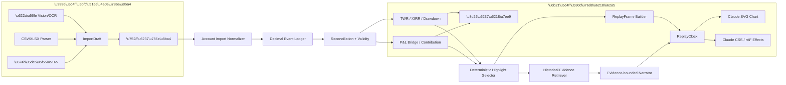

# A/H 股账户高光复盘 Spec v0.1

> 状态：`proposed / implementation-gated`  
> 日期：2026-09-04  
> 适用版本：`CN_A_HK_CASH_V1`  
> 交付边界：本地前后端联调，未经用户验收不部署。

## 0. 一句话决策

做一个两屏响应式 H5：首屏以券商成交/交割流水 CSV/XLSX 为主入口，持仓截图、持仓表格和手工补录是三种对账补充方式；系统自动推断日期、市场、币种和可分析能力，客户确认后才进入真实账户复盘。高光点开后，按客户的真实成交、净值或行情粒度逐帧回放；大模型只根据可引用的历史市场证据解释“当时可能发生了什么”，不参与记账、收益计算或买卖建议。

## 1. 目标与非目标

### 1.1 目标

1. 让客户先用最低成本上传券商成交/交割流水，而不是先填日期、币种和专业账户字段。
2. 根据数据完整度逐级开放持仓快照、成交复盘、账户收益、归因与高光回放。
3. 把真实数据转成有节奏、有共情的“账户战报”，但始终保留证据、口径和不确定性。
4. 电脑和手机使用同一 H5；视觉、排版、SVG 曲线、CSS 动画和回放交互以恢复的 Claude 页面为唯一基线，不重新设计。

公开的 [Moss](https://moss.site/) 和 [Robinhood](https://robinhood.com/us/en/) 页面只用来校准组件组织：全黑画布、大字结论、单一荧光绿主操作、细描边次操作、强留白和市场符号动效。不复制其 logo、插画、私有源码或品牌资产；所有落地仍由 Claude 恢复页的现有组件重组。

### 1.2 非目标

- v0.1 不做实盘下单、跟单或投资建议。
- v0.1 只覆盖现金账户下的 A 股和港股多头持仓；不包括融资融券、卖空、期权、期货和场外衍生品。
- 没有历史净值/资金流时，不从一张期末持仓表反推区间收益。
- 没有真实行情 tick 时，不用插值曲线冒充盘中行情。
- 大模型不得把时间相关性写成已证实的因果。

## 2. 产品结构：只有两屏

### 2.1 首屏：上传券商流水

首屏不展示模拟收益、模拟股票或模拟高光。唯一主任务是“上传券商导出的成交/交割流水”：

1. **成交/交割流水 CSV / XLSX（主入口）**：系统自动识别常见中英文表头、日期、买卖方向、代码、数量、价格、费税和币种，自动推断起止区间、A/H 市场与基准币种。客户不先填这些字段。
2. **当前持仓截图/表格（对账补充）**：只在流水缺少期初余额、公司行动或历史不完整时引导补充。OCR 结果必须可修改并经确认；未配置视觉服务时可直接上传持仓 CSV/XLSX。
3. **手工补一条（最后兜底）**：只补系统标红的缺失项，不让客户从空白表单编写整个账户。

导入区提供一份可点开的 demo 流水和对应战报，先说明“这类文件可以解锁什么”。任何输入都进入同一个自动映射、差异提示与确认步骤。

流水解析后，系统先自己构造可确认的 `ImportDraft`，再仅对缺口询问是否补充：

- 成交流水；
- 资金流水；
- 每日账户总资产/净值；
- 分证券估值或授权的行情分钟/tick 数据；
- 对账周期内的公司行动和费用税费。

用户可以只用流水或只用持仓快照进入次屏。系统“给什么就分析什么”：无证据的收益、归因、持仓或高光模块直接不渲染，不用模拟内容占位。

### 2.2 次屏：复盘战报

次屏按“结论 → 高光 → 证据”排列：

1. **账户主战绩**：展示基准币种、区间、期末资产；数据完整时才展示 TWR、最大回撤和账户曲线。
2. **高光时刻**：0–5 张；没有足够证据就保持 0 张，不为视觉凑数。
3. **可对账归因**：资本利得、分红/利息、汇率、费用/税费、外部资产流构成期初到期末的 bridge；分证券贡献在有分证券日估值后才展示。
4. **持仓阵容**：持仓矩形树图、权重、市值、浮动盈亏和市场/币种。
5. **操作节奏**：买入、卖出、入金、出金、分红、费用和公司行动时间线。
6. **AI 市场剧情**：只在有可引用来源时出现。给出最可能的市场驱动、置信度、未解问题和可点开来源。

## 3. 数据能力分级

| 已确认数据 | 允许输出 | 明确禁止 |
|---|---|---|
| 期末持仓 | 市值、权重、有成本时的浮动盈亏 | 区间收益、最大回撤、历史归因、高光 |
| 持仓 + 成交 | 真实成交序列、有完整成本 lot 时的已实现盈亏 | 把成交之间的插值当成真实行情 |
| 加每日净值 + 外部资产流 | TWR、回撤、日级曲线、日级高光 | 没有分证券估值时的精确标的归因 |
| 加分证券每日估值 | 分证券贡献、盈亏 bridge | 把复权跳点与公司行动重复计入 |
| 加真实行情 tick | 真实 tick 回放、MFE/MAE、更精确的操作节奏 | 超出买入的时间、市场和授权的再分发 |

系统使用两组独立字段：

- `validity.*`：这批数据是否通过格式、币种、账户平衡和期间完整性校验；
- `capabilities.*`：基于当前证据允许产生哪些产品输出。

“数据合法”不等于“支持完整复盘”。

## 4. 输入数据契约

### 4.1 账户元数据

```text
profile = CN_A_HK_CASH_V1
period_start / period_end
base_currency = CNY | HKD
timezone = Asia/Shanghai | Asia/Hong_Kong
cost_basis_method = BROKER_REPORTED | FIFO | MOVING_AVERAGE
```

### 4.2 持仓（可选对账补充）

```text
as_of, market, symbol, name, quantity,
market_price, average_cost?, market_value?, currency, fx_to_base?
```

- `market` 仅允许 `CN_A` 或 `HK`。
- A 股代码规范化到 `.SH/.SZ/.BJ`；港股规范化到五位 `.HK`。
- 非基准币种的记录必须有 `fx_to_base` 或已折算金额；不默默使用当前汇率回填历史。
- 只有持仓而没有流水也可生成期末证券快照，但不能把证券市值冒充含现金的账户总资产，也不能生成区间收益或历史高光。

### 4.3 成交流水

```text
executed_at, market, symbol, side, quantity, price,
gross_amount?, fees, taxes?, currency, fx_to_base?, broker_trade_id?
```

### 4.4 资金与资产流

```text
occurred_at, kind, amount, currency, fx_to_base?, external, source_id?

kind = DEPOSIT | WITHDRAWAL | DIVIDEND | INTEREST |
       FEE | TAX | ASSET_TRANSFER_IN | ASSET_TRANSFER_OUT
```

`DEPOSIT/WITHDRAWAL/ASSET_TRANSFER_*` 属于外部资产流，只改变资产规模，不计作投资收益。分红、利息、费用和税费属于账户表现的组成。

### 4.5 估值与行情

```text
daily_equity: at, equity_base, external_inflow_base, external_outflow_base
position_valuation: at, market, symbol, value_base, pnl_component_base?
market_tick: at, market, symbol, last_price, currency, fx_to_base?
account_tick: at, equity_base
```

用户导入的账户总资产是主要证据；外部行情只用于帮助补全或说明，不得在对账失败时覆盖券商账户数字。

## 5. 账户算法

### 5.1 金额和对账

- 所有账户金额与数量端到端使用 `Decimal`，输出层才格式化。
- 每个导入行保留 `source_id` 和内容哈希；重复导入不能重复记账。
- 先对账，后算收益。对账不平时输出差额和可能缺口，不生成“已完整”标记。

### 5.2 TWR（账户投资表现）

以 [Portfolio Performance 的 TTWROR 口径](https://help.portfolio-performance.info/en/concepts/performance/time-weighted/) 作为语义和差分验算 oracle，不直接复制其 EPL-1.0 Java 实现。对每个子期：

```text
r_t = (MVE_t + CFout_t) / (MVB_t + CFin_t) - 1
TWR = product(1 + r_t) - 1
```

`CFin` 放在子期开始，`CFout` 放在子期结束；资金或证券外部转入/转出都切分子期。币种折算使用记录当时的受信汇率。

### 5.3 MWR/XIRR（客户资金体感）

使用 Unlicense 的 [PyXIRR](https://github.com/Anexen/pyxirr) 计算非等间隔资金流的 XIRR/XNPV。MWR 与 TWR 同时展示时必须解释：TWR 描述投资过程，MWR 包含客户资金进出时点的影响。存在多重 IRR 或无解时降级为不可用，不强行给单值。

### 5.4 风险和统计

输入必须是已经净化外部资产流的日 TWR 序列。优先使用现有项目指标实现；Apache-2.0 的 [empyrical-reloaded](https://github.com/stefan-jansen/empyrical-reloaded) 和 [QuantStats](https://github.com/ranaroussi/quantstats) 先作差分 oracle，只有口径、日期对齐、年化因子、NaN 和无风险利率完全固定后，才允许某一指标进入正式依赖。

v0.1 必需：区间 TWR、最大回撤、胜率的明确定义（正收益日占比或已闭合交易胜率，不得混用）、波动率和最长连续上涨/下跌日。Sharpe/Sortino 只在样本数足够时展示。

### 5.5 归因

v0.1 不上 Brinson 或风格因子模型，先做可对账的 P&L bridge：

```text
期初资产
+ 外部资产流
+ 价格贡献
+ 分红/利息
+ 汇率贡献
- 费用/税费
+ 公司行动影响
= 期末资产
```

以 [Portfolio Performance 的 performance calculation 分解](https://help.portfolio-performance.info/en/reference/view/reports/performance/calculation/) 作对照。对账差额超出阈值时，归因能力关闭。

## 6. 高光算法与回放

### 6.1 高光候选

候选只来自可重放事件：

- 有已实现盈亏和完整 lot 证据的成功卖出；
- 在完整行情窗口内，买入后的 MFE/MAE 表现显著；
- 账户从区间回撤低点后产生可验证的恢复；
- 有相关持仓贡献证据的最佳收益日；
- 在风险未同比例放大时取得的相对表现。

候选先经过硬门槛，再按“账户影响、操作可归因性、时点质量、证据完整度”排序。分数只用来选择展示顺序，不对外宣称为投资能力评分。

### 6.2 回放粒度

| 可用数据 | 对外名称 |
|---|---|
| 真实逐笔或账户 tick | `真实 tick 回放` |
| 分钟 bar + 成交 | `逐分钟回放` |
| 成交时间戳 + 日净值 | `成交级操作 + 日级净值` |
| 每日净值 | `日级回放` |
| 只有持仓 | 不显示历史播放按钮 |

目前常见开源数据源都不能稳定提供长期、可商用的 A/H 股历史逐笔数据。真正的“逐 tick”需采购或由客户导入持牌数据；否则产品必须用上表的准确名称。

### 6.3 播放器架构

- 直接复用 Claude 恢复页中的 `Chart` SVG 绘制、`replay()`、story player、数字跳动、扫描、镜头缩放和高光卡片；不重画图表，不引入新动画库。
- 将原页的 `requestAnimationFrame` 播放逻辑收口为唯一 `ReplayClock`，只把原来的模拟数组换成服务端返回的 `ReplayFrame`。
- 同一秒多 tick 按原始时间顺序播放；SVG 上可按屏幕像素聚合，事件卡和时间文案不丢失原始粒度。
- `prefers-reduced-motion: reduce` 沿用原页降级逻辑，关闭长时间过渡，保留状态切换和可读数字。

## 7. AI “当时的市场剧情”

### 7.1 输入最小化

模型只接收已核验高光的最小上下文：

```text
market, verified_symbol, verified_name,
event_start/end, customer_action,
verified_performance_evidence,
approved_public_market_evidence
```

不上传客户姓名、账号、完整持仓、原始截图或 API Key。API Key 只保存在服务端环境变量/SecretStr，不进前端 bundle、日志、数据库或 Git。

### 7.2 检索和因果门槛

1. 先由确定性系统锁定标的和时间窗口；模型不允许自行换股。
2. 优先使用交易所/公司公告，再使用授权新闻。来源必须带 URL、发布者、发布时间和抓取时间。
3. “当时语境”只使用在事件窗口结束前已公开的来源；事后复盘文章必须单独标记 `hindsight`。
4. 每个驱动只允许 `reported_fact / inference / uncertain`。`inference` 的文案必须显式使用“最可能”或“推断”。
5. 无有效来源时输出 `unresolved`，页面显示“当时原因暂无法核实”，不让模型用常识补全。

### 7.3 输出

```text
headline
empathetic_summary
likely_drivers[{reason, confidence, fact_kind, source_ids}]
sources[{title, publisher, url, published_at}]
unresolved_questions[]
provider/model/prompt_version/response_sha256
```

共情来自对客户真实行为与市场压力的准确述说，不来自夸大、神化或结果偏见。禁止产生买卖指令、未来涨跌预测和“你当时一定知道”类的心理揣测。

## 8. 胶水架构



### 8.1 模块边界

```text
web/src/portfolio-review/
  portfolio-review.html  # Claude 原页为基线，重排两屏并接真实 API
  PortfolioReviewPage.tsx # 路由壳，不重画内部 UI

ashare_lab/domain/portfolio_review/
  models.py           # 第一方领域对象与 Decimal 口径
  reconciliation.py   # 对账与 validity
  performance.py      # TWR / MWR / drawdown 编排
  highlights.py       # 确定性候选与排序

ashare_lab/adapters/
  imports/            # 券商文件/视觉适配器
  analytics/          # PyXIRR 和差分 oracle 适配器
  market_context/     # 持牌数据/公告/新闻适配器
  language/           # 有证据的高光叙事适配器
```

第三方类型不进入 `domain` 层；每个适配器都可独立关闭或替换。

### 8.2 API v0.1

| API | 用途 | 数据保留 |
|---|---|---|
| `GET /api/v1/portfolio-reviews/import-contract` | 三种导入方式、字段和模板 | 无 |
| `POST /api/v1/portfolio-reviews/imports/parse` | 浏览器解码的 CSV/XLSX 行 → 自动推断的 `ImportDraft` | 本地 v0.1 stateless，限 200 行 |
| `POST /api/v1/portfolio-review-imports/vision` | 对账用截图 → 含置信度的持仓草稿 | v0.1 请求内存处理，原图不落盘；未实现时明确降级 |
| `POST /api/v1/portfolio-reviews/analyze` | 已确认 JSON → 确定性复盘 | 本地 v0.1 stateless |
| `POST /api/v1/portfolio-reviews/narrate-highlight` | 已验证高光 → 有来源 AI 剧情 | 仅返回摘要/来源/hash，不保存 Key |

全局接口保持 16KB JSON 上限；只对精确的流水解析和确认复盘路径放宽到 2MB，单高光叙事路径放宽到 1MB。超过 200 行的大文件留待独立流式/分批入口，本版不假装已支持。

## 9. 开源复用决策

| 项目 | 许可证 | 采用方式 | 决策 |
|---|---|---|---|
| [Portfolio Performance](https://github.com/portfolio-performance/portfolio) | EPL-1.0 | 收益/现金流/多币种语义和黄金样例 oracle | 参考，不复制 Java 源码 |
| [PyXIRR](https://github.com/Anexen/pyxirr) | Unlicense | XIRR/XNPV 薄适配器 | 拟直接依赖 |
| [empyrical-reloaded](https://github.com/stefan-jansen/empyrical-reloaded) / [QuantStats](https://github.com/ranaroussi/quantstats) | Apache-2.0 | 净化日收益统计的差分 oracle | 先双跑，不整体接管 |
| [pyfolio-reloaded](https://github.com/stefan-jansen/pyfolio-reloaded) | Apache-2.0 | round-trip/交易分析参考 | 后置 |
| [Ghostfolio](https://github.com/ghostfolio/ghostfolio) | AGPL-3.0 | Web 交互参考 | 不嵌入、不复制 |
| [Rotki](https://github.com/rotki/rotki) | AGPL-3.0/商业双许可 | 可审计事件/lot 思路 | 不嵌入 |
| [Beancount](https://github.com/beancount/beancount) | GPL-2.0-only | 双重记账与余额断言思路 | 不嵌入 |
| Claude 恢复页内嵌 SVG/CSS/JS | 本地已恢复源码 | 导入弹层、曲线、热力图、高光卡和 story player | 直接复用并换真实数据 |
| SheetJS CE `xlsx@0.18.5` | Apache-2.0 | 沿用原页 CSV / Excel 解析 | 首版保持原实现，联调后再评估本地 vendor |

结论：不 fork 其他投资管理 App，也不重画前端。Claude 页面的视觉、图表、动效和三种导入交互全部复用；第一方胶水只负责 A/H 股证券身份、真实账户证据、对账、能力门槛、高光选择和 AI 证据绑定。详细工程门禁沿用 [开源复用与胶水代码边界](reference/reuse-first.md)。

## 10. A/H 股市场数据决策

- **本地原型**：[BaoStock](https://www.baostock.com/mainContent?file=stockKData.md) 可做 A 股日线/5 分钟对照；[AKShare 股票文档](https://akshare.akfamily.xyz/data/stock/stock.html) 可做 A/H 近期分钟数据和公告的研究适配。两者都不作为商业数据授权证明。
- **商业候选**：[Tushare Pro](https://tushare.pro/document/2?doc_id=370) 功能上可覆盖 A 股/港股分钟、公告和新闻，但其[数据服务协议](https://tushare.pro/document/1?doc_id=405) 不能被开源 SDK 的 BSD 许可替代。面向 C 端展示前必须另取得书面商业授权，明确缓存、派生摘要和再分发权利。
- **禁止误区**：[OpenBB](https://github.com/OpenBB-finance/OpenBB) 是 provider/router，不是 A/H 股数据源，且为 AGPL-3.0；本项目只借鉴 provider 抽象，不嵌入。
- 运行期数据统一进入 `instrument_master / market_bar / corporate_action / event_document / provenance / known_at`，模型不直接读临时爬虫返回。

代码许可不等于底层行情/新闻的商业展示权。上述许可判断是工程筛选，不代替法务意见。

## 11. 验收标准

### 11.1 产品

- [ ] 首次打开只见导入首屏，不见任何演示账户数字。
- [ ] 首屏以成交/交割流水 CSV/XLSX 为主入口，同时提供持仓截图、持仓表格、手工补录三种对账补充入口。
- [ ] 任一入口都必须经过预览与确认；未确认不进次屏。
- [ ] 只有持仓的样例只显示快照，收益、归因、历史高光为不可用。
- [ ] 完整样例可展示 TWR、回撤、对账 bridge、不超过 5 个高光和精确粒度标签。
- [ ] 点开高光进入沉浸回放；曲线、数字、事件卡和动效受同一 `ReplayClock` 控制。
- [ ] 桌面 1440/1024 宽度和手机 390/360 宽度无水平滚动，关键内容不被遮挡。
- [ ] reduced-motion 模式下所有结果仍可读可操作。

### 11.2 账户与 AI

- [ ] CNY/HKD 交叉持仓无汇率时 fail closed，有汇率时金额可对账。
- [ ] 外部现金和证券转移不计入收益。
- [ ] 公司行动与复权价不重复计入。
- [ ] 相同原始行幂等导入，不重复记账。
- [ ] 无 API Key 时确定性复盘正常，AI 剧情明确显示未连接。
- [ ] 有 API Key 时，AI 输出的每个最可能原因都有可点开 source id、事实类型和置信度；无证据输出 unresolved。
- [ ] 前端 bundle、服务日志和 Git 差异中不存在 API Key。

## 12. 实施顺序与停线

1. 冻结本 Spec 与 CSV/XLSX/手工/视觉的统一 `ImportDraft` Schema。
2. 先跑通只有持仓的快照纵切，验证“不多算”。
3. 增加成交、资金流和日净值，与 Portfolio Performance 黄金样例差分 TWR/XIRR/回撤。
4. 增加高光选择和 `ReplayClock`，再接曲线和动效。
5. 最后接视觉识别和 AI 市场剧情；此时再向用户索要 API Key。
6. 本地完整联调，由用户在电脑/手机宽度审核；未获得明确授权前不部署。

以下任一条触发停线：金额对账不平、外部资产流无法识别、汇率来源不明、数据授权不明、模型原因无引用、或页面把分钟/日级数据标成真实 tick。

## 13. 本轮需用户审核的三个决策

1. 首屏三个入口固定为“截图识别 / CSV·XLSX / 手工录入”。
2. 只有持仓也可进入次屏，但只展示快照并引导补数据；不强制客户首次就导入所有流水。
3. 大模型剧情默认在用户点开某个高光时按需生成，不阻塞次屏首次加载，也避免为用户没看的高光消耗模型费用。
